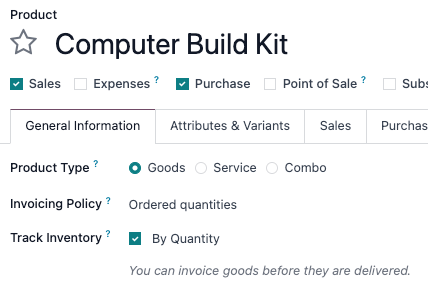
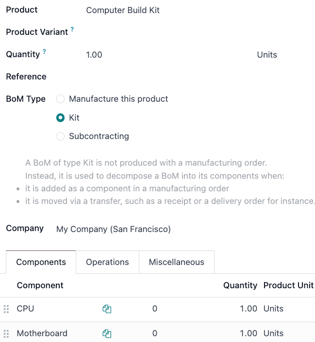
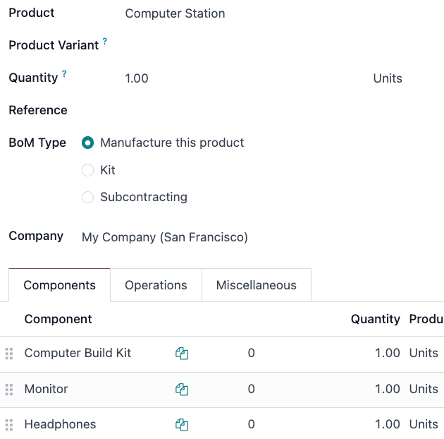
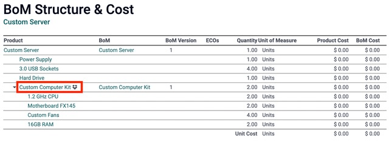

====
Kits
====
<<<<<<< 18.0

.. |BOM| replace:: :abbr:`BoM (Bill of Materials)`
.. |BOMs| replace:: :abbr:`BoMs (Bills of Materials)`
||||||| e8bf7168a1ad48d7c24b7983eb10690179a1a000
========
Use kits
========
=======
>>>>>>> acb8733800f490e204c0c2fbf45e3150773a36ef

In Odoo, a *kit* is a type of bill of materials (BoM) that can be manufactured and sold. Kits are
sets of unassembled components sold to customers. They may be sold as standalone products, and are
also useful tools for managing more complex bills of materials (BoMs).

.. note::
   To use, manufacture, and sell kits, both the :guilabel:`Manufacturing` and :guilabel:`Inventory`
   apps need to be installed.

Create the kit as a product
===========================

<<<<<<< 18.0
To create a kit product, go to :menuselection:`Manufacturing app --> Products --> Products`, then
select :guilabel:`New`.
||||||| e8bf7168a1ad48d7c24b7983eb10690179a1a000
To use a kit as a sellable product, or simply as a component organization tool, the kit should first
be created as a product.
=======
To use a kit as a sellable product, or as a component organization tool, the kit should first be
created as a product.
>>>>>>> acb8733800f490e204c0c2fbf45e3150773a36ef

<<<<<<< 18.0
Start by entering a name in the :guilabel:`Product` field, and then, under the :guilabel:`General
Information` tab, set the :guilabel:`Product Type` to :guilabel:`Goods`. Next, select the checkbox
next to :guilabel:`Track Inventory` and choose :guilabel:`By Quantity` within the corresponding
drop-down menu.
||||||| e8bf7168a1ad48d7c24b7983eb10690179a1a000
To create a kit product, go to :menuselection:`Inventory app --> Products --> Products`, and click
:guilabel:`Create`.
=======
To create a kit product, go to :menuselection:`Inventory app --> Products --> Products`, and then
click :guilabel:`New`.
>>>>>>> acb8733800f490e204c0c2fbf45e3150773a36ef

<<<<<<< 18.0

Create the component products for the kit (via the **Manufacturing**, **Inventory**, or **Sales**
:menuselection:`Products --> Products` menus) in order to populate the |BOM| in the next steps.
These components require no specific configuration in order for them to be included in the kit (for
example, it does not matter if the component's inventory volume is tracked).
||||||| e8bf7168a1ad48d7c24b7983eb10690179a1a000
Then, assign a name to the new kit product. Next, under the :guilabel:`General Information` tab, set
the :guilabel:`Product Type` to :guilabel:`Consumable`. Kit products work best as consumables,
because the stock on-hand for kits is typically not tracked.

.. note::
   Although kits should almost always be set to :guilabel:`Consumable`, companies using
   **Anglo-Saxon** accounting might need to create kits as a :guilabel:`Storable Product`. This is
   because when processing invoices for kits, the Cost of Goods Sold (COGS) will be posted in
   accounting journals.

Unlike storable products, the :guilabel:`Routes` designation under the :guilabel:`Inventory` tab
does not matter for kits, since Odoo uses the routes of the kit's individual components for
replenishment purposes. All other parameters for the kit product may be modified according to
preference. Once ready, click :guilabel:`Save` to save the new product.

The kit's components must also be configured as products via :menuselection:`Inventory app -->
Products --> Products`. These components require no specific configuration.
=======
Then, assign a name to the new kit product. Next, set the kit's product type depending on inventory
tracking needs and accounting requirements. To do this, under the :guilabel:`General Information`
tab, set the :guilabel:`Product Type` to either :guilabel:`Consumable` or :guilabel:`Storable`.

The kit's components must also be configured as products via :menuselection:`Inventory app -->
Products --> Products`. These components require no specific configuration.
>>>>>>> acb8733800f490e204c0c2fbf45e3150773a36ef

Consumable kit setup details
----------------------------

Consumable products do not have inventory tracking. Consider setting the kit as a consumable product
when the kit is used in other manufacturing processes or when tracking inventory for the kit itself
is not needed.

* **Recommended for Continental Accounting**: If costs are expensed immediately upon purchase, then
  setting the kit's type to *consumable* is recommended.
* **Replenishment via Components**: Inventory count is managed at the component level, so reordering
  rules must be set to individual components.
* **Selling & Stock Constraints**: Kits cannot be sold if any required component is out of stock.
  Since availability depends on individual components, a sales order may appear valid, but delivery
  can be delayed if components are unavailable.

Storable kit setup details
--------------------------

Storable products have detailed tracking and inventory management since they are expected to be
*stored* once they are created. Consider setting the kit as a storable product when the kit is a
tangible product or warehouse and inventory tracking is essential.

* **Recommended for Angle-Saxon Accounting**: If the Cost of Goods Sold (COGS) needs to be recorded
  in journals, then setting the kit's type to *storable* is recommended.
* **Component Purchase Constraints**: Only the kit's minimum required components can be added to an
  **eCommerce** cart unless the option to :doc:`continue
  selling<../../../websites/ecommerce/products>` is disabled.
* **No Kit Serial Numbers**: Serial number tracking does not track the kit, only its shipped
  components.
* **Reordering Rule Recommendation**: Reordering rules should be set at the component-level.
* **Stock Replenishment Recommendation**: Stock replenishment should also be done at the
  component-level.

Kit setup similarities
----------------------

Regardless of which setup is used, there are some similarities between the two options.

* **No Kit-Level Stock Adjustments**: Stock adjustments cannot be handled at the kit-level.
* **Kit Value Does Not Change**: The stock's value is the same whether the kit is consumable or
  storable.
* **Kit Internal Transfers**: An internal transfer for the kit breaks it into components.

Set up the kit BoM
==================

Once the kit product and its components are set up as products in Odoo, create a new |BOM| and
assign it to the kit.

<<<<<<< 18.0
Do so by navigating to :menuselection:`Manufacturing app --> Products --> Bills of Materials`, and
then clicking :guilabel:`New`. Next to the :guilabel:`Product` field, select the drop-down menu to
reveal a list of products, then select the previously configured kit product.

.. tip::
   The kit's |BoM| can also be accessed from the product form using the |BOM| smart button at the
   top of the screen. Creating the |BOM| this way automatically links the kit to its |BOM|.
||||||| e8bf7168a1ad48d7c24b7983eb10690179a1a000
To do so, go to :menuselection:`Manufacturing app --> Products --> Bills of Materials`, and click
:guilabel:`Create`. Next to the :guilabel:`Product` field, click the drop-down menu to reveal a list
of products, and select the previously configured kit product.
=======
To do so, go to :menuselection:`Manufacturing app --> Products --> Bills of Materials`, and then
click :guilabel:`New`. Next to the :guilabel:`Product` field, click the drop-down menu to reveal a
list of products, and then select the previously configured kit product.
>>>>>>> acb8733800f490e204c0c2fbf45e3150773a36ef

<<<<<<< 18.0
Then, for the :guilabel:`BoM Type` field, select the :guilabel:`Kit` option. Finally, under the
:guilabel:`Components` tab, select :guilabel:`Add a line`, then add each desired component and
||||||| e8bf7168a1ad48d7c24b7983eb10690179a1a000
Then, for the :guilabel:`BoM Type` field, select the :guilabel:`Kit` option. Finally, under the
:guilabel:`Components` tab, click :guilabel:`Add a line`, and add each desired component, and
=======
Then, for the :guilabel:`BoM Type` field, click the :guilabel:`Kit` option. Finally, under the
:guilabel:`Components` tab, click :guilabel:`Add a line`, and add each desired component, and
>>>>>>> acb8733800f490e204c0c2fbf45e3150773a36ef
specify their quantities under the :guilabel:`Quantity` column.

<<<<<<< 18.0
.. seealso::
   :doc:`Bills of materials <../basic_setup/bill_configuration>`
||||||| e8bf7168a1ad48d7c24b7983eb10690179a1a000
Once ready, click :guilabel:`Save` to save the newly-created :abbr:`BoM (bill of materials)`.

=======
Once ready, click :guilabel:`Save` to save the newly created :abbr:`BoM (bill of materials)`.

>>>>>>> acb8733800f490e204c0c2fbf45e3150773a36ef

If the kit is solely being used as a sellable product, then only components need to be added under
the :guilabel:`Components` tab, and configuring manufacturing operations is not necessary. Kits can
be added as components to other kits, which is described in the next section.

.. note::
   When a kit is sold as a product, it appears as a single line item on the quotation and sales
   order. However, on delivery orders, each component of the kit is listed.

Use kits to manage complex BoMs
===============================

<<<<<<< 18.0
Kits are also used to manage multi-level |BOMs|. These are products that contain **other** |BOM|
products as components, and therefore require *nested* |BOMs|. Incorporating preconfigured kits into
multi-level |BOMs| allows for cleaner organization of bundled products.
||||||| e8bf7168a1ad48d7c24b7983eb10690179a1a000
Kits are also used to manage multi-level :abbr:`BoMs (bills of materials)`. These are products that
contain **other** :abbr:`BoM (bill of materials)` products as components, and therefore require
*nested* :abbr:`BoMs (bills of materials)`. Incorporating pre-configured kits into multi-level
:abbr:`BoMs (bills of materials)` allows for cleaner organization of bundled products.
=======
Kits can also be used for complex :abbr:`BoMs (Bills of Materials)`. This method nests BoMs within
other BoMs, organizing complex products while simplifying manufacturing by defining each procurement
and production step separately.
>>>>>>> acb8733800f490e204c0c2fbf45e3150773a36ef

<<<<<<< 18.0
To configure this type of |BOM| with a kit as a component, go to :menuselection:`Manufacturing app
--> Products --> Bills of Materials`, then select :guilabel:`New`.
||||||| e8bf7168a1ad48d7c24b7983eb10690179a1a000
To configure this type of :abbr:`BoM (bill of materials)` with a kit as a component, go to
:menuselection:`Manufacturing app --> Products --> Bills of Materials`, and click
:guilabel:`Create`.
=======
Sublevel BoMs (subassemblies or semi-finished products) streamline these workflows, helping with
traceability efforts.
>>>>>>> acb8733800f490e204c0c2fbf45e3150773a36ef

<<<<<<< 18.0
Next to the :guilabel:`Product` field, select the drop-down menu to reveal a list of products, and
select the desired |BOM| product. Then, for the :guilabel:`BoM Type` field, select the
:guilabel:`Manufacture this product` option.

Under the :guilabel:`Components` tab, select :guilabel:`Add a line`, then select a kit as the
component. Adding the kit as a component eliminates the need to add the kit's components
individually. Any :guilabel:`BoM Type` can be used for the higher-level product's |BOM|.

Once ready, select :guilabel:`Save` to save changes.

Preview multi-level BoMs
------------------------

To access a comprehensive overview of all the components in the multi-level |BOM| go to the intended
|BOM| and select the :guilabel:`BoM Overview` smart button. Sublevel |BOMs| can be expanded and
viewed from this report.

When creating a manufacturing order for a product with a multi-level |BOM|, the kit product
automatically expands to show all components. Any operations in the kit's |BOM| are also added to
the list of work orders on the manufacturing order.

.. tip::
   Kits are primarily used to bundle components together for organization or sale. However,
   :doc:`sub-assemblies <sub_assemblies>` can be used to manage multi-level products that require
   manufactured sub-components.
||||||| e8bf7168a1ad48d7c24b7983eb10690179a1a000
Next to the :guilabel:`Product` field, click the drop-down menu to reveal a list of products, and
select the desired :abbr:`BoM (bill of materials)` product. Then, for the :guilabel:`BoM Type`
field, select the :guilabel:`Manufacture this product` option.

Under the :guilabel:`Components` tab, click :guilabel:`Add a line`, and select a kit as the
component. Adding the kit as a component eliminates the need to add the kit's components
individually. Any :guilabel:`BoM Type` can be used for the higher-level product's :abbr:`BoM (bill
of materials)`.

Once ready, click :guilabel:`Save` to save changes.

Structure & cost
----------------

To access a comprehensive overview of the multi-level :abbr:`BoM's (bill of material's)` components,
click on the :guilabel:`Structure & Cost` smart button. Sublevel :abbr:`BoMs (bills of materials)`
can be expanded and viewed from this report.

When creating a manufacturing order for a product with a multi-level :abbr:`BoM (bill of
materials)`, the kit product automatically expands to show all components. Any operations in the
kit's :abbr:`BoM (bill of materials)` are also added to the list of work orders on the
manufacturing order.

.. tip::
   Kits are primarily used to bundle components together for organization or sale. To manage
   multi-level products that require manufactured sub-components, refer to :doc:`this documentation
   <sub_assemblies>` on sub-assemblies.
=======
.. seealso::
   :doc:`sub_assemblies`
>>>>>>> acb8733800f490e204c0c2fbf45e3150773a36ef
