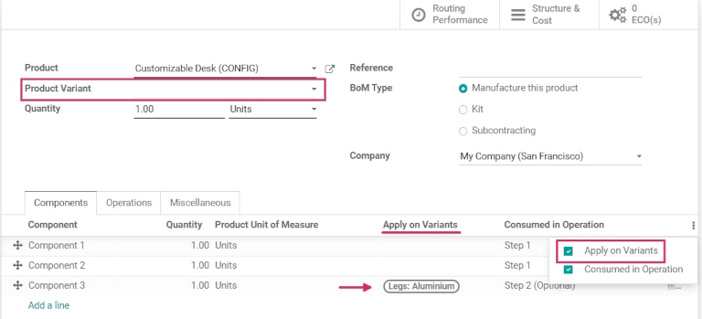
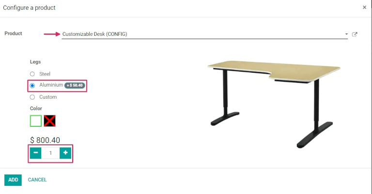
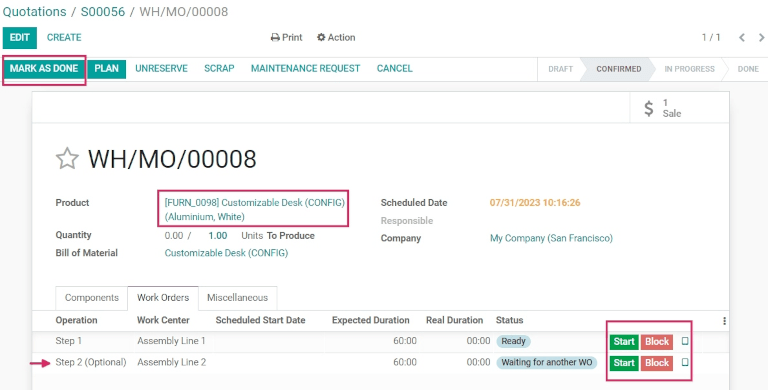

==================================
Managing BoMs for product variants
==================================

Odoo allows one bill of materials (BoM) to be used for multiple variants of the same product. Having
a consolidated :abbr:`BoM (bill of materials)` for a product with variants saves time by preventing
the need to manage multiple :abbr:`BoMs (bills of materials)`.

Activate product variants
=========================

To activate the product variants feature, navigate to :menuselection:`Inventory app -->
Configuration --> Settings`, and scroll down to the :guilabel:`Products` section. Then, click the
checkbox to enable the :guilabel:`Variants` option. After that, click :guilabel:`Save` to apply the
setting.

For more information on configuring product variants, refer to the :doc:`product variants
<../../../sales/sales/products_prices/products/variants>` documentation.

.. image:: product_variants/product-variants-variants-settings.png
   :align: center
   :alt: Selecting "Variants" from Inventory app settings.

Create custom product attributes
================================

Once the product variants feature is activated, create and edit product attributes on the
:guilabel:`Attributes` page.

The :guilabel:`Attributes` page is accessible either from :menuselection:`Inventory app -->
Configuration --> Settings` by clicking the :guilabel:`Attributes` button, or by clicking
:menuselection:`Inventory app --> Configuration --> Attributes`.

Once on the :guilabel:`Attributes` page, either click into an existing attribute, or click
:guilabel:`Create` to create a new one. Clicking :guilabel:`Create` reveals a new, blank form for
customizing an attribute. For an existing attribute, click :guilabel:`Edit` on its form to make
changes.

Assign an :guilabel:`Attribute Name`, and choose a category from the :guilabel:`Category` field's
drop-down menu. Then, select the desired options next to the :guilabel:`Display Type` and
:guilabel:`Variants Creation Mode` fields. Once the desired options are selected, click
:guilabel:`Add a line` under the :guilabel:`Attribute Values` tab to add a new value.

.. tip::
   Included on the :guilabel:`Value` row is a :guilabel:`Is custom value` checkbox. If selected,
   this value will be recognized as a custom value, which allows customers to type special
   customization requests upon ordering a custom variant of a product.

.. example::
   .. image:: product_variants/product-variants-attribute.png
      :align: center
      :alt: Product variant attribute configuration screen.

Once all desired :guilabel:`Values` have been added, click :guilabel:`Save` to save the new
attribute.

Add product variants on the product form
========================================

Created attributes can be applied on specific variants for particular products. To add product
variants to a product, navigate to the product form by going to :menuselection:`Inventory app -->
Products --> Products`. To make changes to the product, click :guilabel:`Edit`. Then, click the
:guilabel:`Variants` tab.

Under the :guilabel:`Attribute` header, click :guilabel:`Add a line` to add a new attribute, and
select one to add from the drop-down menu.

Then, under the :guilabel:`Values` header, click the drop-down menu to choose from the list of
existing values. Click on each desired value to add them, and repeat this process for any additional
attributes that should be added to the product.

Once finished, click :guilabel:`Save` to save changes.

.. image:: product_variants/product-variants-product-form.png
   :align: center
   :alt: Product form variants tab with values and attributes.

.. tip::
   :abbr:`BoM (bill of materials)` products with multiple variants that are manufactured in-house
   should either have a **0,0 reordering rule** set up, or have their replenishment routes set to
   *Replenish on Order (MTO)*.

Apply BoM components to product variants
========================================

Next, create a new :abbr:`BoM (bill of materials)`. Or, edit an existing one, by going to
:menuselection:`Manufacturing app --> Products --> Bills of Materials`. Then, click
:guilabel:`Create` to open a new :guilabel:`Bills of Materials` form to configure from scratch.

Add a product to the :abbr:`BoM (bill of materials)` by clicking the drop-down menu in the
:guilabel:`Product` field and selecting the desired product.

Then, add components by clicking :guilabel:`Add a line` under the :guilabel:`Component` section of
the :guilabel:`Components` tab, and choosing the desired components from the drop-down menu.

Choose the desired values in the :guilabel:`Quantity` and :guilabel:`Product Unit of Measure`
columns. Then, choose the desired values in the :guilabel:`Apply on Variants` column.

.. note::
   The :guilabel:`Apply on Variants` option to assign components to specific product variants on the
   :abbr:`BoM (bill of materials)` is available once the :guilabel:`Variants` setting is activated
   from the :menuselection:`Inventory` application. If the :guilabel:`Apply on Variants` field is
   not immediately visible, activate it from the additional options menu (three-dots icon, to the
   right of the header row).

Each component can be assigned to multiple variants. Components with no variants specified are used
in every variant of the product. The same principle applies when configuring operations and
by-products.

When defining variant :abbr:`BoMs (bills of material)` by component assignment, the
:guilabel:`Product Variant` field in the main section of the :abbr:`BoM (bill of materials)` should
be left blank. This field is *only* used when creating a :abbr:`BoM (bill of materials)`
specifically for one product variant.

When all desired configurations have been made to the :abbr:`BoM (bill of materials)`, click
:guilabel:`Save` at the top of the form to save changes.

.. tip::
   For components that only apply for specific variants, choose which operations the components
   should be consumed in. If the :guilabel:`Consumed in Operation` column is *not* immediately
   visible, activate it from the additional options menu (three-dots icon, to the right of the
   header row).

Sell and manufacture variants of BoM products
=============================================

To sell and manufacture variants of :abbr:`BoM (bill of materials)` products to order, navigate to
:menuselection:`Sales app --> Create` to create a new quotation.

Sell variant of BoM product
---------------------------

Once on the blank :guilabel:`Quotation` form, click the drop-down next to the :guilabel:`Customer`
field to add a customer.

Then, under the :guilabel:`Order Lines` tab, click :guilabel:`Add a product`, and select the
previously-created :abbr:`BoM (bill of materials)` product with variants from the drop-down menu.
Doing so reveals a :guilabel:`Configure a product` pop-up.

From the pop-up window, click the desired attribute options to configure the correct variant of the
product to manufacture. Then, click the green :guilabel:`+` or :guilabel:`-` icons next to the `1`
to change the quantity to sell and manufacture, if desired.

Once all the specifications have been chosen, click :guilabel:`Add`. This will change the pop-up to
a second :guilabel:`Configure` pop-up, where available optional products will appear, if they have
been created previously.

Once ready, click :guilabel:`Confirm` to close the pop-up.

Then, click :guilabel:`Save` to save all changes, and click :guilabel:`Confirm` at the top of the
:guilabel:`Quotation` form to create and confirm a new sales order (SO).

Manufacture variant of BoM product
----------------------------------

Once the :abbr:`SO (sales order)` is confirmed, a :guilabel:`Manufacturing` smart button appears at
the top of the :abbr:`SO (sales order)` form. Click the :guilabel:`Manufacturing` smart button to
open the :guilabel:`Manufacturing Order` form.

On this form, under the :guilabel:`Components` tab, the appropriate components for the chosen
variant are listed. And, depending on the variant, different components will be listed. To see any
mandatory or optional :guilabel:`Operation` steps, click the :guilabel:`Work Orders` tab.

To enter the tablet view work order screen, click the :guilabel:`tablet icon` to the right of the
row for the desired operation to be completed.

From the tablet view, click :guilabel:`Mark as Done` as the operation progresses to complete the
operation steps.

Alternatively, click the :guilabel:`Mark as Done` button at the top of the manufacturing order form
to complete the order.

Then, navigate back to the :abbr:`SO (sales order)` via the breadcrumbs at the top of the page.

Now that the product has been manufactured, click the :guilabel:`Delivery` smart button to deliver
the product to the customer. From the :guilabel:`Delivery Order` form, click :guilabel:`Validate`,
then click :guilabel:`Apply` to deliver the product.

To finish the sale, click back to the :abbr:`SO (sales order)` via the :guilabel:`breadcrumbs` at
the top of the page again. Then, click :guilabel:`Create Invoice` followed by :guilabel:`Create
Invoice` again to invoice the customer for the order.
