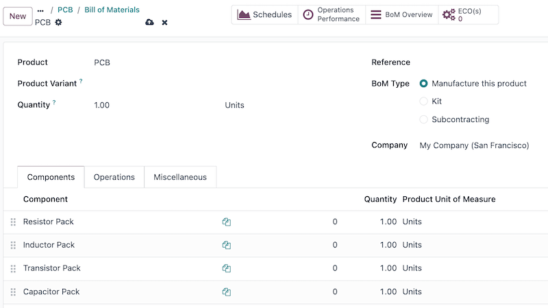
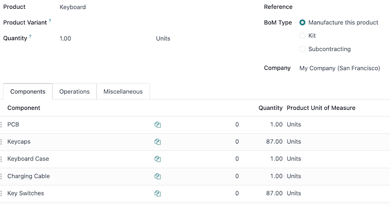

===============
Multilevel BoMs
===============

.. |BOM| replace:: :abbr:`BoM (Bill of Materials)`
.. |BOMs| replace:: :abbr:`BoMs (Bills of Materials)`
.. |MO| replace:: :abbr:`MO (Manufacturing Order)`

Use a multilevel bill of materials (BoM) when a manufactured product is part of another assembly.
This method nests |BOMs| within other |BOMs|, organizing complex products while simplifying
manufacturing by defining each procurement and production step separately.

Sublevel |BOMs| (subassemblies or semifinished products) streamline these production workflows, and
are beneficial when the subassembly is used across multiple finished products (meaning they'd appear
on multiple top-level |BOMs|). The more complicated a product is to build or procure, the more value
a multilevel |BOM| can provide. Because of this, component and subassembly replenishment planning is
vital to ensuring multilevel |BOMs| run smoothly.

Why replenishment planning is important
=======================================

:doc:`Replenishment <../../inventory/warehouses_storage/replenishment>` is critical for multilevel
BoMs to prevent bottlenecks, manage lead times, and optimize inventory. Without it, missing
components can halt production, delay orders, and increase costs. A well-planned replenishment
strategy ensures :doc:`just-in-time availability
<../../inventory/warehouses_storage/replenishment/reordering_rules>`, :doc:`automates procurement
<../../inventory/warehouses_storage/replenishment/reordering_rules>`, balances stock levels, and
keeps supply chains efficient. This minimizes delays, reduces manual effort, and ensures smooth
manufacturing.

Manufacturing orders (MO)s that come from a |BOM| require all components to be available before the
|MO| can be completed. The :guilabel:`Component Status` for that |MO| provides this information.
Learn how to :doc:`check an MO's component status <../basic_setup/bill_configuration>`.

.. _manufactuing/advanced/create-multilevel-bom:

Create a multilevel BoM
=======================

To set up a multilevel |BOM|, the top-level product and sublevel products's |BOMs| must be created.
If starting from scratch, build the |BOMs| from the bottom up. Start with the lowest-level product
|BOMs|, then include those products as components in higher-level |BOMs|.

.. example::
   A printed circuit board (PCB) for a custom keyboard is composed of hundreds of electronic
   components, such as transistors, resistors, and capacitors. Instead of listing all of those
   components out, a sublevel product and |BOM| for a `PCB` is created, to track the quantities of
   transistors and other small components, without needing to overcrowd the top-level |BOM| for the
   custom keyboard by listing them. Instead, the custom keyboard's |BOM| consists of an assortment
   of components and sublevel |BOMs| alike, like key caps, switches, the PCB, and keyboard plate.

:doc:`Learn how to build a simple bill of materials <../basic_setup/bill_configuration>`. For the
PCB, this would include the transistors, resistors, and other components.

After the sublevel products (like the PCB, key caps, and keyboard plate) are fully configured,
create the top-level product by navigating to :menuselection:`Manufacturing app --> Products -->
Products`, and then selecting :guilabel:`New`. From here, configure the product's specifications as
needed.

Once the top-level product (the keyboard) is configured, click the :guilabel:`Bill of Materials`
smart button on the product form, and then select :guilabel:`New` to make a |BOM| for the top-level
product. Add the sublevel products to this |BOM|, along with any other necessary components.

Manage production planning
==========================

The two options below are two of the best ways to manage manufacturing order automation for products
with multilevel |BOMs|.

.. note::
   Complex |BOMs| are specifically used to manage products that require manufactured components. If
   a BoM is being created to organize components or bundle sellable products, :doc:`use a kit
   <kit_shipping>` instead.

To automatically trigger manufacturing orders for sublevel products after confirming a manufacturing
order for the main product, there are two options:

- **Option 1 (recommended):** Create *Reordering Rules* for the sublevel products and set both the
  minimum and maximum needed stock quantities to `0`.
- **Option 2:** Activate the :guilabel:`Replenish on Order (MTO)` and :guilabel:`Manufacture` routes
  under the :guilabel:`Inventory` tab of the sublevel product's product form.

.. seealso::
   - :doc:`../../inventory/warehouses_storage/replenishment/reordering_rules`
   - :doc:`../../inventory/warehouses_storage/replenishment/mto`

Option 1 is more flexible than Option 2 and is recommended. Reordering rules do not directly link
demand to replenishment, allowing stock to be unreserved and reassigned as needed. The Replenish on
Order (MTO) route, however, uniquely links sublevel and top-level products, reserving quantities for
the confirmed top-level manufacturing order.

In both methods, sublevel products must be fully manufactured before starting the top-level product.

Multilevel BoM setup flow
=========================

The following section details how to set up multilevel BoMs, set the initial inventory, establish a
:ref:`0/0/1 reordering rule <manufacturing/advanced/procurement-method>` (the recommended production
plan), configure lead times, and set up production options.

Creating a 0/0/1 reordering rule for the sublevel products (minimum stock set at zero, maximum stock
set at zero, reorder one automatically) regardless of whether they are a component or subassembly is
the recommended approach for managing a multilevel |BOM|. This setup uses the **Inventory**,
**Manufacturing**, and **Purchase** apps.

.. important::
   This is only one example of how to set up a multilevel |BOM| in Odoo. Consider any unique
   circumstances that need to be addressed during the configuration, and make sure they are included
   in the setup. If any specific help is needed during setup, consider purchasing a `success pack
   <https://www.odoo.com/pricing-packs>`_.

Create the BoMs
---------------

Follow the steps in the :ref:`Create a multilevel BoM <manufactuing/advanced/create-multilevel-bom>`
section to build the |BOMs|.

Make sure to build the multilevel |BOM| from the bottom up. Start by creating the lowest-level
component products in Odoo, then the subassembly products that those are used for, then the |BOM|
for that subassembly, and repeat until every level of the multilevel |BOM| is created.

Set the initial inventory
-------------------------

.. note::
   If there's no initial inventory to configure, then skip this section and begin configuring the
   procurement method for the multilevel |BOM|.

Update the quantity on hand for each of the products configured in the prior step (both components,
subassemblies, and the final product). To do this, open the **Inventory** app, and then find the
products with filters, the search bar, or scrolling, and then click on them to open their product
form. From here, click the :guilabel:`On Hand` smart button, :doc:`select the variant
<../../../sales/sales/products_prices/products/variants>` if that was configured, and then enter the
quantity on hand.

.. seealso::
   :doc:`../../inventory/warehouses_storage/inventory_management/count_products`

.. _manufacturing/advanced/procurement-method:

Configure the procurement method
--------------------------------

Now it is time to pick the procurement method this multilevel |BOM| uses. The two options below are
preferred, but unique circumstances may lead to another procurement method making more sense.

- **Option 1 (recommended):** Create *Reordering Rules* for the sublevel products and set both the
  minimum and maximum needed stock quantities to `0`.
- **Option 2:** Activate the :guilabel:`Replenish on Order (MTO)` and :guilabel:`Manufacture` routes
  under the :guilabel:`Inventory` tab of the sublevel product's product form.

.. seealso::
   - :doc:`../../inventory/warehouses_storage/replenishment/reordering_rules`
   - :doc:`../../inventory/warehouses_storage/replenishment/mto`

Reordering rules are recommended because they do not tie the manufactured product to a specific
sales order, allowing that manufactured product to fulfill a different sales order if the original
gets cancelled.

Making the product to order is not recommended because the manufactured product cannot be used to
fulfill another sales order. However, this could be helpful if strict tracking is necessary for the
business.

Enter vendor and manufacturing lead times
-----------------------------------------

Vendor and manufacturing lead times are used by Odoo to coordinate production and procurement
actions to fulfill orders on time. Set vendor lead times for components that are purchased. These
can appear at any level in a multilevel |BOM| except the final product. Set manufacturing lead times
for products that are built using a |BOM|. These can appear at any level in a multilevel |BOM|
except the lowest level (when individual components are procured).

.. seealso::
   :doc:`../../inventory/warehouses_storage/replenishment/lead_times`

Build out operations to handle the production flow
--------------------------------------------------

First, determine the current manufacturing flow for the business, then match the corresponding Odoo
setup. The list below are only some of the configuration pieces that could be involved in this step.

- **Manufacturing Steps**: Consider how many manufacturing steps are taken (one-, two-, or
  three-step manufacturing).
- **Work Centers**: Decide if any :doc:`work centers <using_work_centers>` need to be configured.
- **Master Production Schedule**: If manually planned manufacturing orders are needed (e.g., to
  handle seasonal demand), make a :doc:`master production schedule <../workflows/use_mps>` (MPS).

.. tip::
   Manufacturing operations is an art and a science, so configuring an established flow into Odoo is
   the recommended approach for this step. Read more about :doc:`manufacturing in Odoo
   <../../manufacturing>`

Configuration summary
---------------------

At the end of this process, the multilevel |BOM| is configured, and the top-level product has its
inventory counts, procurement method set, procurement lead times, and manufacturing operations
configured. From here, sales orders can include the top-level product, automatic procurement through
vendors or manufacturing can begin, the top-level product can be included in an **eCommerce** store.

.. seealso::
   - :doc:`../../../sales/sales/sales_quotations/create_quotations`
   - :doc:`../../../websites/ecommerce/products/catalog`
