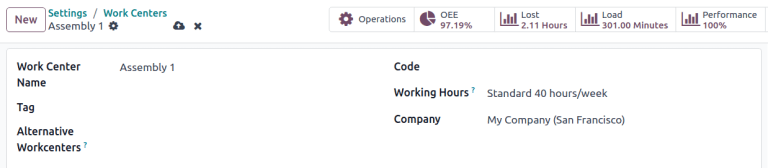
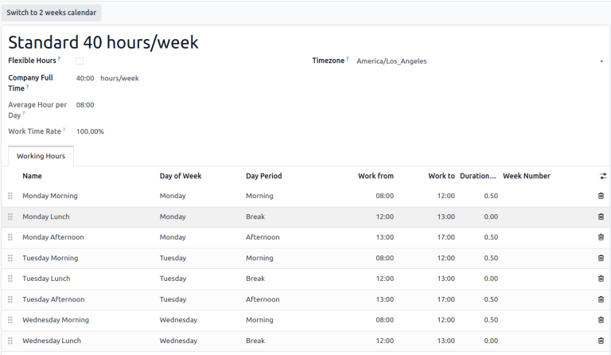
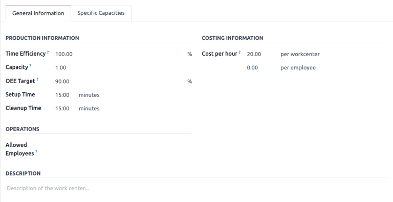
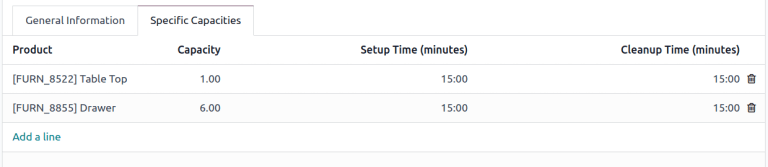
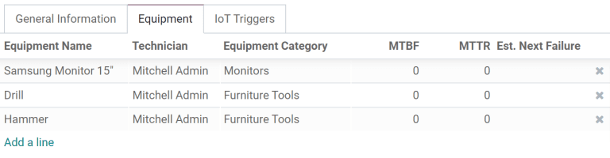
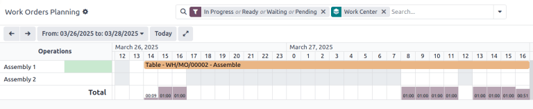

============
Work centers
============

*Work centers* are where **Manufacturing** work orders are processed, and can be used to track
costs, make schedules, plan capacity, organize equipment, and track efficiency. Specifying a work
center is required when a work order is defined in the *Operations* tab of a bill of materials (BoM)
for a product.

.. important::
   Work centers only appear if the :guilabel:`Work Orders` setting is enabled. To do so, navigate to
   :menuselection:`Manufacturing app --> Configuration --> Settings`, then tick the :guilabel:`Work
   Orders` checkbox. Work orders can be managed in the :guilabel:`Manufacturing` app by selecting
   :menuselection:`Operations --> Work Orders`.

.. seealso::
   :doc:`../basic_setup/bill_configuration`

Work center configuration
=========================

.. _manufacturing/management/using_work_centers/wc-setup:

Create a new work center
------------------------

In the **Manufacturing** app, select :menuselection:`Configuration --> Work Centers` and click the
:guilabel:`New` button to open a new work center form.

- :guilabel:`Work Center Name`: the label for the work center used to select it on a work order or
  on the reporting dashboards
- :guilabel:`Tag`: reusable labels that can be used to sort work centers in list view
- :guilabel:`Alternative Workcenters`: where a work order should be carried out if this work center
  is not available
- :guilabel:`Code`: reference id for the work center that is displayed in the list view
- :guilabel:`Working Hours`: the hours that work center can be used during the week

.. _manufacturing/management/using_work_centers/working-hours:

Working hours
~~~~~~~~~~~~~

*Working hours* define when a work center should operate, based on a one- or two-week schedule.
These hours also form the basis for calculating *overall equipment efficiency* (OEE).

.. note::
   By default, Odoo uses the `Standard 40 hours/week` working hours, which expects work centers to
   operate between 8:00 AM and 5:00 PM on Monday through Friday.

To change the working hours, hover over the current :guilabel:`Working Hours` value and click the
:icon:`fa-arrow-right` (:guilabel:`Internal link`) icon to open the working hours form.

To create a new set of working hours, click the :guilabel:`New` button and give it a name. From
here, edit any :guilabel:`Work from` or :guilabel:`Work to` value to adjust the time range. Remove a
line by clicking click the :icon:`fa-trash-o` :guilabel:`(trash)` icon. To create a new time range,
click :guilabel:`Add a line` at the bottom of the list.

.. seealso::
   - :doc:`../reporting/oee`
   - :doc:`../workflows/work_center_time_off`

Set productivity standards and allowed employees
------------------------------------------------

The :guilabel:`General Information` tab on the work center form allows for productivity goals to be
assigned to a work center. These are used as the basis for calculating how much of the potential
time the work center is being used and its operating costs.

- :guilabel:`Time Efficiency`: a multiplier for how using this work center affects the normal speed
  of execution of a work order

  .. example::
     If a work center has older equipment and work orders take twice as long to produce, the `Time
     Efficiency` would be `50.00%`.

- :guilabel:`Capacity`: the number of products that can be processed at the work center
  simultaneously

- :guilabel:`OEE Target`: the target for efficiency at the work center

  .. example::
     If a work center is available for `8 hours per day` but is only expected to be used for `7
     hours per day`, the OEE would be `87.50%`. :math:`7/8*100=87.5`

  .. seealso::
     :doc:`../reporting/oee`

- :guilabel:`Setup Time`: the time required before work can commence on a work order
- :guilabel:`Cleanup Time`: breakdown or cleanup time required after a work order is finished
- :guilabel:`Cost per hour`: the operating expense of that workstation. The :guilabel:`per employee`
  value is for estimating the average cost per employee.

   .. seealso::
      :doc:`../basic_setup/mo_costs`

- :guilabel:`Allowed Employees`: the employees who can perform work at the work center. If blank,
  all employees are allowed.

   .. example::
      If equipment at a work center requires a certification to operate, :guilabel:`Allowed
      Employees` could list only those employees who have the certification.

Set production capacities
-------------------------

The :guilabel:`Capacity` setting on a work center creates a default value for how many units can be
produced at one time in a work center. To specify that a work center can produce different
quantities of different products, select the :guilabel:`Specific Capacities` tab.

.. tip::
   To specify production capacities in different measurements from a count of units, enable the
   *Units of Measure* feature in the **Inventory** app.

.. seealso::
   :doc:`../../maintenance/add_new_equipment`

.. _workcenter_iot:

Integrate IoT devices
---------------------

The :guilabel:`IoT Triggers` tab enables the integration of :abbr:`IoT (Internet of Things)` devices
with a work center:

- :guilabel:`Device`: specifies the IoT device to be triggered
- :guilabel:`Key`: the security key for the device
- :guilabel:`Action`: the IoT device action triggered

.. image:: using_work_centers/work-center-iot.png
   :alt: The IoT Triggers tab of the work center form.

Assigning equipment to work centers
===================================

The **Maintenance** app makes it possible to add specific equipment to a work center and
individually track its costs and productivity. It also adds the :guilabel:`Equipment` and
:guilabel:`Maintenance` tabs to the work center form, used to list equipment and schedule
maintenance activities.

.. seealso::
   :doc:`../../maintenance/add_new_equipment`

Configure equipment
-------------------

Using the :guilabel:`Equipment` tab, it is possible for specific pieces of equipment to be assigned
to a work center. The following information is displayed for each piece of equipment added:

- :guilabel:`Equipment Name`: the name of the piece of equipment
- :guilabel:`Technician`: the technician responsible for servicing the equipment
- :guilabel:`Equipment Category`: the category the equipment belongs to
- :guilabel:`MTBF`: mean time between failures; the average time that the piece of equipment will
  operate before failing
- :guilabel:`MTTR`: mean time to recovery; the average time it takes for the equipment to become
  fully operational again
- :guilabel:`Est. Next Failure`: an estimate of when the next equipment failure will occur

.. note::
    :guilabel:`MTBF`, :guilabel:`MTTR`, and :guilabel:`Est. Next Failure` are all calculated
    automatically based on past failure data, if any exists.

Work center planning
====================

The currently scheduled work orders can be viewed by accessing :menuselection:`Manufacturing app -->
Planning --> Planning by Workcenter`.

Different views show how many individual work orders are scheduled, how many minutes of each hour
the work center is in production, and the dates and times that are currently scheduled for work
orders. Times and planned work centers can be changed by clicking to access the individual work
order.

Work center performance
=======================

Performance for an individual work center can be viewed by selecting :menuselection:`Configuration
--> Work Centers`, and clicking on a work center. Metrics are displayed in smart buttons at the top
of the form.

- :guilabel:`OEE`: overall equipment effectiveness, the percentage of time that the work center has
  been productive out of its available work hours.

   .. seealso::
      - :doc:`../reporting/oee`

- :guilabel:`Lost`: the amount of time lost due to work stoppages
- :guilabel:`Load`: the amount of time it will take to complete the current workload
- :guilabel:`Performance`: the real duration of work time, shown as a percentage of the expected
  duration

Use case: measuring performance by shift using work centers
===========================================================

Work centers support defined working hours, enabling the tracking of production efficiency by shift.
To configure shift-based tracking, create working hours for each of the shifts, then duplicate
versions of each work center for each of the shifts. With this setup, comparing shift productivity
can be done with any of the available :doc:`reporting <../../../essentials/reporting>` tools.

Working hours for multiple shifts
---------------------------------

To create working hours for multiple shifts, open a work center form and in the :guilabel:`Working
Hours` field click the :icon:`fa-arrow-right` (:guilabel:`Internal link`), and then click the
:guilabel:`New` button to create a new set of hours for the second shift.

.. example::
   A manufacturer has two shifts: a day shift from 5 AM to 1 PM and a night shift from 1 PM to 9 PM.
   Starting from any existing work center, edit the existing working hours to match the day shift.

   .. image:: using_work_centers/example-shift-day.png
      :alt: The working hours for a day shift

   Once the day shift is saved, click the :icon:`fa-cog` :guilabel:`(cog)` icon and select
   :guilabel:`Duplicate`. Rename this new schedule `Night Shift` and change each :guilabel:`Work
   from` to 1 PM and :guilabel:`Work from` to 9 PM.

   .. image:: using_work_centers/example-shift-night.png
      :alt: The working hours for a night shift

Work centers for multiple shifts
--------------------------------

To create the duplicate work centers, return to the work center view by navigating to
:menuselection:`Configuration --> Work Centers` and duplicating each of the work centers that are
used by both shifts, either on the individual work center forms, or directly from the list view.

.. tip::
   To duplicate work centers directly from the list view, click the :icon:`fa-check-square-o`
   :guilabel:`(checkbox)` that appears above the list items to select all. Then, click the
   :icon:`fa-cog` :guilabel:`Actions` button at the top of the list and select
   :guilabel:`Duplicate`.

.. example::
   A manufacturer has two work centers, `Assembly Line 1` and `Assembly Line 2`, and two working
   hours, `Day Shift` and `Night Shift`.

   .. image:: using_work_centers/work-centers-with-shifts.png
      :alt: Work centers copied for day and night shifts.

  To create versions of `Assembly Line 1` and `Assembly Line 2` for each shift, duplicate each of
  the work centers. Select the first work center and add the shift name in that work center's name
  and assign it the appropriate working hours. Optionally, configure each work center to use its
  opposite shift counterpart as an alternate work center to make sure that manufacturing orders get
  assigned to both. Tags can also help make a visual distinction between each shift.

   .. tip::
      Use the :icon:`oi-chevron-left`
      :guilabel:`(left arrow)` and :icon:`oi-chevron-right` :guilabel:`(right arrow)` buttons in the
      top left corner to move on to the next form in the list without returning to the list view.

Reports comparing different shifts
----------------------------------

With multiple work centers created to represent shifts, reports that sort by work center will now
compare shifts. This can be used to compare the number of work orders that are being assigned each
shift, the OEE, or actual time that each shift is taking to produce a product.

.. example::
   A report has been created to compare the time efficiency of two shifts producing the same product
   in the same work center.

   .. image:: using_work_centers/work-order-duration-deviation.png
      :alt: A bar graph of two work centers with duration deviations of -6.50 and 15.00

   To create this report, go to :menuselection:`Reporting --> Work Orders` and click to remove the
   :icon:`fa-filter` **Ready** *or* **Waiting** *or* **Pending** *or* **In Progress** filter by
   clicking the :icon:`fa-x` :guilabel:`Remove` icon on its right side. Next, click the
   :guilabel:`Measures` button and select :guilabel:`Duration Deviation (%)`

   In this case, the day shift has on average taken more than the expected time to produce products
   (-6.50%) while the night shift took less than the expected time (15.00%).

