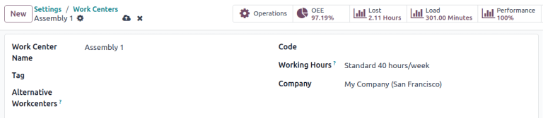
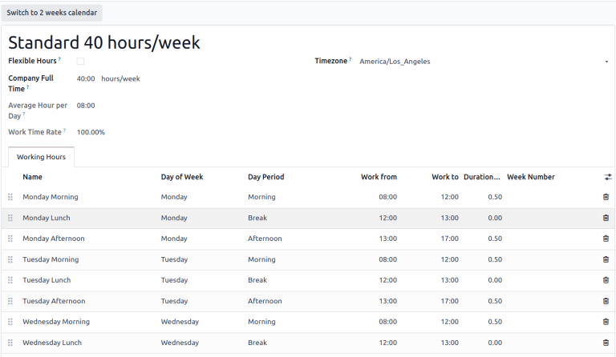
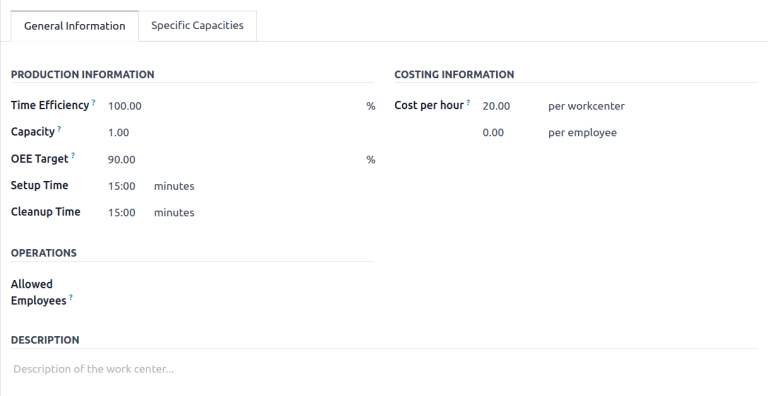
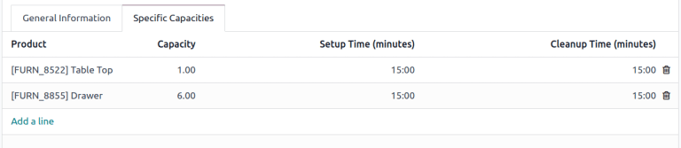
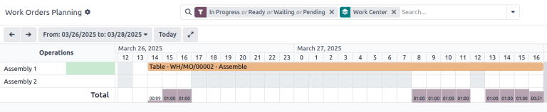

============
Work centers
============

*Work centers* are where **Manufacturing** work orders are processed, and can be used to track
costs, make schedules, plan capacity, organize equipment, and track efficiency. Specifying a work
center is required when a work order is defined in the :guilabel:`Operations` tab of a bill of
materials (BoM) for a product.

.. important::
   Work centers only appear if the :guilabel:`Work Orders` setting is enabled. To do so, navigate to
   :menuselection:`Manufacturing app --> Configuration --> Settings`, then tick the :guilabel:`Work
   Orders` checkbox.

Work orders can be managed in the :guilabel:`Manufacturing` app by selecting
:menuselection:`Operations --> Work Orders`.

.. seealso::
   - :doc:`../basic_setup/bill_configuration`

Work center configuration
=========================

Create a new work center
------------------------

In the **Manufacturing** app, select :menuselection:`Configuration --> Work Centers` and click the
:guilabel:`New` button to open a new work center form.

- :guilabel:`Work Center Name`: the label for the work center used to select it on a work order or
     on the reporting pages
- :guilabel:`Tag`: reusable labels that can be used to sort work centers in the list view
- :guilabel:`Alternative Workcenters`: where a work order should be carried out of the primary work
     center is not available
- :guilabel:`Code`: reference id for the work center that is displayed in the list view
- :guilabel:`Working Hours`: the hours that work center can be used during the week

.. _manufacturing/management/using_work_centers/wc-setup:

Configure working hours
~~~~~~~~~~~~~~~~~~~~~~~

*Working hours* define when a work station should be operational on a one- or two-week basis and are
the basis of calculating the *overall equipment efficiency (OEE)*.

.. note::
   By default, Odoo uses the `Standard 40 hours/week` working hours, which expects work centers to
   operate between 8:00 AM and 5:00 PM on Monday through Friday.

To change working hours for a work station, hover over the :guilabel:`Working Hours` currently set
hours and click the :icon:`fa-arrow-right` (:guilabel:`Internal link`) icon to access the working
hours form.

Click the :guilabel:`New` button to create a new set of working hours and specify a name. From here,
change any :guilabel:`Work from` or :guilabel:`Work to` value to edit the time range, and remove a
line by clicking click the :icon:`fa-trash-o` :guilabel:`(trash)` icon. To create a new time range,
click :guilabel:`Add a line` and the bottom of the list.

.. seealso::
   - :doc:`../reporting/oee`
   - :doc:`../workflows/work_center_time_off`

Set productivity standards and allowed employees
------------------------------------------------

The :guilabel:`General Information` tab on the work center form allows for productivity goals to be
assigned to a work center. These are used as the basis for calculating how much of the potential
time the work center is being used and its operating costs.

- :guilabel:`Time Efficiency`: a multiplier for how using this work station affects the normal speed
     of execution of a work order

  .. example::
    If a work center has older equipment and work orders take twice as long to produce, the `Time
    Efficiency` would be `50.00%`.

- :guilabel:`Capacity`: the number of products that can be processed at the work center
     simultaneously
- :guilabel:`OEE Target`: the target for efficiency at the work center

  .. example::
    If a work center is available for `8 hours per day` but is only expected to be used for `7 hours
    per day`, the OEE would be `87.50%`. :math:`7/8*100=87.5`

  .. seealso::
    :doc:`../reporting/oee`

- :guilabel:`Setup Time`: the time required before work can commence on a work order
- :guilabel:`Cleanup Time`: breakdown or cleanup time required after a work order is finished
- :guilabel:`Cost per hour`: the operating expense of that workstation. The :guilabel:`per employee`
     value is for estimating the average cost per employee.

  .. seealso::
    - :doc:`../basic_setup/mo_costs`

- :guilabel:`Allowed Employees`: the employees who can perform work at the work station. If blank
     all employees are allowed.

  .. example::
    If equipment at a work center requires a certification to operate, :guilabel:`Allowed Employees`
    could list only those employees who have the certification.

Set production capacities
-------------------------

The :guilabel:`Capacity` setting on a work center creates a default value for how many units can be
produced at one time in a work station. To specify that a work center can produce different
quantities of different products, select the :guilabel:`Specific Capacities` tab.

.. tip::
  To specify production capacities in different measurements from a count of units, enable the
  *Units of Measure* feature in the **Inventory** app.

.. seealso::
   :doc:`../../maintenance/add_new_equipment`

Assigning equipment to work centers
===================================

The **Maintenance** app makes it possible to add specific equipment to a work station and individual
track its costs and productivity. Adding **Maintenance** will add :guilabel:`Equipment` and
:guilabel:`Maintenance` tabs to the work center form, which can be used to list equipment and plan
maintenance for it.

.. seealso::
   - :doc:`../../maintenance/add_new_equipment`

Work center planning
====================

The currently scheduled work orders can be viewed by accessing :menuselection:`Manufacturing app -->
Planning --> Planning by Workcenter`.

Different views show how many individual work orders are scheduled, how many minutes of each hour
the work center is in production, and the dates and times that are currently scheduled for work
orders. Times and planned work centers can be changed by clicking to access the individual work
order.

Work center performance
=======================

Performance for an individual work center can be viewed by selecting :menuselection:`Configuration
--> Work Centers`, and clicking on a work center. Metrics are displayed in smart buttons at the top
of the form.

- :guilabel:`OEE`: overall equipment effectiveness, the percentage of time that the work center has
     been productive out of its available work hours.

  .. seealso::
    - :doc:`../reporting/oee`

- :guilabel:`Lost`: the amount of time lost due to work stoppages
- :guilabel:`Load`: the amount of time it will take to complete the current workload
- :guilabel:`Performance`: the real duration of work time, shown as a percentage of the expected
     duration

Use case: measuring performance by shift using work centers
===========================================================

Because work centers have working hours, it is possible to track production efficiency by shift. To
configure this, open a work center form by going to :menuselection:`Configuration --> Work Centers`
and selecting a work center. In the :guilabel:`Working Hours` field click the :icon:`fa-arrow-right`
(:guilabel:`Internal link`) icon to edit the working hours, then click the :guilabel:`New` button to
create a new set of hours for the second shift.

To create the duplicate work centers, return to the work center view by clicking
:menuselection:`Configuration --> Work Centers`.

.. example::
  In this example a manufacturer has two shifts: a day shift from 5 AM to 1 PM and a night shift
  from 1 PM to 9 PM. Starting from any exist work center, the click the :icon:`fa-arrow-right`
  (:guilabel:`Internal link`) in the :guilabel:`Working Hours` field to edit the existing working
  hours to match the day shift. Repeatedly clicking the first :icon:`fa-trash-o` :guilabel:`(trash)`
  icon clears out all the existing time fields, and each day's schedule is added using the
  :guilabel:`Add a line` button.

  .. image:: using_work_centers/example-shift-day.png
    :alt: The working hours for a day shift

  Once the day shift is saved, click the :icon:`fa-cog` :guilabel:`(cog)` icon and select
  :guilabel:`Duplicate`. Rename this new schedule `Night Shift` and change each :guilabel:`Work
  from` to 1 PM and :guilabel:`Work from` to 9 PM.

  .. image:: using_work_centers/example-shift-night.png
    :alt: The working hours for a night shift

Work centers can be duplicated directly from the work center list view. Go to
:menuselection:`Configuration --> Work Centers` and in the list click the :icon:`fa-check-square-o`
:guilabel:`(checkbox)` that appears above the list items to select every work center in the list.
Click the :icon:`fa-cog` :guilabel:`Actions` button at the top of the list and select
:guilabel:`Duplicate`. Select any of the newly created work centers to edit them from the form view.

.. example::
  In this example, the manufacturer has two work centers, `Assembly Line 1` and `Assembly Line 2`,
  and two working hours, `Day Shift` and `Night Shift`.

  .. image:: using_work_centers/work-centers-with-shifts.png
    :alt: Work centers copied for day and night shifts.

  To set this up, open the work centers list through :menuselection:`Configuration --> Work Centers`
  and select all the work centers with the :icon:`fa-check-square-o` :guilabel:`(checkbox)` at the
  top of the list. Press the :icon:`fa-cog` :guilabel:`Actions` button and select
  :guilabel:`Duplicate` to create copies of every work station. Click the first work station on the
  list to go to the work station form, and change its name to include "Day Shift" and confirm that
  it has :guilabel:`Working Hours` set to the day shift hours. In the  :guilabel:`Alternative
  Workcenters` field, set the work center's duplicate (currently, `Assembly Line 1 (copy)`) so that
  work orders will continue to be distributed across the shifts. Repeat this for each of the
  original work centers. For duplicated work centers that have `(copy)` in the name, change the name
  to include to include `Night Shift`, set the :guilabel:`Working Hours` to the night shift hours,
  and set the :guilabel:`Alternative Workcenters` to its day shift counterpart. Optionally, add `Day
  Shift` and `Night Shift` tags to teach of the work centers to make them more visible in list /home/odoo/stul/github/odoo/documentation/content/applications/inventory_and_mrp/manufacturing/advanced_configuration/using_work_centers.rstview.

  .. tip::
    When editing multiple work stations from their forms, you can use the :icon:`oi-chevron-left`
    :guilabel:`(left arrow)` and :icon:`oi-chevron-right` :guilabel:`(right arrow)` buttons in the
    top left corner to move on to the next form in the list without needing to to return to the list
    view.

With multiple work centers created to represent shifts, reports that sort by work center will now
compare shifts. This can be used to compare the number of work orders that are being assigned each
shift, the OEE, or actual time that each shift is taking to produce a product.

.. example::
  In this example, a report has been created to compare the time efficiency of two shifts producing
  the same product in the same work center.

   .. image:: using_work_centers/work-order-duration-deviation.png
    :alt: A bar graph of two work centers with duration deviations of -6.50 and 15.00

  To create this report, go to :menuselection:`Reporting --> Work Orders` and click to remove the
  :icon:`fa-filter` **Ready** *or* **Waiting** *or* **Pending** *or* **In Progress** filter by
  clicking the :icon:`fa-x` :guilabel:`Remove` icon on its right side. Next, click the
  :guilabel:`Measures` button and select :guilabel:`Duration Deviation (%)`

  In this case, the day shift has on average taken more than the expected time to produce products
  (-6.50%) while the night shift took less than the expected time (15.00%)
