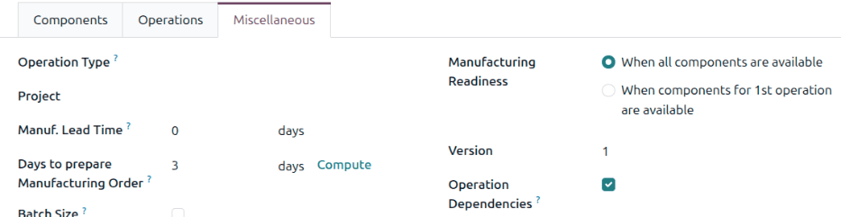
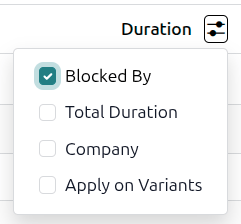
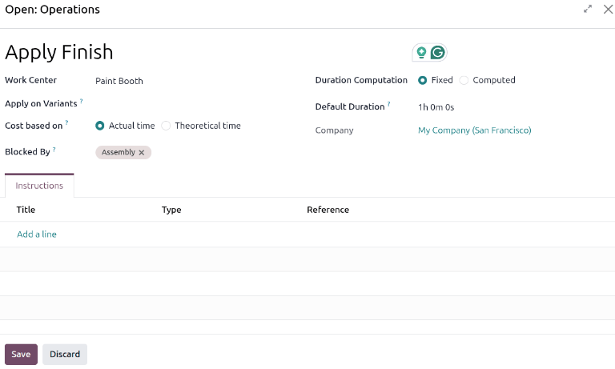
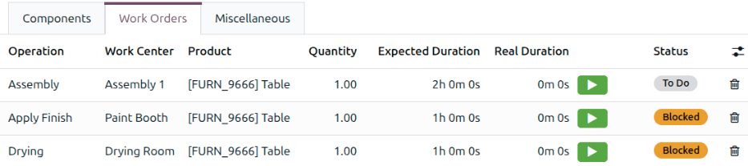
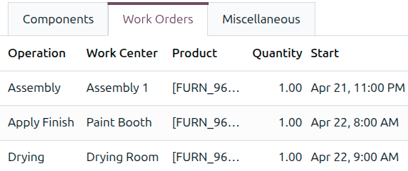
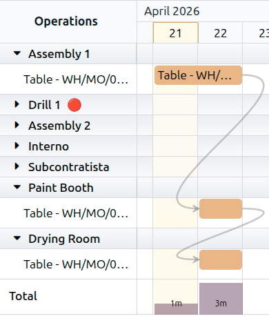
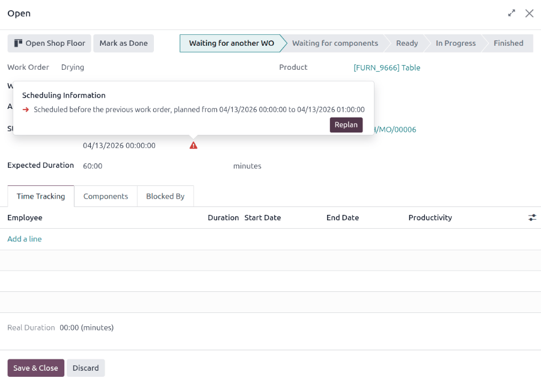
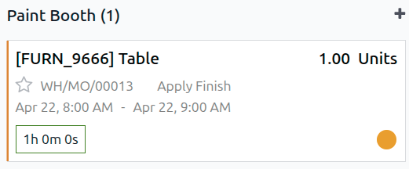

=======================
Work order dependencies
=======================

.. |BOM| replace:: :abbr:`BoM (Bill of Materials)`

When manufacturing certain products, specific operations may need to be completed before others can
begin. To ensure operations are carried out in the correct order, the **Manufacturing** app features
a *work order dependencies* setting. Enabling this setting allows for operations on a bill of
materials (BoM) to be blocked by other operations that should occur first.

Configuration
=============

The *work order dependencies* setting is not enabled by default. To enable it, navigate to
:menuselection:`Manufacturing app --> Configuration --> Settings`. Then, enable the
:guilabel:`Work Orders` setting if it is not already active.

After enabling the :guilabel:`Work Orders` setting, the :guilabel:`Custom Work Order Dependencies`
option appears below it. Enable :guilabel:`Custom Work Order Dependencies`, then click
:guilabel:`Save` to confirm the changes.

Add dependencies to BoM
=======================

Work order dependencies are configured on a product's |BOM|. To do so, navigate to
:menuselection:`Manufacturing app --> Products --> Bills of Materials`, then select a |BOM|, or
create a new one by clicking :guilabel:`New`.

On the |BOM|, open the *Miscellaneous* tab, then enable the :guilabel:`Operation Dependencies`
checkbox. The :guilabel:`Blocked By` option becomes available under the :icon:`oi-settings-adjust`
:guilabel:`(settings)` menu of the *Operations* tab.

Open the *Operations* tab. Click the :icon:`oi-settings-adjust` :guilabel:`(settings)` icon, then
enable the :guilabel:`Blocked By` checkbox. The :guilabel:`Blocked By` field appears for each
operation in the tab.

In the line of the operation that should be blocked by another operation, click the
:guilabel:`Blocked By` field. The *Open: Operations* pop-up window opens. In the :guilabel:`Blocked
By` field, select the blocking operation that must be completed *before* the operation that is
blocked. Click :guilabel:`Save` to save the changes to the work order.

Finally, save the |BOM| by clicking :icon:`fa-cloud-upload` :guilabel:`(Save manually)`.

.. seealso::
   :doc:`../basic_setup/bill_configuration`

Plan work orders using dependencies
===================================

After work order dependencies are configured for a |BOM|, the **Manufacturing** app can plan when
work orders are scheduled based on those dependencies.

From a manufacturing order
--------------------------

To plan the work orders for a manufacturing order, navigate to :menuselection:`Manufacturing app -->
Operations --> Manufacturing Orders`.

Next, select a manufacturing order for a product with work order dependencies set on its |BOM|, or
create a new manufacturing order by clicking :guilabel:`New`. If a new manufacturing order is
created, select a |BOM| configured with work order dependencies from the :guilabel:`Bill of
Material` drop-down field, then click :guilabel:`Confirm`.

After confirming the manufacturing order, open the *Work Orders* tab to view the work orders
required to complete it. Any work orders that are *not* blocked by a different work order display a
:guilabel:`To Do` tag in the :guilabel:`Status` column.

Work orders that are blocked by other work orders display a :guilabel:`Blocked` tag instead. After
the blocking work orders are completed, the tag updates to :guilabel:`To Do`.

To schedule the manufacturing order's work orders, click the :guilabel:`Plan` button at the top of
the page. After doing so, the :guilabel:`Start` field for each work order on the *Work Orders* tab
populates with a scheduled start date and time.

.. note::
   If the :guilabel:`Start` field is not visible in the *Work Orders* tab, click the
   :icon:`oi-settings-adjust` :guilabel:`(settings adjust)` icon and select :guilabel:`Start`.

A blocked work order is scheduled at the end of the time period specified in the :guilabel:`Expected
Duration` field of the work order that precedes it.

.. example::
   A manufacturing order is created for Product A. The manufacturing order has two operations: Cut
   and Assemble. Each operation has an expected duration of 60 minutes, and the Assemble operation
   is blocked by the Cut operation.

   The :guilabel:`Plan` button for the manufacturing order is clicked at 1:30 pm, and the Cut
   operation is scheduled to begin immediately. Since the Cut operation has an expected duration of
   60 minutes, the Assemble operation is scheduled to begin at 2:30 pm.

Planning views
--------------

Two work order planning views are available to display a visual representation of how work orders
are planned:

- :menuselection:`Manufacturing app --> Planning --> Gantt`
- :menuselection:`Manufacturing app --> Planning --> Kanban`

Both open different views of the *Work Orders Planning* page. Both the *Gantt* and *Kanban* views
show all work orders. The *Gantt* view shows a timeline of all the work orders scheduled for each
operation.

By default, the *Gantt* and *Kanban* views are grouped by *Work Center*. This grouping is best used
to view work orders grouped by the work center at which they take place. This view can help identify
overloaded machines or bottlenecks in production.

To view orders grouped by manufacturing order, click in the search bar and deselect the
:guilabel:`Work Center` filter, then select :menuselection:`Group By --> Manufacturing Order`. This
view is ideal for providing estimated delivery times or determining if an order will be completed on
schedule.

In both views, when one work order is blocked by the pending completion of another, the blocked
order is shown as scheduled to begin once the pending order is complete.

The Gantt view
~~~~~~~~~~~~~~

In the Gantt view, a grey arrow connects the two work orders, leading from the blocking operation to
the blocked operation.

Plan unplanned orders
*********************

On the side of the screen, a list of unplanned work orders appears, with a title that reads
:guilabel:`# to schedule`.

To plan a work order, click it in the :guilabel:`# to schedule` list. The *Open* window opens, where
a :guilabel:`Start Date` can be specified. When the :guilabel:`Start Date` and time are specified,
the ending time is automatically populated, based on the :guilabel:`Expected Duration` of the work
order. Click :guilabel:`Save` to plan the work order.

Replan work orders
******************

By default, linked work orders in the *Gantt* view can be rescheduled automatically, preventing them
from being moved out of the order they are set in.

Work orders can be scheduled with a buffer, or the time gap between consecutive work orders. By
default, this view is set to :guilabel:`Auto-Reschedule (Keep Buffer)`. When the buffer is kept,
the work orders are moved, and the gap is maintained. If the buffer is important, use this setting.

.. example::
   A manufacturing order for a table has two work orders:

   #. Apply finish
   #. Assemble

   The first work order has a 24-hour buffer built in to allow for the finish to cure. When a work
   order is rescheduled, the 24-hour buffer is maintained.

Alternatively, you can use the :guilabel:`Auto-Reschedule (Use Buffer)` setting by selecting it from
the :guilabel:`Auto-Reschedule (Keep Buffer)` drop-down menu. Select this option if the gaps were
accidental and meeting a due date is a priority.

For full control over rescheduling work orders, select :guilabel:`Manual Reschedule`.

.. important::
   Unless there is a specific reason to compress the buffer, it is important to maintain the
   :guilabel:`Auto-Reschedule (Keep Buffer)` setting. Other work orders upstream from the work order
   being rescheduled could run late and cause issues with the production schedule.

Resolve inconsistencies
***********************

When the *Gantt* view is set to manually reschedule work orders, it is possible to introduce
inconsistencies in the manufacturing order.

Inconsistencies can be pinpointed in two ways: The color of the arrows and the addition of a flag to
the top corner of the work order.

.. example::
   A workshop is manufacturing a table in three work orders:

   #. Assemble
   #. Apply finish
   #. Dry

   If the third work order is moved before the second work order, the third work order and the arrow
   pointing to it turn orange, and a flag is added to the work order's top corner to indicate that
   the planned schedule violates the defined work order dependency.

   .. image:: work_order_dependencies/out-of-order.png
      :alt: A red line appears between two work orders.

When hovering over the connecting line, an **X** (cancel) button appears. When clicking this button,
Odoo assumes the dependencies no longer apply due to an exception, and the link between the steps is
broken. To remove the dependency, hover over the connecting line. Click the **X** (cancel) button
that appears, and the arrow between the two work orders disappears.

To resolve the scheduling conflict and keep the dependency, select the red work order. Click the
:guilabel:`Edit` button, and the *Open* window appears. Click the red
:icon:`fa-exclamation-triangle` :guilabel:`(exclamation triangle)` icon next to the :guilabel:`Start
Date`, and the *Scheduling Information* pop-up window appears.

Click the :guilabel:`Replan` button, then click :guilabel:`Save` to save the changes to the work
order. The work order is rescheduled after the previous work order in a way that maintains the work
order dependency.

The Kanban view
~~~~~~~~~~~~~~~

By default, the *Kanban* view is filtered to show only :guilabel:`Planned` work orders. To show work
orders that need to be planned, click in the search bar, then select :menuselection:`Filters --> To
Plan`.

In the *Kanban* view, blocked work orders are tagged with a yellow-orange circle in the bottom
corner of the work order card.

If a work order's planned start is in the past, and it has not started yet, its start date and time
appear in red.

Plan unplanned manufacturing orders
***********************************

To plan confirmed manufacturing orders, click the :guilabel:`Plan Orders` button. The *Manufacturing
Orders* pop-up window opens. Select a manufacturing order to plan. The manufacturing order will be
planned so as not to disrupt the existing schedule.

Reschedule work orders
**********************

To reschedule work orders in the *Kanban* view, drag and drop the cards to their intended order,
then click the :guilabel:`Update Planning` button. To avoid introducing work order dependency
conflicts, the work order and any dependencies are replanned to maintain the correct order.

Work orders **can** be rescheduled without clicking the :guilabel:`Update Planning` button, but this
may introduce conflicts, either via dependencies or scheduling work orders at the same time. To
determine if a work order is in conflict, open the work order card from the *Kanban* view. If a work
order is in conflict with another work order, a red :icon:`fa-exclamation-triangle`
:guilabel:`(exclamation triangle)` icon appears next to the :guilabel:`Start Date` fields.

Resolve the conflict by clicking the :guilabel:`Update Planning` button on the Kanban view.

.. seealso::
   :doc:`../basic_setup/manufacturing_work_orders`
