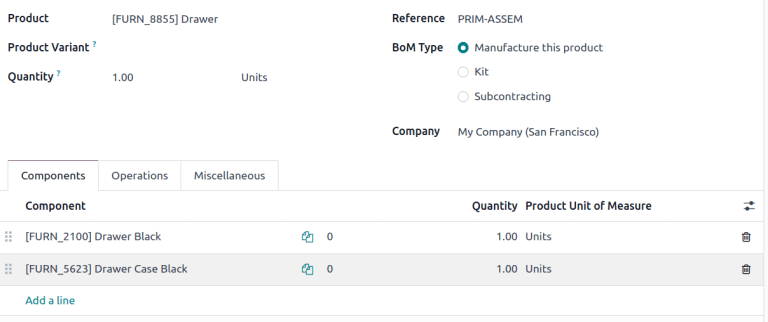
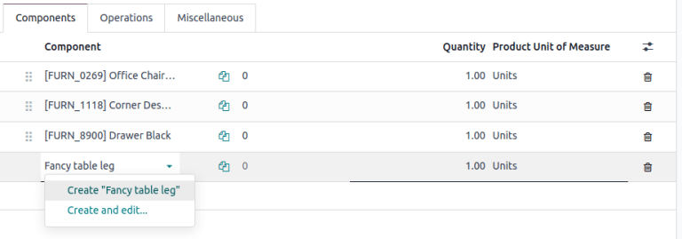
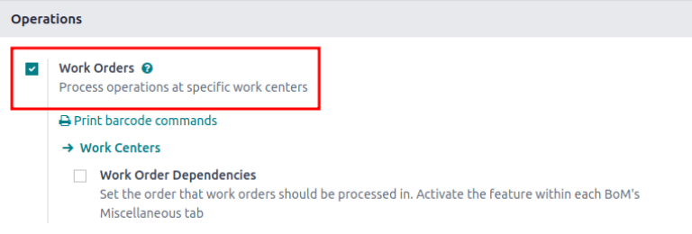
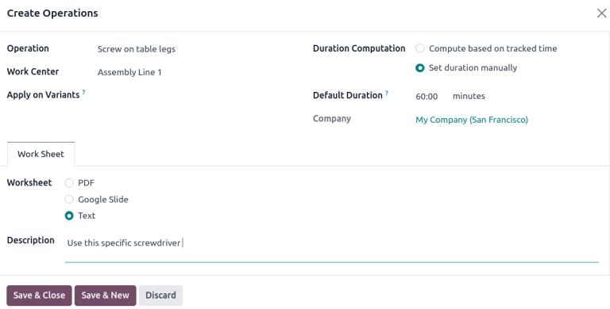
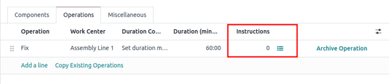
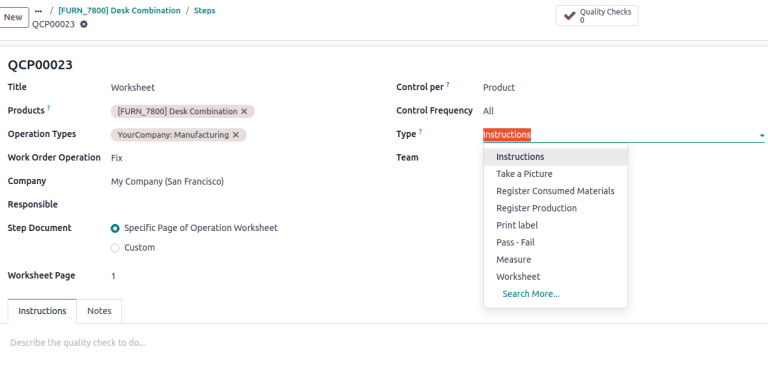
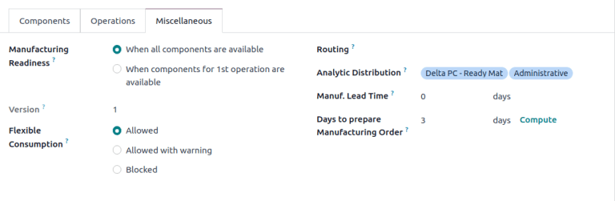

=================
Bill of materials
=================

.. |BOM| replace:: :abbr:`BoM (Bill of Materials)`
.. |BOMs| replace:: :abbr:`BoMs (Bills of Materials)`
.. |MO| replace:: :abbr:`MO (Manufacturing Order)`

A *bill of materials* (or *BoM* for short) documents specific components, along with their
respective quantities, that are needed to produce or repair a product. In Odoo, |BoMs| as blueprints
for manufactured goods and kits, and often include production operations and step-by-step
guidelines, as well.

BoM setup
=========

To create a |BOM|, go to :menuselection:`Manufacturing app --> Products --> Bills of Materials` and
click :guilabel:`New`.

Next, set the :guilabel:`BoM Type` to :guilabel:`Manufacture this Product`.

Then, specify :ref:`required components <manufacturing/basic_setup/setup-components>` and, if
necessary, define any :ref:`manufacturing operations <manufacturing/basic_setup/setup-operations>`.

.. tip::
   Individual |BOMs| can also be quickly accessed or created by clicking the :guilabel:`Bill of
   Materials` smart button on any product form, as accessible through the *Sales*, *Inventory*, and
   *Manufacturing* apps, as well as through any internal links where a product is referenced (such
   as in a field or a line item).

   BoM for `Drawer`, displaying the **Components** tab.

.. seealso::
   - :doc:`../advanced_configuration/kit_shipping`
   - :doc:`../subcontracting/subcontracting_basic`

.. _manufacturing/basic_setup/setup-components:

Components
----------

In the :guilabel:`Components` tab of a |BOM|, specify components used to manufacture the product by
clicking :guilabel:`Add a line`. From the :guilabel:`Components` drop-down menu, select from
existing products or create a new product by typing the name and selecting either the
:guilabel:`Create " "` option to quickly add the line item, or the :guilabel:`Create and edit...`
option to add the component and continue to its configuration form.

Optionally, access additional fields by clicking the :icon:`oi-settings-adjust` :guilabel:`(settings
adjust)` icon to the far-right of the :guilabel:`Components` tab. Tick the checkboxes for the
following features to enable these columns:

- :guilabel:`Apply on Variants`: specify which :doc:`product variant
  <../advanced_configuration/product_variants>` each component is used in. When the field is left
  blank, the component is used in all product variants.

.. _manufacturing/basic_setup/consumed-in-operation:

- :guilabel:`Consumed in Operation`: specify the operation using the component. Useful for
  determining :ref:`manufacturing readiness <manufacturing/basic_setup/manufacturing-readiness>`.
- :guilabel:`Manual Consumption`: tick the checkbox to force operators to check the
  :guilabel:`Consumed` checkbox on a manufacturing order (MO).

  .. image:: bill_configuration/consumed-field.png
     :align: center
     :alt: Show a manufacturing order, highlighting the *Consumed* field.

  Not doing so triggers the :guilabel:`Consumption Warning` error message, where the consumed
  component quantity must be manually inputted. Otherwise, the operation cannot be completed.

  .. image:: bill_configuration/consumption-warning.png
     :align: center
     :alt: Show the consumption warning error message.

.. _manufacturing/basic_setup/setup-operations:

Operations
----------

Add an *operation* to a |BOM| to specify instructions for production and register time spent on an
operation. To use this feature, first enable the *Work Orders* feature by going to
:menuselection:`Manufacturing app --> Configuration --> Settings`. In the :guilabel:`Operations`
section, tick the :guilabel:`Work Orders` checkbox to enable the feature.

.. seealso::
   :doc:`../advanced_configuration/work_order_dependencies`

Next, navigate to the |BOM| by going to :menuselection:`Manufacturing app --> Products --> Bill of
Materials` and selecting the desired |BOM|. To add a new operation, go to the :guilabel:`Operations`
tab, and click :guilabel:`Add a line`.

Doing so opens the :guilabel:`Create Operations` pop-up window, where the various fields of the
operation are configured:

- :guilabel:`Operation`: name of the operation.
- :guilabel:`Work Center`: select existing locations to perform the operation, or create a new work
  center by typing the name and selecting the :guilabel:`Create " "` option.
- :guilabel:`Apply on Variants`: specify if this operation is only available for certain product
  variants. If the operation applies to all product variants, leave this field blank.

  .. seealso::
     :doc:`Configuring BoMs for product variants <../advanced_configuration/product_variants>`

- :guilabel:`Duration Computation`: choose how time spent on the operation is tracked. Opt for
  :guilabel:`Compute based on tracked time` to use the operation's time tracker or :guilabel:`Set
  duration manually` if operators can record and modify time themselves.

  Choosing the :guilabel:`Compute based on tracked time` option enables the :guilabel:`Based on last
  __ work orders` option, which automatically estimates the time to complete this operation based on
  the last few operations. Choosing :guilabel:`Set duration manually` enables the :guilabel:`Default
  Duration` field instead.
- :guilabel:`Default Duration`: estimated amount of time to complete the operation; used for
  `planning manufacturing orders <https://www.youtube.com/watch?v=TK55jIq00pc>`_ and determining
  `work center availability <https://www.youtube.com/watch?v=3YwFlD97Bio>`_.
- :guilabel:`Company`: specify the company the |BOM| is available in.

Include operation details in the :guilabel:`Work Sheet` tab. Choose :guilabel:`PDF` to attach a file
or :guilabel:`Google Slide` with *public* access to share a link. Select :guilabel:`Text` to type
instructions in the :guilabel:`Description` text field.

.. tip::
   Type `/` for a list of formatting options and features, including ChatGPT.

   .. image:: bill_configuration/description.png
      :align: center
      :alt: Show ChatGPT feature to generate instructions for a work order.

Finally, click :guilabel:`Save \& Close` to close the pop-up window. To add more operations, click
:guilabel:`Save & New` and repeat the same steps above to configure another operation.

.. note::
   Each operation is unique, as it is always exclusively linked to one |BOM|.

.. tip::
   After creating an operation, click the :guilabel:`Copy Existing Operations` button to choose an
   operation to duplicate.

   .. image:: bill_configuration/copy-existing-operations.png
      :align: center
      :alt: Show Operation tab, highlighting the "Copy Existing Operations" field.

Instructions
~~~~~~~~~~~~

.. important::
   To add detailed instructions to operations, the *Quality* app must be installed.

Add specific instructions to an existing operation by clicking the operation's :icon:`fa-list-ul`
:guilabel:`(list)` icon in the :guilabel:`Instructions` column. The number in the
:guilabel:`Instructions` column shows the number of existing detailed instructions there are for the
operation.

On the :guilabel:`Steps` dashboard, click :guilabel:`New` to open a blank quality control point form
where the new manufacturing step can be created. Here, give the specific instruction a
:guilabel:`Title` and set the :guilabel:`Type` to :guilabel:`Instructions`. In the
:guilabel:`Instructions` tab of the form, write out the directions for the step in the operation.

.. note::
   Further customizations can be made here on this form, beyond ordinary instructions, to also
   include specific types of quality control points that carry specific (or complex) conditions. For
   more details about quality control points refer the :doc:`Instruction check
   <../../quality/quality_check_types/instructions_check>` documentation.

Miscellaneous
-------------

The :guilabel:`Miscellaneous` tab contains more |BoM| configurations to customize procurement,
calculate costs, and define how components are consumed.

.. _manufacturing/basic_setup/manufacturing-readiness:

- :guilabel:`Manufacturing Readiness`: choosing :guilabel:`When components for the 1st operation are
  available` shows the :guilabel:`Component Status` as a **green** :guilabel:`Not Available`, when
  only the components that are consumed in the first operation are in stock. This indicates that
  although not all components are available, operators can at least begin with the first operation.
  Choosing :guilabel:`When all components are available` displays a **red** :guilabel:`Not
  Available` component status unless all components are in available.

  .. tip::
     Specify which operation consumes each component on the |BoM| in the :ref:`Manual Consumption
     field <manufacturing/basic_setup/consumed-in-operation>`.

  .. image:: bill_configuration/component-status.png
     :align: center
     :alt: Show the *Component Status* field on the manufacturing order dashboard.

- :guilabel:`Version`: displays the current |BoM| version, visible with the Odoo *PLM* app installed
  for managing |BoM| changes.
- :guilabel:`Flexible Consumption`: specifies if components used can deviate from the quantity
  defined on the |BoM|. Choose :guilabel:`Blocked` if operators **must** adhere strictly to the
  |BoM| quantity. Otherwise, choose :guilabel:`Allowed` or :guilabel:`Allowed with Warning`.
- :guilabel:`Routing`: select the preferred warehouse's manufacturing operation type for products
  produced in multiple warehouses. If left blank, this warehouse's `Manufacturing` operation type is
  used by default.
- :guilabel:`Analytic Distribution`: select pre-created :doc:`analytic distribution models
  <../../../finance/accounting/reporting/analytic_accounting>` from the list to automatically record
  the cost of manufacturing products in the chosen journal.
- :guilabel:`Manuf Lead Time`: define the number of days needed to complete a |MO| from the date of
  confirmation.
- :guilabel:`Days to prepare Manufacturing Order`: number of days needed to replenish components, or
  manufacture sub-assemblies of the product.

.. seealso::
   - :doc:`Analytic distribution <../../../finance/accounting/reporting/analytic_accounting>`
   - :doc:`Lead times
     <../../inventory/warehouses_storage/replenishment/lead_times>`

Add by-products to BoMs
=======================

A *by-product* is a residual product that is created during production in addition to the main
product of a |BOM|. Unlike the primary product, there can be more than one by-product on a |BOM|.

To add by-products to a |BOM|, first enable the *By-Products* feature in
:menuselection:`Manufacturing app --> Configuration --> Settings`. In the :guilabel:`Operations`
section, tick the checkbox for :guilabel:`By-Products` to enable the feature.

.. image:: bill_configuration/by-products.png
   :align: center
   :alt: "By Products" feature in the settings page.

Once the feature is enabled, add by-products to a |BOM| by clicking the :guilabel:`By-products` tab.
Click :guilabel:`Add a line`, and fill in the :guilabel:`By-product`, :guilabel:`Quantity`, and
:guilabel:`Unit of Measure`. Optionally, specify a :guilabel:`Produced in Operation` for the
by-product.

.. example::
   The by-product, `Mush`, is created in the `Grind grapes` operation when producing `Red Wine`.

   .. image:: bill_configuration/add-by-product.png
      :align: center
      :alt: Show sample by-product in the BoM.
