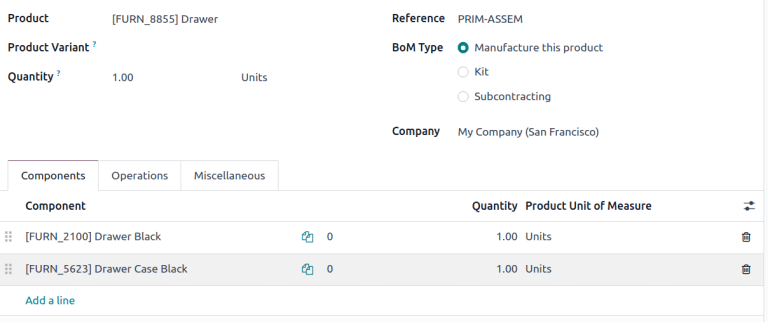
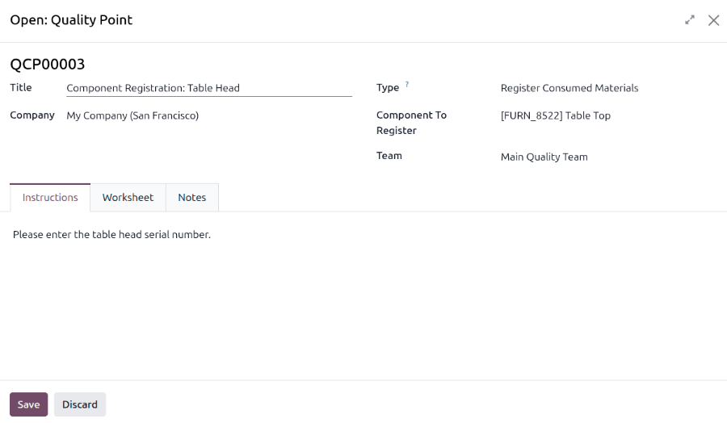
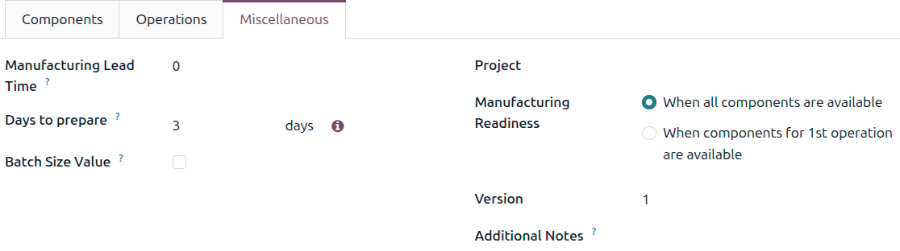
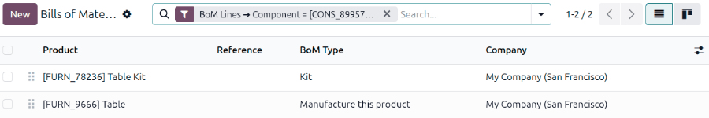
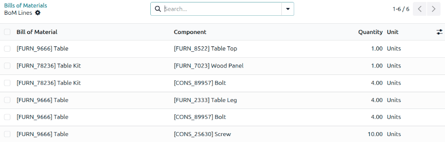
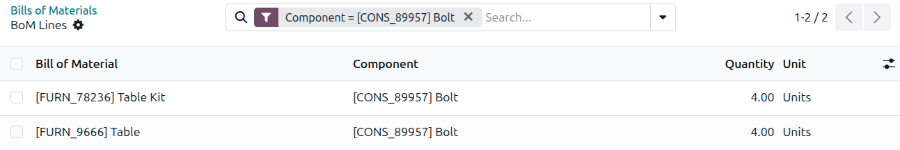

=================
Bill of materials
=================

.. |BOM| replace:: :abbr:`BoM (Bill of Materials)`
.. |BOMs| replace:: :abbr:`BoMs (Bills of Materials)`
.. |MO| replace:: :abbr:`MO (Manufacturing Order)`
.. |MOs| replace:: :abbr:`MO (Manufacturing Orders)`
.. |QCP| replace:: :abbr:`QCP (quality control point)`

A *bill of materials*, or *BoM* for short, documents specific components and their respective
quantities that are needed to produce or repair a product. In Odoo, |BOMs| serve as blueprints for
manufactured goods and kits and often include production operations and step-by-step guidelines.

.. _manufacturing/basic_setup/bom-setup:

BoM setup
=========

To create a |BOM|, go to :menuselection:`Manufacturing app --> Products --> Bills of Materials` and
click :guilabel:`New`.

First, select a :guilabel:`Product` using the drop-down menu. Optionally specify a
:guilabel:`Product Variant` that this |BOM| applies to.

Specify the :guilabel:`Quantity` of units that are produced with a single |BOM|.

Optionally specify a :guilabel:`Reference` that can be used to differentiate similar |BOMs| for the
same product from one another. This reference is visible when selecting the |BOM| to use on the
manufacturing order (MO) form.

.. example::
   A computer manufacturer specializes in `Mini Tower Computers`. A graphical processing unit (GPU)
   shortage requires the manufacturer to use a different GPU to continue to produce mini tower PCs.
   They create a new |BOM| with the :guilabel:`Reference` `2080Ti` to differentiate it from their
   standard build.

   .. image:: bill_configuration/bom-reference.png
      :alt: Use the Reference line to differentiate similar BOMs from each other.

Next, set the :guilabel:`BoM Type` to :guilabel:`Manufacture this product`.

Then, specify :ref:`required components <manufacturing/basic_setup/setup-components>` and, if
necessary, define any :ref:`manufacturing operations <manufacturing/basic_setup/setup-operations>`.

.. tip::
   Individual |BOMs| can also be quickly accessed or created by clicking the :icon:`fa-flask`
   :guilabel:`Bill of Materials` smart button on any product form available in the **Sales**,
   **Inventory**, and **Manufacturing** apps, as well as through any internal links that reference a
   product (such as in a field or a line item).

   BoM for the `Drawer` product, displaying the **Components** tab.

.. seealso::
   - :doc:`../advanced_configuration/kit_shipping`
   - :doc:`../subcontracting/subcontracting_basic`

.. _manufacturing/basic_setup/setup-components:

Components
----------

In the *Components* tab of a |BOM|, specify components used to manufacture the product by clicking
:guilabel:`Add a line`. From the :guilabel:`Component` drop-down menu, select from existing products
or create a new product by typing the name and selecting either the :guilabel:`Create "(component)"`
option to quickly add the line item, or the :guilabel:`Create and edit` option to add the component
and continue to its configuration form.

Optionally, access additional fields by clicking the :icon:`oi-settings-adjust` :guilabel:`(settings
adjust)` icon at the end of the *Components* tab. Select the checkboxes for the following features
to enable these columns:

- :guilabel:`Apply on Variants`: Specify which :doc:`product variant
  <../advanced_configuration/product_variants>` each component is used in. When the field is left
  blank, the component is used in all product variants.
- :guilabel:`Consumed in Operation`: Specify the operation using the component. Useful for
  determining :ref:`manufacturing readiness <manufacturing/basic_setup/manufacturing-readiness>`.

.. _manufacturing/basic_setup/setup-operations:

Operations
----------

Add an *operation* to a |BOM| to specify production instructions and register time spent on an
operation. To use this feature, first enable the *Work Orders* feature by going to
:menuselection:`Manufacturing app --> Configuration --> Settings`. In the *Operations* section,
select the :guilabel:`Work Orders` checkbox to enable the feature.

.. seealso::
   :doc:`../advanced_configuration/work_order_dependencies`

Next, navigate to the |BOM| by going to :menuselection:`Manufacturing app --> Products --> Bill of
Materials` and selecting the desired |BOM|. To add a new operation, go to the *Operations* tab and
click :guilabel:`Add Operation` (if no operations exist) or :guilabel:`Add a line` (if operations
already exist).

Doing so opens a new operation form, where the various fields of the operation are configured:

- :guilabel:`Operation`: Enter the name of the operation.
- :guilabel:`Work Center`: Select an existing location to perform the operation, or create a new
  work center by typing the name and selecting the :guilabel:`Create "(work center)"` option.
- :guilabel:`Apply on Variants`: Specify if this operation is only available for certain product
  variants. If the operation applies to all product variants, leave this field blank.

  .. seealso::
     :doc:`Configuring BoMs for product variants <../advanced_configuration/product_variants>`

- :guilabel:`Cost based on`: Specify whether the cost for the operation is based on
  :guilabel:`Actual time` (tracked time and real employee costs) or :guilabel:`Theoretical time`
  (estimated time and costs).
- :guilabel:`Duration Computation`: Choose how time spent on the operation is tracked. Opt for
  :guilabel:`Fixed` if operators can record and modify time themselves, which allows a
  :guilabel:`Default Duration` to be specified. Alternatively, choose :guilabel:`Computed` to use
  the operation's time tracker, which enables the :guilabel:`last (#) work orders` field. This
  ensures the estimated time to completion is based on a specified number of the previous
  operations.
- :guilabel:`Company`: Specify the company for which the |BOM| is available.

Finally, click :icon:`fa-cloud-upload` :guilabel:`(Save manually)` to save the operation.

Instructions
~~~~~~~~~~~~

In the *Instructions* tab, click the :guilabel:`Add a line` link to open the *Create Quality Point*
window. Individual steps in the instructions are saved as :doc:`quality control points
<../../quality/quality_management/quality_control_points>` (QCPs).

In the *Create Quality Point* window, specify a :guilabel:`Title` and the :guilabel:`Company` for
which the instruction is valid.

In the :guilabel:`Type` field, specify the type of step that should be performed. The following
types of steps are available:

- :guilabel:`Instructions`: This check provides specific instructions for how to complete the
  quality check.
- :guilabel:`Take a Picture`: This check requires a picture of the product to be uploaded for later
  review by the assigned quality team.
- :guilabel:`Register Consumed Materials`: This check prompts operators to confirm the quantity of
  materials that were consumed during the manufacturing operation.
- :guilabel:`Register Production`: This check prompts manufacturing employees to confirm the
  quantity of the product that was produced during the manufacturing operation.
- :guilabel:`Print label`: This check prompts operators to download and print a label to attach to
  the product or its packaging.
- :guilabel:`Pass - Fail`: This check specifies a criterion that products must meet for the check to
  pass.
- :guilabel:`Measure`: This check prompts employees to record a measurement of the product that must
  be within a tolerance of a norm value for the check to pass.
- :guilabel:`Worksheet`: This check requires the employee processing the check to fill out an
  interactive worksheet.
- :guilabel:`Spreadsheet`: This check requires the employee processing the check to fill out an
  interactive spreadsheet.

.. important::
   When a step is added to a |BOM| operation, Odoo stores it in the **Quality** app as a |QCP|. It
   is possible to manually create a |QCP| with the :guilabel:`Instructions` check type and even
   assign it to an operation other than manufacturing, like receipts.

In the :guilabel:`Team` field, specify the team that is responsible for the step.

Use the *Instructions* tab to specify the step's instructions.

.. tip::
   Type `/` for a list of formatting options and features, including Odoo AI. In the following
   example, Odoo AI is asked to generate a detailed instruction list to measure and cut wood.

   .. image:: bill_configuration/description.png
      :alt: Google Gemini feature to generate instructions for a work order.

Use the *Attachment* tab to upload a supplementary PDF that displays when the operator completes
that step.

If the :guilabel:`Type` is set to :guilabel:`Pass - Fail`, :guilabel:`Measure`, :guilabel:`Register
Production`, :guilabel:`Worksheet`, or :guilabel:`Spreadsheet`, the *Message If Failure* tab
appears. Use this tab to include instructions for what to do if the quality check fails. For
example, instruct the employee processing the step to create a quality alert.

Click :guilabel:`Save` to save the step.

After all instructions are added, click :guilabel:`Save & Close` to close the pop-up window. To add
more steps, click :guilabel:`Save & New`, then repeat the same steps above to configure another
operation.

Finally, in the operation form, click :icon:`fa-cloud-upload` :guilabel:`(Save manually)` to save
the operation.

.. note::
   Each operation is unique, as it is always exclusively linked to one |BOM|.

.. tip::
   After creating an operation, click the :guilabel:`Copy Existing Operations` button to choose an
   operation to duplicate into the |BOM|. It is possible to choose operations from other |BOMs|.
   This creates an independent copy of the selected operation and adds it to the |BOM|.

   .. image:: bill_configuration/copy-existing-operations.png
      :alt: Click Copy Existing Operations to duplicate operations.

Miscellaneous
-------------

The *Miscellaneous* tab contains more |BoM| configurations to customize the following fields:

- :guilabel:`Manufacturing Lead Time`: The number of days required to manufacture the product
- :guilabel:`Days to prepare`: The number of days in advance that |MOs| should be created to allow
  time to replenish components or manufacture sub-assemblies
- :guilabel:`Batch Size Value`: If selected, the number of units to add to a |MO| can be specified.
  When the demand exceeds the batch size, the |MO| is split into multiple |MOs|.
- :guilabel:`Project`: the project to which the BoM applies. The Project app must be installed for
  this field to display.

.. _manufacturing/basic_setup/manufacturing-readiness:

- :guilabel:`Manufacturing Readiness`: Choosing :guilabel:`When all components are available`
  displays a **red** :guilabel:`Not Available` component status unless *all* components are
  available. Choosing :guilabel:`When components for the 1st operation are available` shows the
  :guilabel:`Component Status` as a **green** :guilabel:`Not Available` when only the components
  consumed in the first operation are in stock. This indicates that although not all components are
  available, operators can at least begin with the first operation.

  .. tip::
     Add a *Register Consumed Materials* step to the |BoM| instructions to indicate when a component
     is consumed.

  .. image:: bill_configuration/component-status.png
     :alt: Show the Component Status field on the manufacturing order dashboard.

- :guilabel:`Version`: Displays the current |BoM| version, visible with the Odoo **PLM** app
  installed for managing |BoM| changes.
- :guilabel:`Additional Notes`: Additional notes that are added to an |MO|. These notes are also
  visible in the *Shop Floor* module.

.. seealso::
   :doc:`Lead times <../../inventory/warehouses_storage/replenishment/lead_times>`

Replace components across multiple BoMs
=======================================

Periodically, the design of a product may change to use different components. Use the :ref:`Bill of
Materials page <manufacturing/basic-setup/bom-replace>` or the :ref:`component's product form
<manufacturing/basic-setup/component-replace>` to update the component across multiple products at
the same time.

.. _manufacturing/basic-setup/bom-replace:

Bill of Materials page
----------------------

To begin, navigate to :menuselection:`Manufacturing app --> Products --> Bills of Materials`. All
|BOMs| are listed on this page.

To locate all |BOMs| that use the affected component, click into the search bar and filter using a
:guilabel:`Custom Filter`. Select :menuselection:`BoM Lines --> Component`. Set :guilabel:`is equal
to`, and select the component to filter by. Click :guilabel:`Search`. |BOMs| with the matching
component display.

Then, select the checkmarks next to the |BOMs| to update and click :icon:`fa-cog`
:menuselection:`(Actions) --> Compare BoMs`. This opens the *BoM Lines* page.

.. note::
   By default, the page opens in the :icon:`oi-view-pivot` :guilabel:`(Pivot)` view, allowing users
   to compare multiple |BOMs| simultaneously based on the quantities of their components.
   Alternatively, see a list of component lines by clicking the :icon:`oi-view-list`
   :guilabel:`(List)` view.

To continue, click the :icon:`oi-view-list` :guilabel:`(List)` view to open the component lines.

To update the component across multiple |BOMs|, first filter by the component again by clicking into
the search bar and selecting :guilabel:`Custom Filter`. Filter by :guilabel:`Component`, set
:guilabel:`is equal to`, and select the component, then click :guilabel:`Search`. The |BOM| lines
(component and associated |BOMs|) display.

Select the checkmark next to the lines to update, then update the :guilabel:`Component` field for
one of the lines. When clicking away from the :guilabel:`Component` field, a *Confirmation* window
opens to verify that multiple components will be updated. Click :guilabel:`Update` to verify the
changes.

.. _manufacturing/basic-setup/component-replace:

Component product form
----------------------

To begin, navigate to :menuselection:`Manufacturing app --> Products --> Products`. Click in the
search bar and search for the component product, then open its product form.

Click the :icon:`fa-level-up` :guilabel:`Used In` smart button. All |BOM| lines that contain this
component are displayed. To update the component across multiple products, select the checkbox next
to the affected |BOMs|, then click in the :guilabel:`Component` field of one of the selected |BOMs|.
Update the :guilabel:`Component` to the new component, then click away. A *Confirmation* pop-up
window opens. Verify that the selected records should be updated by clicking :guilabel:`Update`.

Add by-products to BoMs
=======================

A *by-product* is a residual product that is created during production in addition to the main
product of a |BOM|. Unlike the primary product, there can be more than one by-product on a |BOM|.

To add by-products to a |BOM|, first enable the *By-Products* feature in
:menuselection:`Manufacturing app --> Configuration --> Settings`. In the :guilabel:`Operations`
section, select the checkbox for :guilabel:`By-Products` to enable the feature.

Once the feature is enabled, add by-products to a |BOM| by clicking the *By-products* tab. Click
:guilabel:`Add a line`, and fill in the :guilabel:`By-product`, :guilabel:`Quantity`, and
:guilabel:`Unit`. Optionally, specify a :guilabel:`Produced in Operation` for the by-product.

Optionally, the :guilabel:`Cost Share` percentage of a by-product can also be specified at this
stage. The cost share is the percentage of the final production cost for the by-product, divided by
the quantity produced. The total of all by-products' cost share must be less than or equal to `100`.

.. example::
   The by-product, `Mush`, is created in the `Grind grapes` operation when producing `Red Wine`.

   .. image:: bill_configuration/add-by-product.png
      :alt: Show sample by-product in the BoM.

.. _manufacturing/basic-setup/bom-overview:

BOM Overview
============

Each |BOM| form includes a *BOM Overview* that serves as a roadmap for all the |BOMs| and operations
involved in manufacturing a :guilabel:`Quantity` of a product, including routes, times, and costs.

To open it, navigate to :menuselection:`Manufacturing app --> Products --> Bills of Materials`, then
select a |BOM| from the list. In the |BOM| form, click the :icon:`fa-bars` :guilabel:`BoM Overview`
smart button.

.. example::
   Consider a `Table` product manufactured using the following components:

   - 1 `Table Top`
   - 4 `Table Legs`
   - 4 `Bolts`
   - 10 `Screws`

   In this multi-level hierarchy, the `Table Top` is a sub-assembly consisting of 2 `Wood Panels`,
   following the *Manual Assembly* operation. Furthermore, each `Wood Panel` is produced from 6 `Ply
   Layers` and 2 `Wear Layers`.

   .. image:: bill_configuration/bom-overview-table-example.png
      :alt: The BOM Overview report for a table product.

By default, the following columns are listed in the *BOM Overview*:

- :guilabel:`Product`: The product being manufactured is listed in the top row. In subsequent rows,
  the components required to manufacture the product are listed. If sub-assemblies are required for
  a component, expand the row using the :icon:`fa-caret-right` :guilabel:`(Fold)` icon. If an
  operation is required to manufacture the component or product, it is listed under the
  :guilabel:`Operations` section.
- :guilabel:`Quantity`: The number of units required to manufacture the product is listed. This
  quantity can be adjusted by specifying a number in the :guilabel:`(# Units)` next to the
  :guilabel:`Quantity` field at the top of the page.
- :guilabel:`Total Cost`: This is the total cost of the unit, including price, labor, and other
  factors. Costs displayed in grey are read directly from the component's product record (the
  :guilabel:`Cost` field), while costs in regular text are computed by the report. The *BOM
  Overview* only calculates a cost when it has a sub-|BOM| to expand (using manufactured components)
  or when it can derive it from a work center rate (via operations). For purchased components,
  consumables, or any product without a |BOM|, the report shows the standard cost defined on the
  product and greys it out to make the distinction visible.

Toggle the :icon:`fa-toggle-on` :guilabel:`Forecast` button to display more columns in the *BOM
Overview* report. These fields help forecast future product manufacturing, taking into account
existing component inventory.

The following columns are available in the *BOM Overview* when :guilabel:`Forecast` is enabled:

- :guilabel:`Free to Use/On Hand`: This shows how many units can be reserved for an order out of the
  total number of units available to the company.
- :guilabel:`Subcontractor Stock`: This column only appears if the :guilabel:`BoM Type` is set to
  :guilabel:`Subcontracting`. It displays how many units can be reserved for an order out of the
  total number of units available at the subcontracting location.
- :guilabel:`Status`: This column specifies whether a component is :guilabel:`Available` or
  :guilabel:`Not Available`, or if it needs to be purchased (:guilabel:`# To Buy`). If the product
  or component needs to be manufactured, the :guilabel:`Estimated` date of completion is listed,
  taking into account the :guilabel:`Lead Time` listed in the next column. If the product or
  component is subcontracted, this status is determined by the combined free-to-use quantities of
  the company and the subcontractor.
- :guilabel:`Lead Time`: The number of days required to manufacture or purchase a component or
  product is listed.
- :guilabel:`Route`: If a product or component is replenished via a specific :doc:`route
  <../../inventory/shipping_receiving/daily_operations/use_routes>`, it is listed in this column.

.. note::
   The :guilabel:`Subcontractor Stock` column only displays values for a product or component if the
   free-to-use quantity is above `0`. This quantity can be added by directly :ref:`adjusting
   inventory <inventory/create-adjustment>` at the subcontracting location.

Click the :guilabel:`Manufacture` button to create a new manufacturing order for the selected
product.

Click the :guilabel:`Print` button to generate a PDF of the report. To include all lines in the PDF,
expand them using the :icon:`fa-caret-right` :guilabel:`(Fold)` icon.

For :doc:`multilevel BoMs <../advanced_configuration/sub_assemblies>`, some component lines may be
automatically collapsed. To expand all lines in the report at once, click the :guilabel:`Unfold`
button. To collapse the lines again, click the :guilabel:`Fold` button.
