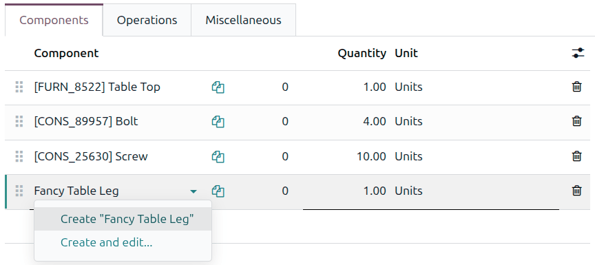
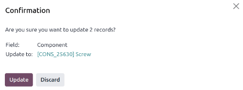

=================
Bill of materials
=================

.. |BOM| replace:: :abbr:`BoM (Bill of Materials)`
.. |BOMs| replace:: :abbr:`BoMs (Bills of Materials)`
.. |MO| replace:: :abbr:`MO (Manufacturing Order)`
.. |QCP| replace:: :abbr:`QCP (quality control point)`

A *bill of materials* (or *BoM* for short) documents specific components and their respective
quantities that are needed to produce or repair a product. In Odoo, |BOMs| serve as blueprints for
manufactured goods and kits and often include production operations and step-by-step guidelines.

.. _manufacturing/basic_setup/bom-setup:

BoM setup
=========

To create a |BOM|, go to :menuselection:`Manufacturing app --> Products --> Bills of Materials` and
click :guilabel:`New`.

Next, set the :guilabel:`BoM Type` to :guilabel:`Manufacture this product`.

Then, specify :ref:`required components <manufacturing/basic_setup/setup-components>` and, if
necessary, define any :ref:`manufacturing operations <manufacturing/basic_setup/setup-operations>`.

.. tip::
   Individual |BOMs| can also be quickly accessed or created by clicking the :guilabel:`Bill of
   Materials` smart button on any product form available in the **Sales**, **Inventory**, and
   **Manufacturing** apps, as well as through any internal links that reference a product (such as
   in a field or a line item).

.. figure:: bill_configuration/bom-example.png
   :alt: Show BoM for a product, with components listed.

   BoM for the `Drawer` product, displaying the **Components** tab.

.. seealso::
   - :doc:`../advanced_configuration/kit_shipping`
   - :doc:`../subcontracting/subcontracting_basic`

.. _manufacturing/basic_setup/setup-components:

Components
----------

In the :guilabel:`Components` tab of a |BOM|, specify components used to manufacture the product by
clicking :guilabel:`Add a line`. From the :guilabel:`Component` drop-down menu, select from
existing products or create a new product by typing the name and selecting either the
:guilabel:`Create " "` option to quickly add the line item, or the :guilabel:`Create and edit`
option to add the component and continue to its configuration form.

Optionally, access additional fields by clicking the :icon:`oi-settings-adjust` :guilabel:`(settings
adjust)` icon at the end of the :guilabel:`Components` tab. Select the checkboxes for the following
features to enable these columns:

- :guilabel:`Apply on Variants`: Specify which :doc:`product variant
  <../advanced_configuration/product_variants>` each component is used in. When the field is left
  blank, the component is used in all product variants.

.. _manufacturing/basic_setup/consumed-in-operation:

- :guilabel:`Consumed in Operation`: Specify the operation using the component. Useful for
  determining :ref:`manufacturing readiness <manufacturing/basic_setup/manufacturing-readiness>`.

.. _manufacturing/basic_setup/setup-operations:

Operations
----------

Add an *operation* to a |BOM| to specify production instructions and register time spent on an
operation. To use this feature, first enable the *Work Orders* feature by going to
:menuselection:`Manufacturing app --> Configuration --> Settings`. In the :guilabel:`Operations`
section, select the :guilabel:`Work Orders` checkbox to enable the feature.

.. seealso::
   :doc:`../advanced_configuration/work_order_dependencies`

Next, navigate to the |BOM| by going to :menuselection:`Manufacturing app --> Products --> Bill of
Materials` and selecting the desired |BOM|. To add a new operation, go to the :guilabel:`Operations`
tab and click :guilabel:`Add a line`.

Doing so opens the *Open: Operations* pop-up window, where the various fields of the operation are
configured:

- :guilabel:`Operation`: Enter the name of the operation.
- :guilabel:`Work Center`: Select an existing location to perform the operation, or create a new
  work center by typing the name and selecting the :guilabel:`Create " "` option.
- :guilabel:`Cost based on`: Specify whether the cost for the operation is based on
  :guilabel:`Actual time` (tracked time and real employee costs) or :guilabel:`Theoretical time`
  (estimated time and costs).
- :guilabel:`Apply on Variants`: Specify if this operation is only available for certain product
  variants. If the operation applies to all product variants, leave this field blank.

  .. seealso::
     :doc:`Configuring BoMs for product variants <../advanced_configuration/product_variants>`

- :guilabel:`Duration Computation`: Choose how time spent on the operation is tracked. Opt for
  :guilabel:`Fixed` if operators can record and modify time themselves, which allows a
  :guilabel:`Default Duration` to be specified. Alternatively, choose :guilabel:`Computed` to
  use the operation's time tracker, which enables the :guilabel:`last __ work orders` field. This
  ensures the time to complete will be estimated based on a specified number of the previous
  operations.
- :guilabel:`Company`: Specify the company for which the |BOM| is available.

Include operation details in the :guilabel:`Instructions` tab.

Instructions
~~~~~~~~~~~~

Click the :guilabel:`Add a line` link to open the *Create Quality Point* window. Individual steps in
the instructions are saved as :doc:`quality control points
<../../quality/quality_management/quality_control_points>` (QCPs).

In the *Create Quality Point* window, specify a :guilabel:`Title` and the :guilabel:`Company` for
which the instruction is valid.

In the :guilabel:`Type` field, specify the type of step that should be performed. The following
types of steps are available:

- :guilabel:`Instructions` checks provide specific instructions for how to complete the quality
  check.
- :guilabel:`Take a Picture` checks require a picture of the product to be uploaded for later review
  by the assigned quality team.
- :guilabel:`Register Consumed Materials` checks prompt operators to confirm the quantity of
  materials that were consumed during the manufacturing operation.
- :guilabel:`Register Production` checks prompt manufacturing employees to confirm the quantity of
  the product that was produced during the manufacturing operation.
- :guilabel:`Print label` checks prompt operators to download and print a label to attach to the
  product or its packaging.
- :guilabel:`Pass - Fail` checks specify a criterion that products must meet for the check to pass.
- :guilabel:`Measure` checks prompt employees to record a measurement of the product that must be
  within a tolerance of a norm value for the check to pass.
- :guilabel:`Worksheet` checks require the employee processing the check to fill out an interactive
  worksheet.
- :guilabel:`Spreadsheet` checks require the employee processing the check to fill out an
  interactive spreadsheet.

.. important::
   When a step is added to a work order, Odoo stores it in the **Quality** app as a |QCP|. It is
   possible to manually create a |QCP| with the :guilabel:`Instructions` check type and even assign
   it to an operation other than manufacturing, like receipts.

In the :guilabel:`Team` field, specify the team that is responsible for the step.

Use the :guilabel:`Instructions` tab to specify the step's instructions.

.. tip::
   Type `/` for a list of formatting options and features, including ChatGPT.

   .. image:: bill_configuration/description.png
      :alt: Google Gemini feature to generate instructions for a work order.

Use the :guilabel:`Worksheet` tab to upload a supplementary PDF that will display when the operator
completes that step.

If the :guilabel:`Type` is set to :guilabel:`Pass - Fail`, :guilabel:`Measure`, :guilabel:`Register
Production`, :guilabel:`Worksheet`, or :guilabel:`Spreadsheet`, the :guilabel:`Message if Failure`
tab appears. Use this tab to include instructions for what to do if the quality check fails. For
example, instruct the employee processing the step to create a quality alert.

Click :guilabel:`Save` to save the step.

.. image:: bill_configuration/create-step.png
   :alt: Fill out the Quality Point pop-up window.

After all instructions are added, click :guilabel:`Save & Close` to close the pop-up window. To add
more steps, click :guilabel:`Save & New`, then repeat the same steps above to configure another
operation.

Finally in the *Open: Operations* window, click :guilabel:`Save` to save the operation.

.. note::
   Each operation is unique, as it is always exclusively linked to one |BOM|.

.. tip::
   After creating an operation, click the :guilabel:`Copy Existing Operations` button to choose an
   operation to duplicate.

   .. image:: bill_configuration/copy-existing-operations.png
      :alt: Click Copy Existing Operations to duplicate operations.

Miscellaneous
-------------

The :guilabel:`Miscellaneous` tab contains more |BoM| configurations to customize the following
fields:

- :guilabel:`Manufacturing Lead Time`: the number of days required to manufacture the product
- :guilabel:`Days to prepare`: the number of days in advance that manufacturing orders should be
  created to allow time to replenish components or manufacture sub-assemblies
- :guilabel:`Batch Size Value`: If selected, the number of units to add to a manufacturing order can
  be specified.
- :guilabel:`Project`: the project to which the BoM applies. The Project app must be installed for
  this field to display.

.. _manufacturing/basic_setup/manufacturing-readiness:

- :guilabel:`Manufacturing Readiness`: Choosing :guilabel:`When all components are available`
  displays a **red** :guilabel:`Not Available` component status unless all components are available.
  Choosing :guilabel:`When components for the 1st operation are available` shows the
  :guilabel:`Component Status` as a **green** :guilabel:`Not Available` when only the components
  consumed in the first operation are in stock. This indicates that although not all components are
  available, operators can at least begin with the first operation.

  .. tip::
     Add a *Register Consumed Materials* step to the |BoM| instructions to indicate when a component
     is consumed.

  .. image:: bill_configuration/component-status.png
     :alt: Show the *Component Status* field on the manufacturing order dashboard.

- :guilabel:`Version`: displays the current |BoM| version, visible with the Odoo **PLM** app
  installed for managing |BoM| changes.

.. seealso::
   :doc:`Lead times <../../inventory/warehouses_storage/replenishment/lead_times>`

.. image:: bill_configuration/misc-tab.png
   :alt: Show the *Miscellaneous* tab of the BoM.

Replace components across multiple BoMs
=======================================

Periodically, the design of a product may change to use different components. Use the :ref:`Bill of
Materials page <manufacturing/basic-setup/bom-replace>` or the :ref:`component's product form
<manufacturing/basic-setup/component-replace>` to update the component across multiple products at
the same time.

.. _manufacturing/basic-setup/bom-replace:

Bill of Materials page
----------------------

To begin, navigate to :menuselection:`Manufacturing app --> Products --> Bills of Materials`. All
|BOMs| are listed on this page.

To locate all |BOMs| that use the affected component, click in the :guilabel:`Search` field. Filter
using a :guilabel:`Custom Filter`. Select :menuselection:`BoM Lines --> Component`. Set
:guilabel:`is equal to`, and select the component that you want to filter by. Click
:guilabel:`Search`. |BOMs| with the matching component display.

.. image:: bill_configuration/bom-match-component.png
   :alt: The Bills of Materials page filtered by the Bolt component.

Then, select the |BOMs| to update and select :icon:`fa-cog` :menuselection:`Actions --> Show BoM
Lines`. The component lines display on the *BoM Lines* page.

.. image:: bill_configuration/show-bom-lines.png
   :alt: The BoM Lines page filtered to all BoMs that use the Bolt component.

To update the component across multiple |BOMs|, first filter by the component again by clicking in
the :guilabel:`Search` field and selecting :guilabel:`Custom Filter`. Filter by
:guilabel:`Component`, set :guilabel:`is equal to`, and select the component, then click
:guilabel:`Search`. The |BOM| lines (component and associated |BOMs|) display.

.. image:: bill_configuration/bom-lines.png
   :alt: The BoM lines matching the Bolt component display.

Select the lines to update, then update the :guilabel:`Component` field for one of the lines. When
clicking away from the :guilabel:`Component` field, a *Confirmation* window opens to verify that
multiple components will be updated. Click :guilabel:`Update` to verify the changes.

.. _manufacturing/basic-setup/component-replace:

Component product form
----------------------

To begin, navigate to :menuselection:`Manufacturing app --> Products --> Products`. Click in the
:guilabel:`Search` field and search for the component product, then open its product form.

Click the :icon:`fa-level-up` :guilabel:`Used In` smart button. All |BOM| lines that contain this
component are displayed. To update the component across multiple products, select the checkbox next
to the affected |BOMs|, then click in the :guilabel:`Component` field of one of the selected |BOMs|.
Update the :guilabel:`Component` to the new component, then click away. A *Confirmation* pop-up
window opens. Verify that the selected records should be updated by clicking :guilabel:`Update`.

Add by-products to BoMs
=======================

A *by-product* is a residual product that is created during production in addition to the main
product of a |BOM|. Unlike the primary product, there can be more than one by-product on a |BOM|.

To add by-products to a |BOM|, first enable the *By-Products* feature in
:menuselection:`Manufacturing app --> Configuration --> Settings`. In the :guilabel:`Operations`
section, select the checkbox for :guilabel:`By-Products` to enable the feature.

Once the feature is enabled, add by-products to a |BOM| by clicking the :guilabel:`By-products` tab.
Click :guilabel:`Add a line`, and fill in the :guilabel:`By-product`, :guilabel:`Quantity`, and
:guilabel:`Unit`. Optionally, specify a :guilabel:`Produced in Operation` for the by-product.

.. example::
   The by-product, `Mush`, is created in the `Grind grapes` operation when producing `Red Wine`.

   .. image:: bill_configuration/add-by-product.png
      :alt: Show sample by-product in the BoM.
