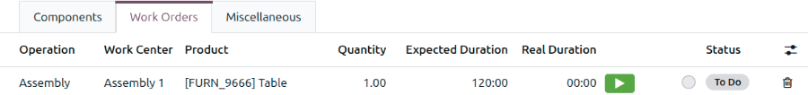
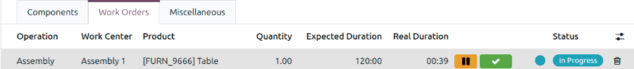
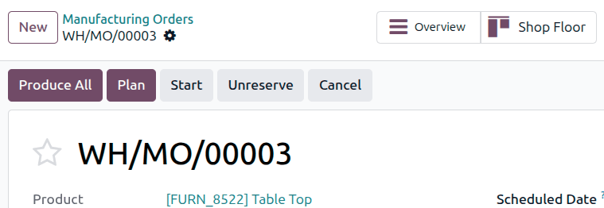
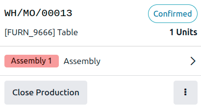
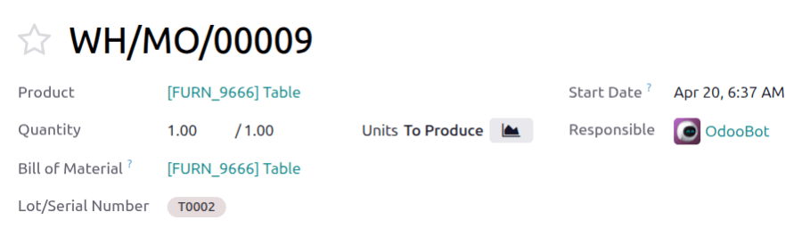
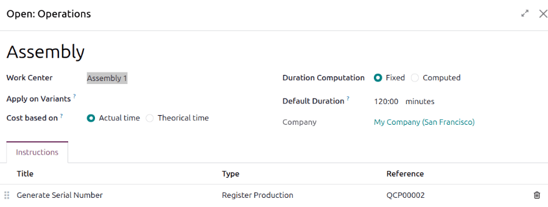
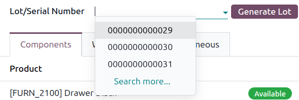
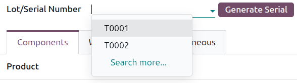
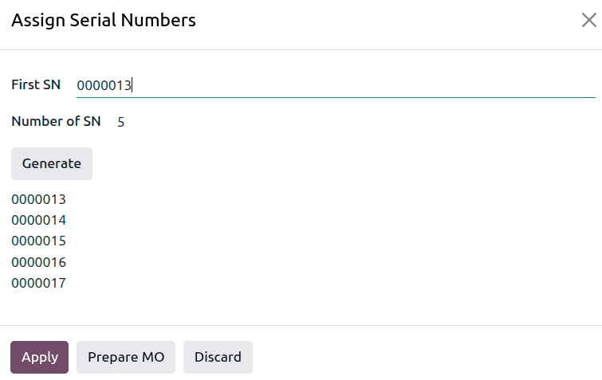

====================================
Manufacturing orders and work orders
====================================

.. |MO| replace:: :abbr:`MO (manufacturing order)`
.. |MOs| replace:: :abbr:`MOs (manufacturing orders)`
.. |BoM| replace:: :abbr:`BoM (bill of materials)`

Odoo **Manufacturing** allows users to manufacture products using manufacturing orders (MOs) and
work orders.

At its most basic level, manufacturing can be performed in one step. When using one-step
manufacturing, Odoo creates an |MO| and generates transfers to move components out of inventory and
finished products into stock.

.. tip::
   The number of steps used in manufacturing is set at the warehouse level, allowing for each
   warehouse to use a different number of steps. To change the number of steps used for a specific
   warehouse, navigate to :menuselection:`Inventory app --> Configuration --> Warehouses`, then
   select a warehouse from the *Warehouses* page.

   On the :guilabel:`Warehouse Configuration` tab, find the :guilabel:`Manufacture` radio input
   field and select one of the three options: :guilabel:`Manufacture (1 step)`, :guilabel:`Pick
   components then manufacture (2 steps)`, or :guilabel:`Pick components, manufacture, then store
   products (3 steps)`.

    .. image:: manufacturing_work_orders/warehouse-manufacture-field.png
       :alt: Select the number of steps the warehouse should use for manufacturing.

.. seealso::
   - :doc:`one_step_manufacturing`
   - :doc:`two_step_manufacturing`
   - :doc:`three_step_manufacturing`

Create a manufacturing order
============================

To manufacture a product in Odoo **Manufacturing**, begin by navigating to
:menuselection:`Manufacturing app --> Operations --> Manufacturing Orders`, then click
:guilabel:`New` to create a new |MO|.

On the new |MO|, select the product to be produced from the :guilabel:`Product` drop-down menu. The
:guilabel:`Bill of Material` field auto-populates with the associated bill of materials (BoM).

Specify the :guilabel:`Quantity` of the product to be produced.

If a product has more than one |BoM| configured for it, the specific |BoM| can be selected in the
:guilabel:`Bill of Material` field, and the :guilabel:`Product` field auto-populates with the
associated product.

After a |BoM| is selected, the *Components* and *Work Orders* tabs auto-populate with the components
and operations specified on the |BoM|. If additional components or operations are required for the
|MO|, add them to the :guilabel:`Components` and :guilabel:`Work Orders` tabs by clicking
:guilabel:`Add a line`.

Finally, click :guilabel:`Confirm` to confirm the |MO|.

Process manufacturing order
===========================

An |MO| is processed by completing all of the work orders listed under its *Work Orders* tab. This
can be done on the |MO| itself or from the *Shop Floor* module.

Basic workflow
--------------

Work orders can be completed from the :ref:`Work Orders tab <manufacturing/basic_setup/wo-from-mo>`
or a :ref:`work order form <manufacturing/basic_setup/wo-from-wo>`.

.. _manufacturing/basic_setup/wo-from-mo:

Work Orders tab
~~~~~~~~~~~~~~~

To complete work orders from the |MO| itself, navigate to :menuselection:`Manufacturing app -->
Operations --> Manufacturing Orders`, then select an |MO|.

On the |MO| form, open the :guilabel:`Work Orders` tab. When work begins on the first work order
that needs to be completed, click the :icon:`fa-play` :guilabel:`(Start)` button for that work
order. Odoo **Manufacturing** then starts a timer that tracks how long the work order takes to
complete.

When the work order is completed, click the :icon:`fa-check` :guilabel:`(Done)` button for that work
order. Repeat the same process for each work order listed in the :guilabel:`Work Orders` tab.

After all work orders are complete, :ref:`complete the MO <manufacturing/basic_setup/complete-mo>`.

.. _manufacturing/basic_setup/wo-from-wo:

Work order form
~~~~~~~~~~~~~~~

To process work orders from their forms, open the *Work Orders* page by navigating to
:menuselection:`Manufacturing app --> Operations --> Work Orders`. A list of work orders displays.
Choose a work order from the list. The work order form opens.

In the top corner of the form, the status of the work order is displayed. When changing the status
from :guilabel:`To Do` to :guilabel:`In Progress`, a new :guilabel:`Time Tracking` entry is created.
The :guilabel:`Planned Date` updates to the current date and time, with the end time based on the
:guilabel:`Expected Duration`.

Work on a work order can be split into different :guilabel:`Time Tracking` entries. To end an entry
and pause work, change the status of the work order to :guilabel:`To Do`. Then, to add a new entry
and begin work, change the status of the work order back to :guilabel:`In Progress`.

If :guilabel:`Instructions` are included, click an instruction. The *Open: Check* window opens.
Click the :icon:`fa-expand` :guilabel:`(Expand)` icon in the top corner of the pop-up window. A
quality check order form opens. Follow the :guilabel:`Instructions`, then click :guilabel:`Pass` to
mark the instruction as completed.

.. tip::
   For an easier path to complete work orders, click the :icon:`oi-view-kanban` :guilabel:`Open Shop
   Floor` smart button to open the *Shop Floor* module, filtered to the |MO|, then :ref:`process the
   work order in Shop Floor <manufacturing/basic_setup/complete-wo>`.

After all instructions are completed, complete the work order by changing its status to
:guilabel:`Done`.

After all work orders for the |MO| are complete, :ref:`complete the MO
<manufacturing/basic_setup/complete-mo>`.

.. _manufacturing/basic_setup/complete-mo:

Complete the MO
~~~~~~~~~~~~~~~

Back in the |MO| form, after completing all work orders, click :guilabel:`Produce All` at the top of
the screen to mark the |MO| as :guilabel:`Done` and register the manufactured products into
inventory.

Shop Floor workflow
-------------------

To complete the work orders for an |MO| using the *Shop Floor* module, begin by navigating to
:menuselection:`Manufacturing app --> Operations --> Manufacturing Orders`, and then select an |MO|.

Shop Floor can be opened in two ways for manufacturing orders:

- :ref:`From the MO form <manufacturing/basic_setup/shop-floor-mo>`
- :ref:`From the main Odoo dashboard <manufacturing/basic_setup/shop-floor-open>`

.. _manufacturing/basic_setup/shop-floor-mo:

MO form
~~~~~~~

On the |MO|, click the :icon:`oi-view-kanban` :guilabel:`Shop Floor` smart button. The |MO| opens in
the *Shop Floor* module.

When accessed directly from an |MO|, the *Shop Floor* page defaults to the *Overview* for the |MO|
to be carried out. The page shows a card for the |MO| that displays the |MO| number, the product,
the number of units to be produced, and the next work order required for the |MO|.

Click the work order in the *Overview* to open it in its work center, then :ref:`process it in
Shop Floor <manufacturing/basic_setup/complete-wo>`.

.. _manufacturing/basic_setup/shop-floor-open:

Shop Floor module
~~~~~~~~~~~~~~~~~

Open *Shop Floor* from the main Odoo dashboard.

Click the |MO| or work order from the *Overview* or work center view, then :ref:`process the work
order in the Shop Floor module <manufacturing/basic_setup/complete-wo>`.

.. seealso::
   :doc:`../shop_floor/shop_floor_overview`

.. _manufacturing/basic_setup/complete-wo:

Complete work orders in Shop Floor
~~~~~~~~~~~~~~~~~~~~~~~~~~~~~~~~~~

Process the work order by completing each step listed on its card. Click a step and follow the
instructions in the pop-up window. Repeat this process until all steps are addressed.

After completing all steps for a work order, a button appears in the footer of the work order card.
If any other work orders must be completed before the |MO| can be closed, the button is labeled
:guilabel:`Mark as Done`. If there are no additional work orders to complete, the button is labeled
:guilabel:`Close Production`.

Clicking :guilabel:`Mark as Done` causes the work order card to disappear. After it disappears, the
work order's status is marked as :guilabel:`Done` on the |MO|, and the next work order appears in
the *Shop Floor* module, on the work center page, where it is configured to be carried out. Any
additional work orders can be processed using the instructions detailed in this section.

Clicking :guilabel:`Close Production` causes the work order card to disappear. The |MO| is marked as
:guilabel:`Done`, and the units of the product that were produced are entered into inventory.

.. tip::
   This section details the basic workflow for processing an |MO| in the *Shop Floor* module. For a
   more in-depth explanation of the module and all of its features, please see the
   :doc:`../shop_floor/shop_floor_overview` documentation.

Adding or editing work order components
=======================================

Components can be edited from the work order form.

Open a work order form by navigating to :menuselection:`Manufacturing app --> Operations --> Work
Orders` and selecting a work order from the list.

In the work order form, open the :guilabel:`Components` tab.

Mark components as :guilabel:`Consumed` by selecting the checkbox for them on the product line.

Add components by clicking the :guilabel:`Add component` link and adding them from the *Products*
form. After all additional components are added, return to the work order form by clicking
:guilabel:`Back to Order`.

Work order properties
=====================

Add properties to a work order to customize it.

Open a work order form by navigating to :menuselection:`Manufacturing app --> Operations --> Work
Orders` and selecting a work order from the list.

In the work order form, click the :icon:`fa-cog` :guilabel:`(Actions)` icon, then select
:icon:`fa-cogs` :guilabel:`Edit Properties`. Add a property to the work order form. To add
additional properties, click the :icon:`fa-plus` :guilabel:`Add Property` link.

When all properties are added, click the :icon:`fa-cog` :guilabel:`(Actions)` icon, then select
:icon:`fa-cogs` :guilabel:`Save Properties`. The properties are added to the form.

.. example::
   In the work order form for a `Table`, a `Wood Type` property is added to track the type of wood
   used for a product.

   .. image:: manufacturing_work_orders/wo-add-property.png
      :alt: Add a property to a work order form.

.. seealso::
   :doc:`../../../essentials/property_fields`

Lot/serial number tracking
==========================

*Lot numbers* and *serial numbers* are used to identify and track products in Odoo. Serial numbers
are used to assign unique numbers to individual products, while lot numbers are used to assign a
single number to multiple units of a specific product.

When manufacturing products tracked using lots or serial numbers, Odoo requires the lot or serial
number to be assigned to each product before manufacturing can be completed. This ensures that each
product is properly tracked from the moment it enters inventory.

Configure products for tracking
-------------------------------

By default, Odoo tracks the quantity of each product on hand, but does not track individual units of
a product. Lot or serial number tracking must be enabled for each product individually.

To track a product using lots or serial numbers, begin by navigating to :menuselection:`Inventory
app --> Configuration --> Settings`, then scroll down to the :guilabel:`Traceability` section and
select the :guilabel:`Lots & Serial Numbers` checkbox. Finally, click :guilabel:`Save` to save the
change.

Next, click on :menuselection:`Inventory app --> Products --> Products` and select a product to
track. In the :guilabel:`General Information` tab, update the :guilabel:`Tracking` field.

The default :guilabel:`Tracking` setting is :guilabel:`By Quantity`, which only tracks the quantity
on hand. Select :guilabel:`By Lots` to track the product using lot numbers, or :guilabel:`By Unique
Serial Number` to track the product using serial numbers.

Doing so enables the :guilabel:`Lot/Serial Number` field on an |MO| or the :guilabel:`Register
Production` instruction on a work order operation.

   :guilabel:`Lot/Serial Number` field on the |MO|.

   :guilabel:`Register Production` instruction type to generate lot/serial number on a work order
   card.

Configure an MO for products with lot or serial numbers
-------------------------------------------------------

To manufacture a product tracked by lots or serial numbers, navigate to
:menuselection:`Manufacturing app --> Operations --> Manufacturing Orders`. Click :guilabel:`New` to
create a new |MO|.

In the :guilabel:`Product` field, select a product tracked using lots or serial numbers and enter
the desired :guilabel:`Quantity`. Click :guilabel:`Confirm` to confirm the |MO|.

After the |MO| is confirmed, the :guilabel:`Lot/Serial Number` field appears above the tabs of the
|MO| form. By default, this field is empty.

Lot number manufacturing
~~~~~~~~~~~~~~~~~~~~~~~~

To populate the :guilabel:`Lot/Serial Number` field with a lot number, click the :guilabel:`Generate
Lot` button next to the field. Doing so automatically generates a lot using the next available
number and enters it in the field.

Alternatively, click on the :guilabel:`Lot/Serial Number` field and select an existing lot number,
or manually enter a new lot number and click :guilabel:`Create "#"`  in the drop-down menu.

Either of these methods assigns a lot number to the products in the |MO| before production is
finished. It is also possible to complete production and close the |MO| by clicking
:guilabel:`Produce All` without assigning a lot number. Doing so automatically generates and assigns
a lot using the next available number.

Serial number manufacturing
~~~~~~~~~~~~~~~~~~~~~~~~~~~

Clicking the :guilabel:`Produce All` button closes the |MO| and automatically generates and assigns
serial numbers for the quantity of the products being produced.

For single-unit |MOs|, enter a number manually in the :guilabel:`Lot/Serial Number` field and click
:guilabel:`Create "#"`, or click the :guilabel:`Generate Serial` button next to the field to
automatically populate the field with the next available serial number.

For |MOs| that manufacture multiple units, click the :guilabel:`Generate Serial` button next to the
:guilabel:`Lot/Serial Number` field. The *Assign Serial Numbers* pop-up window opens.

In this window, the next available serial number is automatically entered into the :guilabel:`First
SN` field. Keep this number or enter a number manually into the field.

The :guilabel:`Number of SN` field is automatically populated with the number of units produced by
the |MO|. Keep this number or enter a number manually into the field, then click the
:guilabel:`Generate` button to generate serial numbers for the units in the |MO|. Click
:guilabel:`Apply` to apply the serial numbers to the products in the MO.

On the |MO|, click :guilabel:`Produce All` to mark the products as produced and mark the |MO| as
:guilabel:`Done`.

.. seealso::
   :doc:`../advanced_configuration/work_order_dependencies`
