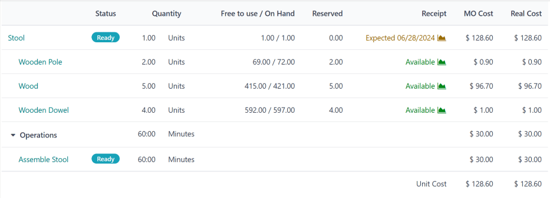

=========================
Manufacturing order costs
=========================

.. |MO| replace:: :abbr:`MO (Manufacturing Order)`
.. |MOs| replace:: :abbr:`MOs (Manufacturing Orders)`
.. |POs| replace:: :abbr:`POs (Purchase Orders)`
.. |BoM| replace:: :abbr:`BoM (Bill of Materials)`
.. |BoMs| replace:: :abbr:`BoMs (Bills of Materials)`

The ability to accurately calculate the cost of manufacturing a product is critical when determining
product profitability. Odoo's **Manufacturing** app simplifies this calculation by automatically
calculating the cost to complete each manufacturing order (MO), as well as the average production
cost of a product, based on all completed |MOs|.

.. important::
   Odoo's Manufacturing app distinguishes between the *MO cost* and the *real cost* of an |MO|.

   The |MO| cost represents how much it *should* cost to complete an |MO|, based on the
   configuration of the product's bill of materials (BoM). This takes into account the cost and
   quantity of components, as well as the cost of completing the necessary operations.

   The real cost represents how much it *actually* costs to complete the |MO|. A few factors can
   cause the real cost to differ from the |MO| cost. For example, an operation may take longer to
   complete than estimated, a greater component quantity might be needed than was specified on the
   |BoM|, or the price of components may change during manufacturing.

Cost configuration
==================

Odoo computes |MO| costs based on the configuration of the |BoM| used to manufacture a product. This
calculation includes the cost and quantity of components and operations listed on the |BoM|, in
addition to the operating costs of the work centers where those operations are carried out, and the
amount paid to each employee who works on an operation.

Component cost
--------------

Component cost is calculated automatically, based on the average purchase cost of a component across
all purchase orders (POs). To view a component's cost, navigate to :guilabel:`Inventory app -->
Products --> Products`, and select a component product. The cost is displayed in the
:guilabel:`Cost` field of the :guilabel:`General Information` tab, on the component's product form.

It is possible to set the cost of a component manually, by clicking the :guilabel:`Cost` field on
the component's product form and entering a value. However, any future |POs| for the component
override a manually entered value, resetting the :guilabel:`Cost` field back to an automatically
computed value.

.. _manufacturing/mo-costs/work-center-cost:

Work center cost
----------------

To set the operating cost for a specific work center, navigate to :menuselection:`Manufacturing app
--> Configuration --> Work Centers`, and select a work center.

To set the cost of operating the work center for one hour, enter a value in the :guilabel:`per
workcenter` field, located beside the :guilabel:`Cost per hour` section on the work center's
:guilabel:`General Information` tab.

To set the hourly cost of each employee that operates the work center, enter a value in the
:guilabel:`per employee` field, located beside the :guilabel:`Cost per hour` section on the work
center's :guilabel:`General Information` tab. For example, if `25.00` is entered in the
:guilabel:`per employee` field, it costs $25.00 per hour for *each* employee working at the work
center.

.. important::
   The value entered in the :guilabel:`per employee` field is only used to calculate the |MO| cost,
   which is the estimated cost of completing the |MO|.

   The actual cost of completing the |MO| is represented by the real cost. Instead of using the
   value entered in the :guilabel:`per employee` field, the real cost is calculated using the hourly
   cost specific to each employee.

   For example, if the :guilabel:`per employee` cost of a work center is '$50.00', and an employee
   with an hourly cost of '$60.00' completes a work order there, the |MO| cost (estimated) is
   calculated using the $50/hr cost, while the real cost is calculated using the $60/hr cost.

   See the :ref:`employee cost section <manufacturing/mo-costs/employee-cost>` below for information
   on how to set the cost for specific employees.

.. _manufacturing/mo-costs/employee-cost:

Employee cost
-------------

To set the hourly cost for a specific employee, navigate to the :menuselection:`Employees` app, and
select an employee. On the employee's form, select the :guilabel:`Settings` tab, and enter the
employee's rate in the :guilabel:`Hourly Cost` field of the :guilabel:`Application Settings`
section.

.. important::
   As detailed in the :ref:`work center cost section <manufacturing/mo-costs/work-center-cost>`
   above, the value entered in the :guilabel:`Hourly Cost` field on the employee's form is used to
   calculate the real cost of an |MO|. The estimated cost of an |MO|, referred to as the |MO| cost,
   uses the per employee cost set on each work center's form.

|BoM| configuration
-------------------

Configuring a |BoM| so Odoo can accurately calculate the cost of |MOs| that use it requires two
steps. First, components **must** be added, and the required quantity specified. Second, operations
**must** be added, along with the work centers where they are carried out.

Begin by navigating to :menuselection:`Manufacturing app --> Products --> Bills of Materials`.
Select a |BoM|, or create a new one by clicking :guilabel:`New`.

In the :guilabel:`Components` tab of the |BoM| form, add each component by clicking :guilabel:`Add a
line`, selecting the component from the drop-down menu in the :guilabel:`Component` column, and
entering the quantity in the :guilabel:`Quantity` column.

In the :guilabel:`Operations` tab, add an operation by clicking :guilabel:`Add a line` to open the
:guilabel:`Create Operations` pop-up window. Enter a title for the operation in the
:guilabel:`Operation` field.

Select the :guilabel:`Work Center` where the operation is carried out. Then, add a
:guilabel:`Default Duration`, which is the estimated amount of time the operation takes to complete.

By default, the :guilabel:`Duration Computation` field is set to :guilabel:`Set duration manually`,
which means that the number entered in :guilabel:`Default Duration` field is always used as the
expected duration of the operation.

Selecting :guilabel:`Compute based on tracked time` causes Odoo to automatically compute the
:guilabel:`Default Duration` based on a certain number of work orders, which is set in the
:guilabel:`Based on` field. Before there are work orders to compute this duration, the value in the
:guilabel:`Default Duration` field is used instead.

The hourly cost of operating the work center, and the duration of the operation, are used to
calculate the operation's cost.

Finally, click :guilabel:`Save & Close` to add the operation to the |BoM|, and close the
:guilabel:`Create Operations` pop-up window. Alternatively, click :guilabel:`Save & New` to add the
operation to the |BoM|, and open a blank :guilabel:`Create Operations` pop-up window to add another
operation.

.. seealso::
   For a full overview of |BoM| configuration, see the documentation on :doc:`bills of materials
   <bill_configuration>`.

|MO| overview
=============

Each |MO| has an *overview* page, which lists a variety of information about the |MO|, including
|MO| cost and real cost. To view the overview for an |MO|, navigate to :menuselection:`Manufacturing
app --> Operations --> Manufacturing Orders`, and select an |MO|. Then, click the :icon:`fa-bars`
:guilabel:`Overview` smart button at the top of the |MO|.

Both the |MO| cost and real cost take into account the cost and quantity of components, as well as
the cost of completing each work order. The overview page lists a row for each of these values, with
the sum of them listed at the bottom of the :guilabel:`MO Cost` and :guilabel:`Real Cost` columns.

Before work begins on an |MO|, the :guilabel:`MO Cost` and :guilabel:`Real Cost` columns display the
same costs. This is the *estimated* cost of completing the |MO|.

However, once work commences, the values in the :guilabel:`Real Cost` column may begin to diverge
from the values in the :guilabel:`MO Cost` column. This happens if a different component quantity is
used than was listed on the |MO|, the duration of a work order is different than expected, or the
hourly cost of the employee performing a work order differs from the employee cost set on the work
center.

Once the |MO| has been completed by clicking :guilabel:`Produce All`, the values in the
:guilabel:`MO Cost` column update to match those displayed in the :guilabel:`Real Cost` column.

Average manufacturing cost
==========================

In addition to the cost of each individual |MO| for a product, Odoo also tracks the average cost of
manufacturing the product, taking into account the cost of every completed |MO|. To view this,
navigate to :menuselection:`Inventory app --> Products --> Products`, and select a product.

The manufacturing cost of the product is displayed per unit of measure in the :guilabel:`Cost`
field, located in the :guilabel:`General Information` tab. The value continues to update as the
costs of additional |MOs| are factored into the average cost.

To the right of the :guilabel:`Cost` field is a :guilabel:`Compute Price from BoM` button, which
only appears for products with at least one |BoM|. Click this button to reset the cost of the
product to the expected cost, which only takes into account the components and operations listed on
the |BoM|.

.. important::

   Be aware that clicking :guilabel:`Compute Price from BoM` does not set the price permanently. The
   cost continues to update based on the average of the |BoM| price and the real cost of any future
   |MOs|.

.. admonition:: Example workflow: manufacturing cost
   :class: alert alert-success

   Golf product manufacturer *Fairway Fields* produces a variety of golf products, including an
   indoor *putting green*. They have configured a |BoM| for the putting green, so Odoo automatically
   calculates the manufacturing cost of each putting green |MO|.

   The |BoM| lists two components:

   - One unit of *green felt*, which costs $20.00.
   - One unit of a *rubber pad*, which costs $30.00.

   The |BoM| also lists four operations, all of which are carried out at *Assembly Station 1*, which
   has an hourly operating cost of $30.00. Those operations are as follows:

   - *Cut felt*: default duration of seven minutes, for a total cost of $3.50.
   - *Cut rubber pad*: default duration of five minutes, for a total cost of $2.50.
   - *Attach pad to felt*: default duration of 15 minutes, for a total cost of $7.50.
   - *Cut holes*: default duration of three minutes, for a total cost of $1.50.

   Altogether, the components required to produce one putting green cost $50.00, and the operations
   required cost $15.00, for a total manufacturing cost of $65.00. This cost is reflected in the
   :guilabel:`Cost` field on the putting green's product form.

   Fairway Fields confirms an |MO| for one putting green. Before manufacturing starts, the |MO|
   overview lists a cost of `$65.00` in both the :guilabel:`MO Cost` and :guilabel:`Real Cost`
   fields.

   .. image:: mo_costs/overview-before.png
      :align: center
      :alt: The MO Overview page for one putting green, before production starts.

   Manufacturing begins, and the operations take ten minutes longer than expected, for a total
   manufacturing time of 40 minutes. This deviation from the |BoM| is reflected on the |MO|
   overview, which now lists a :guilabel:`Real Cost` of `$70.00`.

   .. image:: mo_costs/overview-during.png
      :align: center
      :alt: The MO Overview page for one putting green, during production.

   Once manufacturing is finished, and the |MO| is marked as *Done*, the |MO| overview updates
   again, so the values in the :guilabel:`MO Cost` and :guilabel:`Real Cost` columns match, each
   displaying a value of `$70.00`.

   On the putting green's product page, the :guilabel:`Cost` field now displays a cost of `$67.50`,
   the average of the original cost of $65.00 and the real cost of $70.00 from the |MO|.
