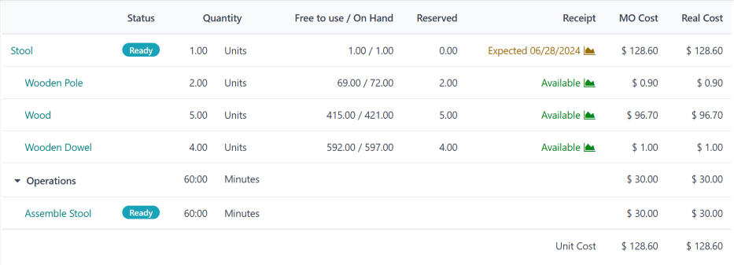

=========================
Manufacturing order costs
=========================

.. |MO| replace:: :abbr:`MO (manufacturing order)`
.. |MOs| replace:: :abbr:`MOs (manufacturing orders)`
.. |POs| replace:: :abbr:`POs (Purchase orders)`
.. |BoM| replace:: :abbr:`BoM (Bill of Materials)`
.. |BoMs| replace:: :abbr:`BoMs (Bills of Materials)`

The ability to accurately calculate the cost of manufacturing a product is critical when determining
product profitability. Odoo's *Manufacturing* app simplifies this calculation by automatically
calculating the cost to complete each |MO|, as well as the average production cost of a product
based on all |MOs|.

.. important::
   Odoo's Manufacturing app distinguishes between the *|MO| cost* and the *real cost*  of an |MO|.

   The |MO| cost represents how much it *should* cost to complete an |MO|, based on the
   configuration of the product's |BoM|. This takes into account the cost and quantity of
   components, as well as the cost of completing the necessary operations.

   The real cost represents how much it *actually* cost to complete the |MO|. A few factors can
   cause the real cost to differ from the |MO| cost. For example, an operation may take longer to
   complete than estimated, or a greater component quantity is needed than was specified on the
   |BoM|.

Cost configuration
==================

Odoo computes |MO| cost based on the configuration of the |BoM| used to manufacture a product. This
includes the cost and quantity of components listed on the |BoM|, as well as the operations listed,
and the operating costs of the work centers where those operations are carried out.

Component cost
--------------

Component cost is calculated automatically, based on the average purchase cost of a component across
all purchase orders (POs). To view the cost of a component, navigate to :guilabel:`Inventory app -->
Products --> Products`, and select a component. The cost is displayed in the :guilabel:`Cost` field
of the :guilabel:`General Information` tab.

It is possible to set the cost of a component manually by clicking on the :guilabel:`Cost` field on
the component's product form, and entering a value. However, any future |POs| for the component
override a value entered manually, resetting the :guilabel:`Cost` field back to an automatically
computed value.

Work center cost
----------------

To set the operating cost for a specific work center, navigate to :menuselection:`Manufacturing app
--> Configuration --> Work Centers`, and select a work center.

To set the operating cost for the work center as a whole, enter a value in the :guilabel:`per
workcenter` field of the :guilabel:`Cost per hour` section  on the work center's :guilabel:`General
Information` tab. This operating cost is used regardless of how many employees are working at the
work center at any given time.

To set the operating cost for the work center based on the number of employees working there at a
given time, enter a value in the :guilabel:`per employee` field of the :guilabel:`Cost per hour`
section  on the work center's :guilabel:`General Information` tab. For example, if `25.00` is
entered in the :guilabel:`per employee` field, it costs $25.00 per hour for *each* employee working
at the work center.

Note that if values are entered in both the :guilabel:`per workcenter` *and* :guilabel:`per
employee` fields, the value in the :guilabel:`per workcenter` field takes precedence, and the value
in the :guilabel:`per employee` field is ignored.

.. important::
   It is also possible to set a per hour cost for specific employees, by navigating to the
   :menuselection:`Employees` app, selecting an employee, clicking the :guilabel:`HR Settings` tab,
   and entering a value in the :guilabel:`Hourly Cost` field.

   Just like the *per workcenter* field on a work center form, the :guilabel:`Hourly Cost` field on
   a employee's form overrides the *per employee* field on a work center form.

   However, the *per workcenter* field takes precedence over both the *per employee* field on the
   workcenter form *and* the :guilabel:`Hourly Cost` field on the employee form.

|BoM| cost
----------

Configuring a |BoM| so that Odoo can accurately calculate the cost of |MOs| that use it requires two
steps. First, components must be added, and the required quantity specified. Second, operations must
be added, along with the work centers where they are carried out.

Begin by navigating to :menuselection:`Manufacturing app --> Products --> Bills of Materials`.
Select a |BoM|, or create a new one by clicking :guilabel:`New`.

On the :guilabel:`Components` tab, add each component by clicking :guilabel:`Add a line`, selecting
the component from the drop-down menu in the :guilabel:`Component` column, and entering the quantity
in the :guilabel:`Quantity` column.

On the :guilabel:`Operations` tab, add an operation by clicking :guilabel:`Add a line` to open the
:guilabel:`Create Operations` pop-up window. Enter a title for the operation in the
:guilabel:`Operation` field.

Next, select a :guilabel:`Work Center` and enter the expected duration of the operation in the
:guilabel:`Default Duration` field. The hourly cost of operating the work center and the duration of
the operation are used to calculate the operation's cost. If no duration is recorded during
manufacturing, the value in the :guilabel:`Default Duration` field is used instead.

Finally, click :guilabel:`Save & Close` to add the operation to the |BoM| and close the
:guilabel:`Create Operations` pop-up window. Alternatively, click :guilabel:`Save & New` to add the
operation to the |BoM|, and open a blank :guilabel:`Create Operations` pop-up window to add another
operation.

.. seealso::
   For a full overview of |BoM| configuration, see the documentation on :doc:`bills of materials
   <bill_configuration>`.

|MO| Overview
=============

Each |MO| has an *overview* page, which lists a variety of information about the |MO|, including
|MO| cost and real cost. To view the overview for an |MO|, navigate to :menuselection:`Manufacturing
app --> Operations --> Manufacturing Orders`, and select an |MO|. Then, click the
:guilabel:`Overview` smart button at the top of the |MO|.

Both the |MO| cost and real cost take into account the cost and quantity of components, as well as
the cost of completing each work order. The overview page lists a row for each of these values, with
the sum of them listed at the bottom of the :guilabel:`MO Cost` and :guilabel:`Real Cost` columns.

Before work begins on an |MO|, the :guilabel:`MO Cost` and :guilabel:`Real Cost` columns display the
same costs. This is the *estimated* cost of completing the |MO|.

However, once work commences, the values in the :guilabel:`Real Cost` column may begin to diverge
from the ones in the :guilabel:`MO Cost` column. This happens if a different component quantity is
used than was listed on the |MO|, or if the duration of a work order is shorter or longer than
expected.

Once the |MO| has been completed by clicking :guilabel:`Produce All`, the values in the
:guilabel:`MO Cost` column update to match those displayed in the :guilabel:`Real Cost` column.

Average manufacturing cost
==========================

In addition to the cost of each individual |MO| for a product, Odoo also tracks the average cost of
manufacturing the product, taking into account the cost of every completed |MO|. To view this,
navigate to :menuselection:`Inventory app --> Products --> Products`, and select a product.

The manufacturing cost of the product is displayed per unit of measure in the :guilabel:`Cost`
field. The value continues to update as the costs of additional |MOs| are factored into the average
cost.

To the right of the :guilabel:`Cost` field is a :guilabel:`Compute Price from BoM` button. Click
this button to reset the cost of the product to the expected cost, which only takes into account the
components and operations listed on the |BoM|.

Be aware that clicking :guilabel:`Compute Price from BoM` does not set the price permanently. The
cost continues to update based on the average of the |BoM| price and the real cost of any future
|MOs|.

.. admonition:: Example workflow: manufacturing cost
   :class: alert alert-success

   Golf product manufacturer *Fairway Fields* produces a variety of golf products, include an indoor
   *putting green*. They have configured a |BoM| for the putting green so that Odoo automatically
   calculates the manufacturing cost of each putting green |MO|.

   The |BoM| lists two components:

   - One unit of *green felt*, which costs $20.00.
   - One unit of a *rubber pad*, which costs $30.00.

   The |BoM| also lists four operations, all of which are carried out at *Assembly Station 1*, which
   has an hourly operating cost of $30.00:

   - *Cut felt*, which has a default duration of seven minutes, for a total cost of $3.50.
   - *Cut rubber pad*, which has a default duration of five minutes, for a total cost of $2.50.
   - *Attach pad to felt*, which has a default duration of 15 minutes, for a total cost of $7.50.
   - *Cut holes*, which has a default duration of three minutes, for a total cost of $1.50.

   Altogether, the components required to produce one putting green cost $50.00, and the operations
   required cost $15.00, for a total manufacturing cost of $65.00. This cost is reflected in the
   Cost field on the putting green's product form.

   Fairway Fields confirms an |MO| for one putting green. Before manufacturing starts, the |MO|
   overview lists a cost of `$65.00` in both the |MO| Cost and Real Cost fields.

   .. image:: mo_costs/overview-before.png
      :align: center
      :alt: The MO Overview page for one putting green, before production starts.

   Manufacturing begins, and the operations take ten minutes longer than expected, for a total
   manufacturing time of 40 minutes. This deviation from the |BoM| is reflected on the |MO|
   overview, which now lists a real cost of $70.00.

   .. image:: mo_costs/overview-during.png
      :align: center
      :alt: The MO Overview page for one putting green, during production.

   Once manufacturing is finished, and the |MO| is marked as *Done*, the |MO| overview updates again
   so the values in the MO Cost and Real Cost columns match, each displaying a value of $70.00.

   On the putting green's product page, the Cost field now displays a cost of $67.50, the average of
   the original cost of $65.00 and the real cost of $70.00 from the |MO|.
