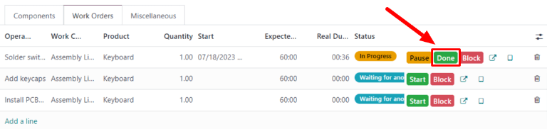
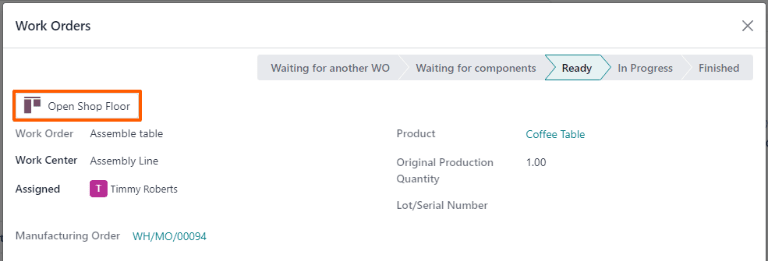

======================
Two-step manufacturing
======================

.. _manufacturing/management/one_step_manufacturing:
.. |BOM| replace:: :abbr:`BoM (Bill of Materials)`
.. |MO| replace:: :abbr:`MO (Manufacturing Order)`

Odoo *Manufacturing* allows users to manufacture products using one, two, or three steps. When using
two-step manufacturing, Odoo creates a manufacturing order (MO) and a pick components transfer, but
does not generate a transfer for the movement of finished products into stock. Inventory counts
still update based on the number of products manufactured, but the act of transferring them to and
from inventory is not tracked.

.. tip::
   The number of steps used in manufacturing is set at the warehouse level, allowing for each
   warehouse to use a different number of steps. To change the number of steps used for a specific
   warehouse, begin by navigating to :menuselection:`Inventory --> Configuration --> Warehouses`,
   and then select a warehouse from the :guilabel:`Warehouses` screen.

   On the :guilabel:`Warehouse Configuration` tab, find the :guilabel:`Manufacture` radio input
   field, and select one of the three options: :guilabel:`Manufacture (1 step)`, :guilabel:`Pick
   components and then manufacture (2 steps)`, or :guilabel:`Pick components, manufacture and then
   store products (3 steps)`.

   .. image:: two_step_manufacturing/manufacturing-type.png
      :align: center
      :alt: The Manufacture radio input field on a warehouse configuration page.

.. important::
   Products must be properly configured before they can be manufactured in Odoo. For details on how
   to do so, see the documentation on how to :ref:`configure a product for manufacturing
   <manufacturing/management/configure-manufacturing-product>`.

Create manufacturing order
==========================

To manufacture a product in Odoo *Manufacturing*, begin by navigating to
:menuselection:`Manufacturing --> Operations --> Manufacturing Orders`, and then click
:guilabel:`New` to create a new |MO|.

On the new |MO|, select the product to be produced from the :guilabel:`Product` drop-down menu. The
:guilabel:`Bill of Material` field auto-populates with the associated Bill of Materials (BoM).

If a product has more than one |BOM| configured for it, the specific |BOM| can be selected in the
:guilabel:`Bill of Material` field, and the :guilabel:`Product` field auto-populates with the
associated product.

After a |BOM| has been selected, the :guilabel:`Components` and :guilabel:`Work Orders` tabs
auto-populate with the components and operations specified on the |BOM|. If additional components or
operations are required for the |MO| being configured, add them to the :guilabel:`Components` and
:guilabel:`Work Orders` tabs by clicking :guilabel:`Add a line`.

Finally, click :guilabel:`Confirm` to confirm the |MO|.

Process pick components transfer
================================

After confirming a two-step |MO|, a :guilabel:`Transfers` smart button appears at the top of the
page. Click it to open the pick components transfer for the |MO|. This transfer is used to track the
movement of components from the locations where they are stored to the location where they are used
to manufacture the product.

After transferring the components out of their storage location, click :guilabel:`Validate` at the
top of the transfer, followed by :guilabel:`Apply` on the :guilabel:`Immediate Transfer?` pop-up
window that appears. Doing so marks the transfer as :guilabel:`Done`, and updates inventory counts
to reflect the quantity of components transferred.

Finally, return to the |MO| by clicking the :guilabel:`WH/MO/XXXXX` breadcrumb at the top of the
page.

.. image:: two_step_manufacturing/mo-bread-crumb.png
   :align: center
   :alt: The manufacturing order bread crumb on a pick components transfer.

Process manufacturing order
===========================

An |MO| is processed by completing all of the work orders listed under its :guilabel:`Work Orders`
tab. This can be done on the |MO| itself, or from the work order tablet view.

Basic workflow
--------------

To complete work orders from the |MO| itself, begin by navigating to :menuselection:`Manufacturing
--> Operations --> Manufacturing Orders`, and then select an |MO|.

On the |MO| page, select the :guilabel:`Work Orders` tab. Once work begins on the first work order
that needs to be completed, click the :guilabel:`Start` button for that operation. Odoo
*Manufacturing* then starts a timer that keeps track of how long the work order takes to complete.

.. image:: two_step_manufacturing/start-button.png
   :align: center
   :alt: The Start button for an work order on a manufacturing order.

When the work order is completed, click the :guilabel:`Done` button for that work order. Repeat the
same process for each work order listed on the :guilabel:`Work Orders` tab.

After completing all of the work orders, click :guilabel:`Produce All` at the top of the screen to
mark the |MO| as :guilabel:`Done`, and register the manufactured product(s) into inventory.

Shop Floor workflow
-------------------

To complete the work orders for an |MO| using the *Shop Floor* module, begin by navigating to
:menuselection:`Manufacturing --> Operations --> Manufacturing Orders`, and then select an |MO|.

On the |MO|, click on the :guilabel:`Work Orders` tab, and then select the :guilabel:`↗️ (square
with arrow coming out of it)` button on the line of the first work order to be processed. Doing so
opens a :guilabel:`Work Orders` pop-up window, with details and processing options for the work
order.

On the pop-up window, select the :guilabel:`Open Shop Floor` button at the top-left of the window to
open the *Shop Floor* module.

When accessed directly from a specific work order within an |MO|, *Shop Floor* defaults to the page
for the work center where the work order is configured to be carried out. The page shows a card for
the work order that displays the |MO| number, the product and number of units to be produced, and
the steps required to complete the work order.

.. image:: two_step_manufacturing/work-order-card.png
   :align: center
   :alt: A work order card on a work center page in the Shop Floor module.

A work order is processed by completing each step listed on its card. This can be done by clicking
on a step and following the instructions listed on the pop-up window that appears. Once the step is
completed, click :guilabel:`Next` to move on to the next step, if any are required.

Alternatively, work order steps can be completed by clicking the checkbox that appears on the right
side of the step's line on the work order card. When using this method, the step is automatically
marked as completed, without a pop-up window appearing.

The final step on a work order card is titled *Register Production*. This step is used to register
the number of product units that were produced. If the number produced is equal to the number that
the |MO| was created for, click the :guilabel:`# Units` button on the right side of the line to
automatically register that number as the quantity produced.

If a different number must be entered, click the :guilabel:`Register Production` step to open a
pop-up window. Enter the number of units produced in the :guilabel:`Units` field, and then click
:guilabel:`Validate` to register that number.

.. note::
   The *Register Production* step appears on every work order card. It must be completed for the
   first work order that is processed. After doing so, the step appears as already completed for
   each remaining work order in the |MO|.

After completing all of the steps for a work order, a button appears on the footer of the work order
card. If any other work orders must be completed before the |MO| can be closed, the button is titled
:guilabel:`Mark as Done`. If there are no additional work orders to complete, the button is titled
:guilabel:`Close Production`.

Clicking :guilabel:`Mark as Done` causes the work order card to fade away. Once it disappears
completely, the work order's status is marked as *Finished* on the |MO|, and the next work order
appears in the *Shop Floor* module, on the page of the work center where it is configured to be
carried out. Any additional work orders can be processed using the instructions detailed in this
section.

Clicking :guilabel:`Close Production` causes the work order card to fade away. Once it disappears,
the |MO| is marked as *Done*, and the units of the product that were produced are entered into
inventory.

After clicking :guilabel:`Mark as Done` or :guilabel:`Close Production`, each button is replaced by
an :guilabel:`Undo` button. Click the :guilabel:`Undo` button before the work order card fades away
to keep the work order open.

.. tip::
   This section details the basic workflow for processing an |MO| in the *Shop Floor* module. For a
   more in-depth explanation of the module and all of its features, please see the :ref:`Shop Floor
   overview <manufacturing/shop_floor/shop_floor_overview>` documentation.
