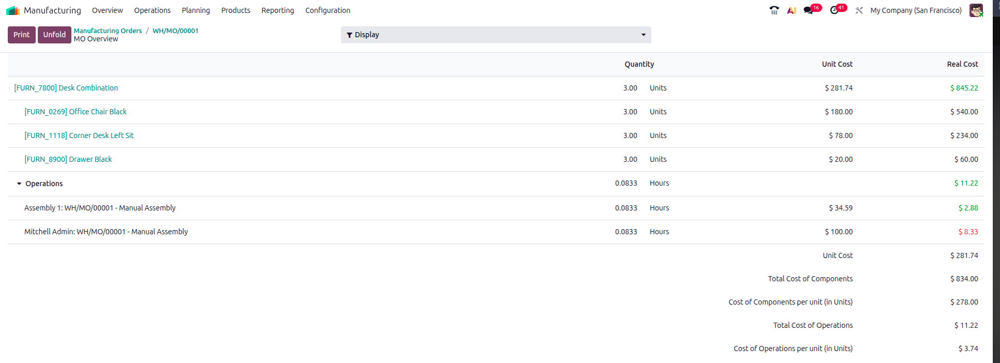
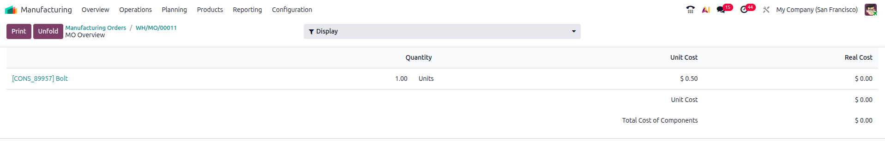
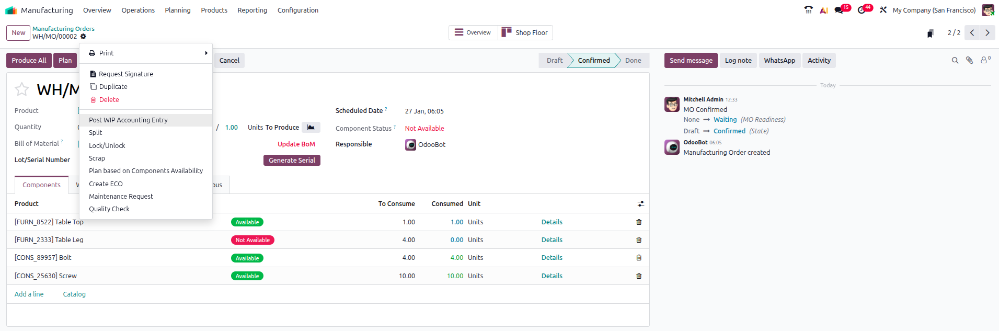
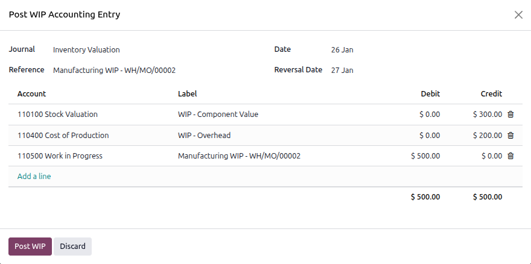
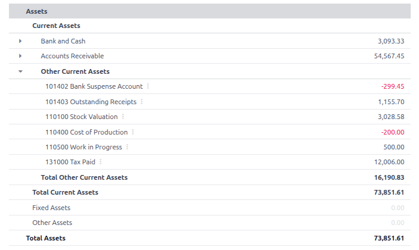
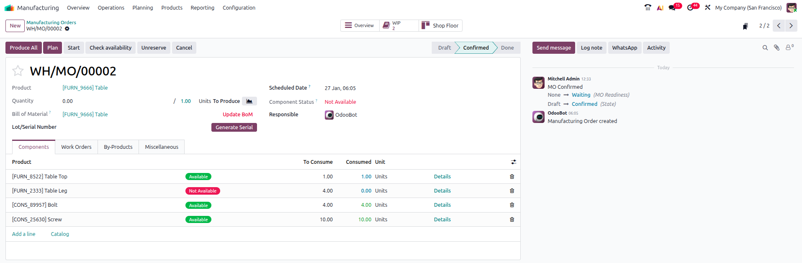
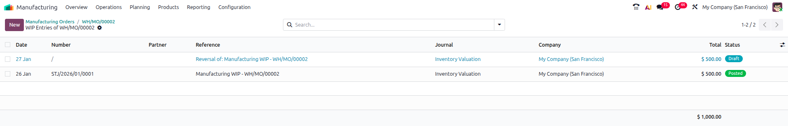
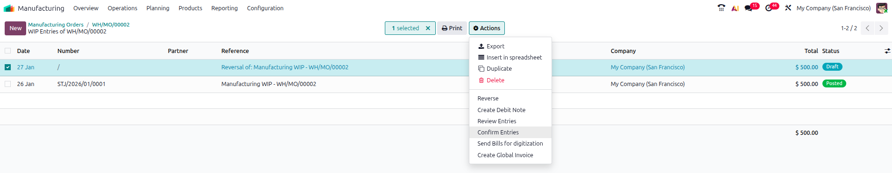

======================
Work in progress (WIP)
======================

.. |MO| replace:: :abbr:`MO (Manufacturing Order)`
.. |WIP| replace:: :abbr:`WIP (Work In Progress)`
.. |FY| replace:: :abbr:`FY (Fiscal Year)`

What is |WIP|?
==============

The Odoo *Manufacturing* application includes a Work In Progress feature that allows users to
account for the value of partially completed products during the manufacturing process to ensure
accurate financial statements and effective management. |WIP| only applies to |MO|'s that are in
progress. |WIP| is calculated based on a variety of factors including materials, overhead, and
employee costs.

.. important::
    |WIP| entry amounts are based on costs that **have already been incurred** during the
    manufacturing process, not on planned or estimated costs.

.. tip::
   In Odoo V19.0, |WIP| is enabled by default when the *Accounting* application is installed. To
   verify that |WIP| is configured to post to the correct accounts in the relevant journals,
   navigate to :menuselection:`Settings -->  Accounting --> Inventory Valuation --> Manufacturing`.

   From this view, the :guilabel:`Work In Progress Account` field displays the account used to track
   the value of goods in progress. By default, Odoo sets this account to :guilabel:`110500 Work in
   Progress`. The :guilabel:`WIP Overhead Account` field shows the account used to track overhead
   costs associated with |WIP|. By default, Odoo sets this account to :guilabel:`110400 Cost of
   Production`.

    In the default setup, initial |WIP| entries debit :guilabel:`110500 Work in Progress` and credit
    :guilabel:`110100 Stock Valuation` and :guilabel:`110400 Cost of Production`. When the |MO| is
    completed, the initial |WIP| entries are reversed to reset the |WIP| account and maintain
    accurate financial records that reflect that snapshot in time.

.. important::
    The default |WIP| accounts can be changed to align with a company's accounting practices. To
    change these accounts, simply navigate back to :menuselection:`Settings -->  Accounting -->
    Inventory Valuation --> Manufacturing`. Click on the account names or use the
    :icon:`fa-caret-down` icon next to the account names to either select another preconfigured
    account or create a new account.

    .. image:: work_in_progress/WIP_Settings.png
       :alt: The Work In Progress Account and Work In Progress Overhead Account fields on the
             Manufacturing configuration page.

Why |WIP| matters
-----------------

While |WIP| may seem like just another accounting term, it has real-world implications that affect
both financial reporting and manufacturing operations.

Let's explore why |WIP| matters across business functions:

|WIP| for accountants
---------------------

In USA GAAP and IFRS accounting standards, companies are required to account for the value of
partially completed goods at the end of a *defined* accounting period. For some companies, their
Fiscal Year |FY| may align with the calendar year, while others may have a |FY| that spans multiple
calendar years or starts and ends at a unique date.

Regardless of their specific |FY|, companies must ensure that their financial statements are
accurate no matter the date they are generated. This means that if a company has partially completed
goods at the end of their |FY| or another reporting period, they must account for the value of those
goods appropriately in their financial statements.

.. note::
   Failure to properly account for |WIP| can lead to significant mistatements in financial
   reporting, with consequences ranging from pushing revenue into the wrong period to misstating
   inventory values.

The *Matching Principle* under accrual accounting states that expenses should be recognized in the
same period as the revenues they help generate. By accurately accounting for |WIP|, companies can
ensure that expenses related to partially completed goods are matched with the revenues they will
ultimately help generate, leading to more accurate financial reporting.

|WIP| for manufacturing managers
--------------------------------

|WIP| is not just one of those *accounting things* that have no real-world implications.

For manufacturing managers, |WIP| is an important part of creating and maintaining an accurate
manufacturing lifecycle and process.

|WIP| is the value of partially completed goods at any given point in time.

Another way to frame it: |WIP| tells your business where the cash is tied up in the manufacturing
process at any given point.

|WIP| is an indicator of real costs already incurred: materials, labor, and overhead consumed. By
taking this information seriously, manufacturing managers can improve cash flow management,
inventory turnover, and working capital optimization.

   The :guilabel:`Unit Cost` column shows the planned cost per unit, while the :guilabel:`Real Cost`
   column reflects the actual cost based on consumption of materials and labor (i.e., what |WIP|
   uses to calculate jounral entry values).

.. tip::
    Materials can also be marked as consumed by employees via the Shop Floor application or by using
    barcode scanning. This consumption data directly impacts |WIP| calculations, ensuring that the
    value of partially completed goods reflects the actual materials used in the manufacturing
    process.

TL;DR
-----

While accountants care about |WIP| for financial reporting purposes, manufacturing managers care
about |WIP| for operational efficiency and cost control.

|WIP| is not only highly relevant to financial valuation, but also deeply operational in nature.

What |WIP| *actually* does in Odoo
==================================

Ok, so now that we understand *why* |WIP| is important from an accounting and manufacturing
perspective, let's look at *what* |WIP| actually does in Odoo.

|WIP| exists within the context of |MO|'s
-----------------------------------------

For those businesses making products, |MO|'s are regularly created to track the manufacturing
process from start to finish. These orders define what products are being made, what components are
needed to make them, and other relevant information.

From the |MO| Overview perspective (available since Odoo V17.0), values listed under the column
:guilabel:`MO Cost` are the total costs you plan to incur from the manufacturing process, and real
costs are what the |WIP| entries record. They represent incurred but not yet finalized costs.

|WIP| comes into play only *during* the process of fulfilling an |MO|.

:doc:`../../../inventory_and_mrp/inventory/inventory_valuation/landed_costs` (costs of bringing
goods into stock) and Costs of Goods Sold (COGS) are not included in |WIP| because these factors
relevant only before or after the manufacturing process.

|WIP| entries
-------------

|WIP| entries are posted after an |MO| is confirmed but before a product's manufacturing process has
been completed. These entries are posted manually as needed.

|WIP| is posted manually. This method allows for greater control and accuracy for companies.

.. important::
   By default, Odoo automatically schedules an action to reverse the initial |WIP| entries once they
   are posted. The automated reversal is set for the next day. The reversal day can be adjusted when
   posting the initial |WIP| entry.

Making initial |WIP| entries
----------------------------

To post initial |WIP| entries, navigate to the relevant |MO| and locate the :icon:`fa-cog` icon next
to the |MO| number. Clicking on the gear icon opens a dropdown menu with various options.

From the dropdown menu, select the :guilabel:`Post |WIP| Accounting Entry` option.

This will open a popup window where you can specify the date, journal, accounts, and amounts for the
|WIP| entry posting.

.. tip::
    If you have posted a |WIP| entry and need to make updates, first reverse the existing |WIP|
    entry before posting a new one. This ensures that your financial records remain accurate and
    values are not misstated.

Verify |WIP| entries
--------------------

Not sure if your |WIP| entries are actually posting? Check your :guilabel:`Balance Sheet` report for
that specific period to make sure that |WIP| entries are being posted and reversed correctly. |WIP|
is an inventory asset.

Reversing |WIP| entries
-----------------------

.. attention::
   |WIP| entries are reversed automatically by default the day after the initial WIP entry is posted.
   However, users can also manually reverse |WIP| entries if needed.

To manually reverse |WIP| entries, navigate to the relevant |MO|.

From the |MO|, click on the :guilabel:`Work In Progress` smart button to view the |WIP| entries
associated with it.

This will open a new window displaying all |WIP| entries for that |MO|.

To reverse the initial |WIP| entry, click the :guilabel:`Confirm Entries` button from the dropdown
menu.

Verify the reversal was posted by reviewing the :guilabel:`Balance Sheet` report for that period.

.. image:: work_in_progress/Reversed_BS.png
   :alt: The balance sheet report after the Work In Progress entries have been reversed.

.. note::
    If the |WIP| entries do not appear as expected in the :guilabel:`Balance Sheet` report,
    double-check the dates and filters applied to ensure they align with the posting and reversal
    dates of the |WIP| entries.

