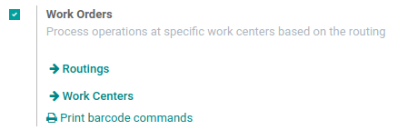
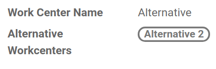
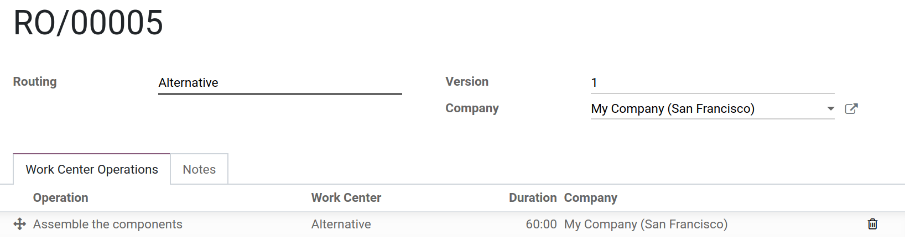
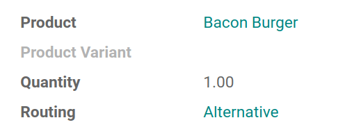

================================
Using an alternative Work Center
================================

For many manufacturing companies, a common issue is to have to
manufacture, at the same time, several products usually produced at the
same work center. If in practice, employees can manufacture the goods at
another work center, it is not that simple.

You need to keep track of the job: which work center has been used and
when, so you can schedule maintenance efficiently. With Odoo, you can
configure it so you can keep tracking manufacturing orders and your
employees have an alternative work center to use.

This way, your process becomes more efficient, and less non-productive
time will be noticed.

Configure your Work Centers
===========================

The first thing to do is to go to the *Manufacturing* app settings.
Then, enable the *Work Orders* feature and hit save.

Now, go to the *Work Centers* menu under *Master Data* and create
two new work centers. Add the second work centers as an alternative to
the first and vice versa.

The next step is to create your *routing*. Add your work center and an
operation to it before saving.

Then, you can create your *Bill of Materials* and add components and
routing to it.

Create your Work Orders
=======================

Now that everything is configured, you can create your *Work Orders*.
Go to the *Manufacturing Orders* menu and hit *Create*. There, add
your product and plan it. In the *Work Orders* list, you can find it
ready to be assembled.

Each new *Work Order*, which will be created before the end of the
first one, will be scheduled at the alternative work center you
configured.

.. note::
         Keep in mind that, if you add time after production to your work center,
         you may have work orders scheduled for your alternative work center even
         if the usual one is free.