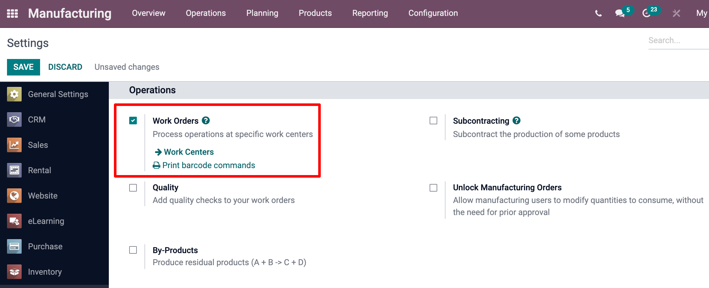

========================
Alternative Work Centers
========================

Manufacturing several different products simultaneously at the same work center is a common issue
for manufacturing companies. Although in practice, employees can manufacture the goods at another
work center instead of waiting for one to be available, it's not always simple to have visibility
on which work center is busy and plan resources accordingly in real-time.

With Odoo, you can configure alternative work centers to solve this issue. This automatically
checks which work center is busy and which equivalent ones are free, and schedules orders and
maintenance accordingly.

This way, your process becomes more efficient, as work center utilisation is optimised.

Configure your Work Centers
===========================

First, go to the :menuselection:`Manufacturing app --> Configuration --> Settings`. Then, enable
the :guilabel:`Work Orders` feature and hit :guilabel:`Save`.

Now, go to :menuselection:`Configuration --> Work Centers` and create two new work centers. Add the
second work center as an alternative to the first one and vice versa.

.. image:: alternative_wc/alternative-wc-config.png
   :align: center
   :alt: Create a secondary work center as an alternate to the first.

Next, go to :menuselection:`Products --> Bills of Materials`, choose your product, and add these
work centers to the operations of your :abbr:`BoM (Bill of Materials)`.

.. image:: alternative_wc/wc-bom-operations.png
   :align: center
   :alt: Add work centers to Bill of Materials operations.

Create your Work Orders
=======================

Now that everything is configured, you can create your *Work Orders*.

Go to :menuselection:`Operations --> Manufacturing Orders`, and hit :guilabel:`Create`. There, add
your product to your manufacturing order and plan it. You can then retrieve them from the
:guilabel:`Work Orders` list view, under :menuselection:`Operations > Work Orders`.

Each new *Work Order*, which will be created before the end of the first one, will be scheduled at
the alternative work center you configured, as shown below.

.. image:: alternative_wc/work-orders-by-wc.png
   :align: center
   :alt: Work order creation and scheduling.

.. note::
   Keep in mind that, if you add time after production to your work center, you may have work
   orders scheduled for your alternative work center even if the usual one is free.
