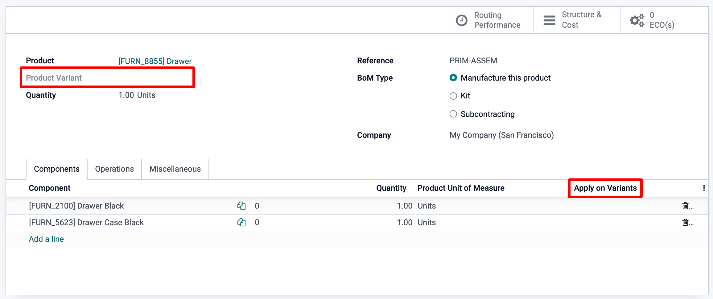
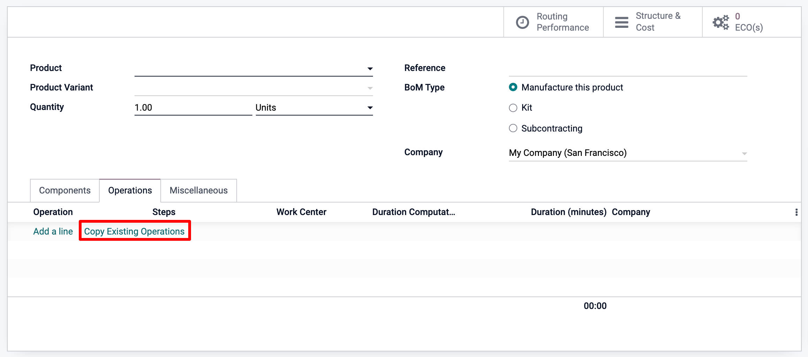

=========================
Create Bills of Materials
=========================

A *Bill of Materials* is a document defining the quantity of each
component required to make or deliver a finished product. Additionally, it 
can also include various operations and individual step guidelines
needed to complete a production process. 

With Odoo's MRP solution, multiple BOMs can also be linked to each product,
so that even product variants can have their *own* tailored BOM.

This will help you to optimize your manufacturing process and save time 
as a result. 

Setting up a BoM
================
The simplest BoM set up is one without operations or instructions. 
In this case, you will manage your production using Manufacturing Orders
only.

To create a BoM from the Manufacturing module, go to :menuselection:`Products --> Bills of Materials`. 
If you click **Create**, the first thing you'll have to do is to specify the final product. 
For an existing product, simply select it from the list, or create a new one on the spot. Note 
that if you go through the product form to create your BOM, the product will already be set for you.

For a standard Bill of Material, keep the default *BoM* type, which is *Manufacture this Product*. 
Now specify the various components that make up the production of your final product and their 
respective quantities. You can create components as you go, on the BOM, or create products beforehand,
by going to the :menuselection:`Top Menu --> Products --> Create`, and add them later on. 

.. image:: bill_configuration/bom_1.png
    :align: center

.. warning::
   The destination location should **not** be a scrap location. A scrap location is where you put
   products that you don't need.

Using the same BoM to describe Variants
---------------------------------------

As suggested above, you can use *BOMs* for specific *Product Variants*. 
Once the various attributes have been configured on the product form, there 
are two ways to configure the appropriate BoM for the respective product combination. 

Either create one BoM per variant, by specifying the Product Variant
in the dedicated field below the product name. Or use one BOM, that contains
all of the components and for each component, indicate which variant it applies to, 
using the *Apply on Variants* column, as shown below. 

Adding Operations
=================

You can also add operations to your *BoM*, if you want workers to follow instructions
or register time spent. To use this feature, enable the *Work Orders* feature in the 
*Manufacturing* app settings, as shown below.

.. image:: bill_configuration/bom_3.png
    :align: center

.. note::
         Each operation is unique as it is always linked to only one BOM. This being said, 
         Operations Operations can be re-used when configuring a new BOM, with the *Copy Existing 
         Operations* feature.

Finally, just like for components, operations can also be variant specific only, as shown below.

.. image:: bill_configuration/bom_5.png
    :align: center

Adding By-Products
==================

A *by-product* is a product that is produced on top of the main product 
of a *BoM*. As opposed to the primary product, there can be more than one on a BOM. 

To add *by-products* to a *BoM*, you will first need to enable the by-product
feature from the *Manufacturing* app settings.

.. image:: bill_configuration/bom_6.png
    :align: center

Once the feature is enabled, you can add *by-products* to your
*BoMs*. Note that if you have Operations, you'll need to specify 
in which operation the by-product is produced. 
