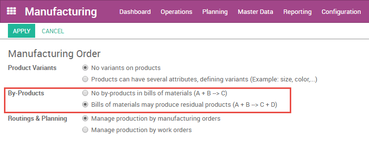
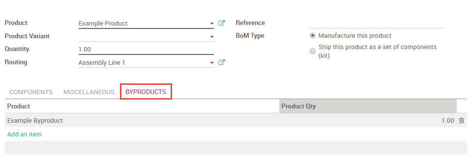
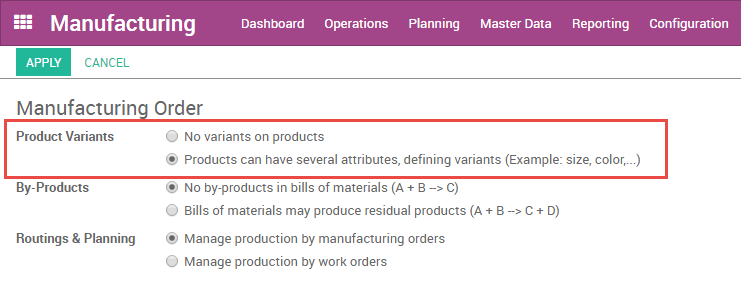
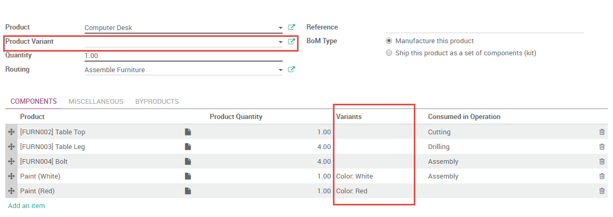

=================================
How to create a Bill of Materials
=================================

A bill of materials (BoM) is a document that describes the component
products, the quantity of each component, and the process required to
manufacture a product, including a routing and individual steps.

In Odoo, each product may have multiple BoMs associated with it, but a
BoM can only be associated with a single product. A single BoM can,
however, describe multiple variants of the same product.

Setting up a Basic BoM
======================

If you choose to manage your manufacturing operations using manufacturing
orders only, you will define basic bills of materials without routings.

Before creating your first bill of materials, you will need to create a
product and at least one component (components are considered products
in Odoo). You can do so from :menuselection:`Master Data --> Products`, or
on the fly from the relevant fields on the BoM form. Review the
Inventory chapter for more information about configuring products. Once
you have created a product and at least one component, select them from
the relevant dropdown menus to add them to your bill of materials. A new
bill of materials can be created from :menuselection:`Master Data --> Bills of Materials`,
or using the button on the top of the product form.

Under the **Miscellaneous** tab, you can fill additional fields.
**Sequence** defines the order in which your BoMs will be selected
for production orders, with lower numbers having higher priority.
**Version** allows you to track changes to your BoM over time.

Adding a Routing to a BoM
=========================

A routing defines a series of operations required to manufacture a
product and the work center at which each operation is performed. A
routing may be added to multiple BoMs, though a BoM may only have one
routing. For more information about configuring routings, review the
chapter on routings.

After enabling routings from :menuselection:`Configuration --> Settings`,
you will be able to add a routing to a bill of materials by selecting a
routing from the dropdown list or creating one on the fly.

You may define the work operation or step in which each component is
consumed using the field, **Consumed in Operation** under the
**Components** tab. Similarly, you can define the operation at which the
product will be produced under the **Miscellaneous** tab using the field
**Produced at Operation**. If this field is left blank, the products
will be consumed/produced at the final operation in the routing.

.. image:: media/bill_configuration01.png
    :align: center

Adding Byproducts to a BoM
==========================

In Odoo, a byproduct is any product produced by a BoM in addition to the
primary product.

To add byproducts to a BoM, you will first need to enable them from
:menuselection:`Configuration --> Settings`. 

Once byproducts are enabled, you can add them to your bills of materials
under the **Byproducts** tab of the bill of materials. You can add
any product or products as byproducts. Byproducts are produced in the
same step of the routing as the primary product of the BoM.

Setting up a BoM for a Product With Sub-Assemblies
==================================================

A subassembly is a manufactured product which is intended to be used as
a component of another manufactured product. You may wish to employ
sub-assemblies to simplify a complex BoM, to more accurately represent
your manufacturing flow, or to use the same subassembly in multiple
BoMs. A BoM that employs subassemblies is often referred to as a
multi-level BoM.

Multi-level bills of materials in Odoo are accomplished by creating a
top-level BoM and subassembly BoMs. Next, the procurement route of the
subassembly product is defined. This ensures that every time a
manufacturing order for the top-level product is created, a
manufacturing order for each subassembly is created as well.

Configure the Top-Level Product BoM
-----------------------------------

To configure a multi-level BoM, create the top-level product and its
BoM. Include any subassemblies in the list of components. Create a BoM
for each subassembly as you would for any product.

.. image:: media/bill_configuration04.png
    :align: center

Configure the Subassembly Product Data
--------------------------------------

On the product form of the subassembly, you must select the routes
**Manufacture** and **Make To Order**. The **Manufacture**
route takes precedence over the **Buy** route, so selecting the
latter will have no effect. 

.. image:: media/bill_configuration05.png
    :align: center

If you would like to be able to purchase the subassembly in addition to
manufacturing it, select **Can be Purchased**. All other fields on
the subassembly product form may be configured according to your
preference.

Using a Single BoM to Describe Several Variants of a Single Product
===================================================================

Odoo allows you to use one bill of materials for multiple variants of
the same product. Simply enable variants from
:menuselection:`Configuration --> Settings`.

You will then be able to specify which component lines are to be used in
the manufacture of each product variant. You may specify multiple
variants for each line. If no variant is specified, the line will be
used for all variants.

When defining variant BoMs on a line-item-basis, the **Product
Variant** field in the main section of the BoM should be left blank.
This field is used when creating a BoM for one variant of a product
only.

