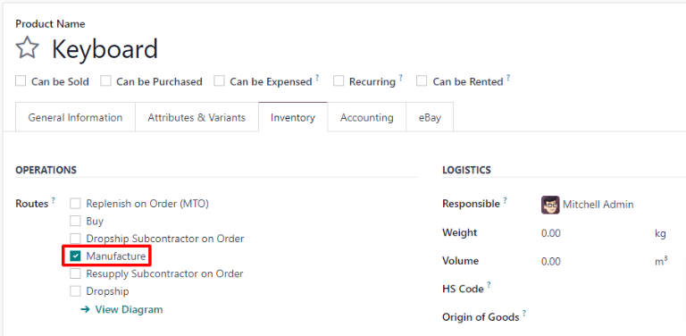
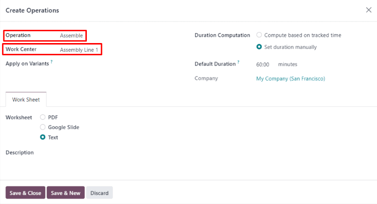

===================================
Manufacturing product configuration
===================================

.. _manufacturing/management/configure-manufacturing-product:
.. |BOM| replace:: :abbr:`BoM (Bill of Materials)`

In order to manufacture a product in Odoo *Manufacturing*, the product must be properly configured.
Doing so consists of enabling the *Manufacturing* route and configuring a bill of materials (BoM)
for the product. Once these steps are completed, the product is selectable when creating a new
manufacturing order.

Activate the Manufacture route
==============================

The Manufacture route is activated for each product on its own product page. To do so, begin by
navigating to :menuselection:`Manufacturing --> Products --> Products`. Then, select an existing
product, or create a new one by clicking :guilabel:`New`.

On the product page, select the :guilabel:`Inventory` tab, then enable the :guilabel:`Manufacture`
checkbox in the :guilabel:`Routes` section. This tells Odoo the product can be manufactured.

Configure a bill of materials (BoM)
===================================

Next, a |BOM| must be configured for the product so Odoo knows how it is manufactured. A |BOM| is a
list of the components and operations required to manufacture a product.

To create a |BOM| for a specific product, navigate to :menuselection:`Manufacturing --> Products -->
Products`, then select the product. On the product page, click the :guilabel:`Bill of Materials`
smart button at the top of the page, then select :guilabel:`New` to configure a new |BOM|.

.. image:: configure_manufacturing_product/bom-smart-button.png
   :align: center
   :alt: The Bill of Materials smart button on a product page.

On the |BOM|, the :guilabel:`Product` field auto-populates with the product. In the
:guilabel:`Quantity` field, specify the number of units that the BoM produces.

Add a component to the |BOM| by selecting the :guilabel:`Components` tab and clicking :guilabel:`Add
a line`. Select a component from the :guilabel:`Component` drop-down menu, then enter the quantity
in the :guilabel:`Quantity` field. Continue adding components on new lines until all components have
been added.

.. image:: configure_manufacturing_product/components-tab.png
   :align: center
   :alt: The Components tab on a bill of materials.

Next, select the :guilabel:`Operations` tab. Click :guilabel:`Add a line` and a :guilabel:`Create
Operations` pop-up window appears. In the :guilabel:`Operation` field, specify the name of the
operation being added (e.g. Assemble, Cut, etc.). Select the work center where the operation will be
carried out from the :guilabel:`Work Center` drop-down menu. Finally, click :guilabel:`Save & Close`
to finish adding operations, or :guilabel:`Save & New` to add more.

.. important::
   The :guilabel:`Operations` tab only appears if the :guilabel:`Work Orders` setting is enabled. To
   do so, navigate to :menuselection:`Manufacturing --> Configuration --> Settings`, then enable the
   :guilabel:`Work Orders` checkbox.

.. admonition:: Learn more

   The section above provides instructions for creating a basic |BOM| that allows a product to be
   manufactured in Odoo. However, it is by no means an exhaustive summary of all the options
   available when configuring a |BOM|. For more information about bills of materials, see the
   documentation on how to :ref:`create a bill of materials
   <manufacturing/management/bill-configuration>`.
