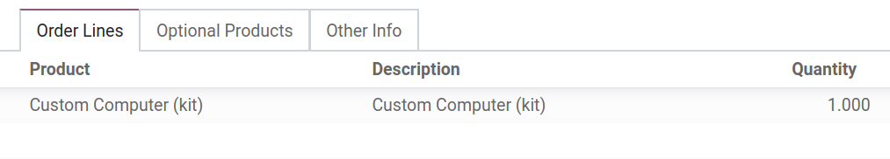
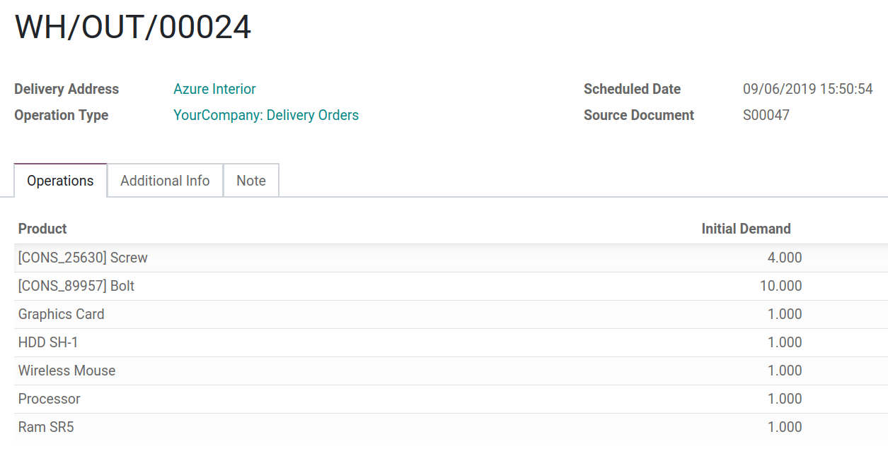
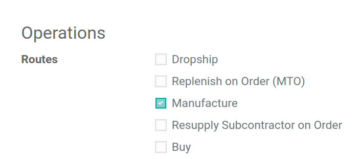
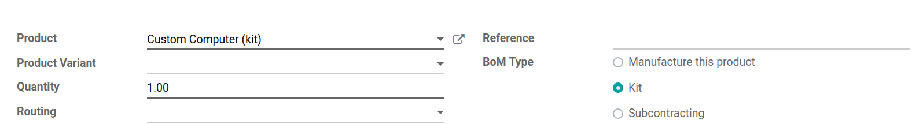
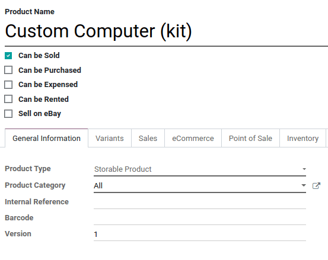
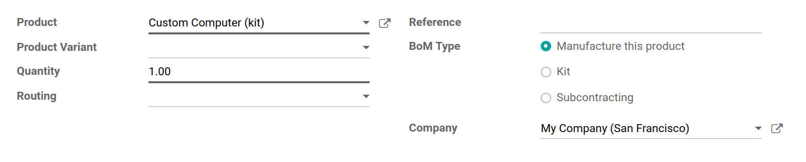

=============================
Sell sets of products as kits
=============================

A *kit* is a set of components that are delivered without first being
assembled or mixed. *Kits* are described in Odoo using *Bills of
Materials*. There are two basic ways to configure *kits*, depending
on how the stock of the kit product is to be managed. In either case,
both the *Inventory* and *Manufacturing* apps must be installed.

Manage Stock of Component Products
==================================

If you want to assemble kits as they are ordered, managing stock of the
kit components only, you will use a *Kit BoM* without a manufacturing
step.

A product using a *Kit BoM* will appear as a single line item on a
quotation and sales order, but will generate a delivery order with one
line item for each of the components of the kit. In the examples below,
the first image shows a sales order for the kit *Custom Computer Kit*,
while the second image shows the corresponding delivery order.

Configuration
=============

From the *Products menu* in either the *Inventory* or
*Manufacturing* app, create each component product as you would with
any other product, then create the top-level, or kit product. The kit
product should have only the *route Manufacture* set, in the
*Inventory tab*. Because you cannot track the stock of kit products,
the *Product Type* should be set to Consumable. Because a kit product
cannot be purchased, then, *Can be Purchased* should be unchecked.

All other parameters on the kit product may be modified according to
your preference. The component products require no particular
configuration.

Once the products are configured, create a *bill of materials* for the
kit product. Add each component and its quantity. Select the *BoM Type
Ship this product as a set of components*. All other options may be
left with their default values.

Manage Stock of Kit Product and Component Products
==================================================

If you want to manage stock of the *top-level kit product*, you will
use a standard *BoM* with a manufacturing step instead of a *Kit
BoM*. When using a standard BoM to assemble kits, a *manufacturing
order* will be created. The *manufacturing order* must be registered
as completed before the kit product will appear in your stock.

Configuration
=============

On the kit product, select the *route Manufacture*. You may also
select *Make to Order*, which will create a *manufacturing order*
whenever a sales order is confirmed. Select the product type *Storable
Product* to enable stock management.

When you create the *bill of materials*, select the BoM Type
*Manufacture this product*. The assembly of the kit will be described
by a *manufacturing order* rather than a packing operation.

