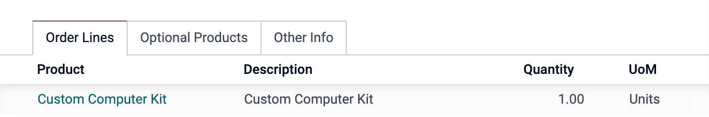
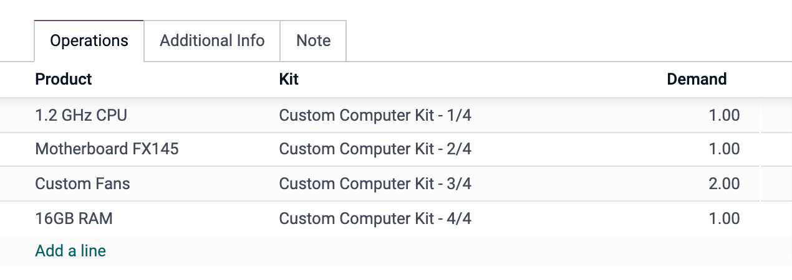
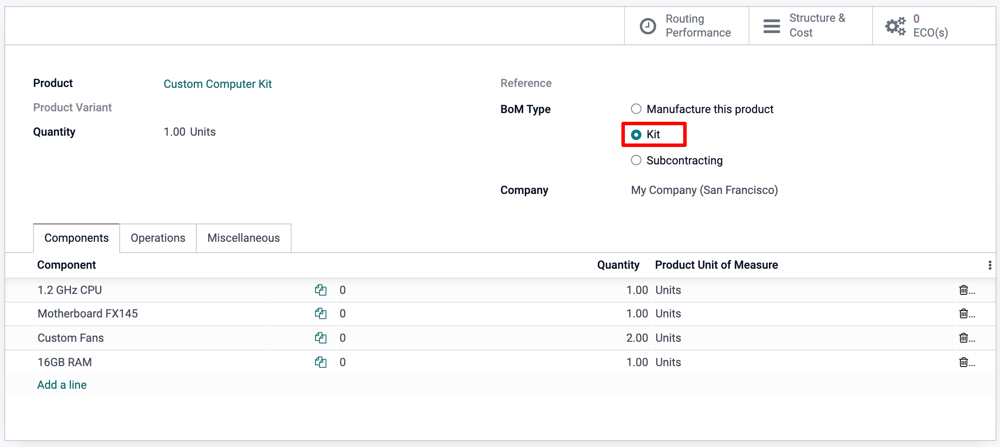
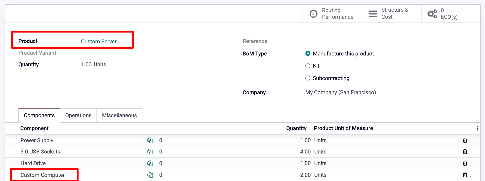
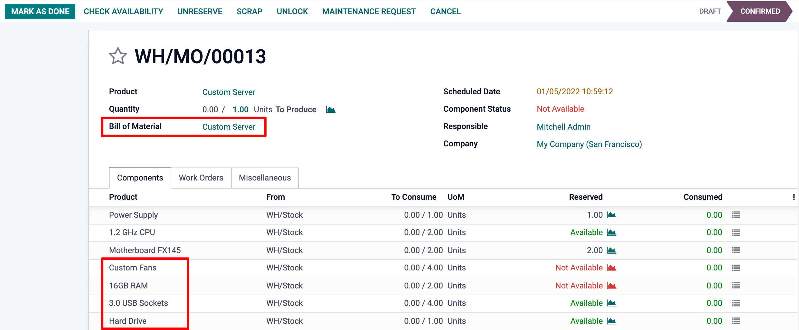

=====
Kits
=====

A *kit* is a set of components that are not pre-assembled or mixed. This is useful for
selling but also for creating cleaner and more effective *BOMs*. To use kits, you need 
both the Manufacturing and Inventory apps to be installed. 

Manage Stock of Component Products
==================================

If you want to assemble kits as they are ordered, managing stock of the kit components only, 
you will use a *Kit BoM* Type without any manufacturing operations. 

A product using a *Kit BoM* will appear as a single line item on a quotation and a sales order,
but will generate a delivery order with one line item for each of the components of the kit. In 
the examples below, the first image shows a sales order for the kit *Custom Computer Kit*,
while the second image shows the corresponding delivery order.

Configuration
=============

From the *Products menu* in either the *Inventory* or *Manufacturing* app, create each component 
product (as you would with any other product), then create the top-level, or kit product. Because
you cannot track the stock of kit products, the *Product Type* should be set to *Consumable*. 
However, if you are using Anglo-Saxon accounting, and you would like COGS to be posted when 
invoicing your kits (and only for this reason), the storable product type should selected instead. 
Because a kit product cannot be purchased, *Can be Purchased* should be unchecked. The route of the
kit product in the *Inventory* Tab does not really matter, as, for replenishment, only the route of 
the components that will be taken into account only. 

All other parameters on the kit product may be modified according to your preference. The component 
products require no particular configuration.

Once the products are configured, create a *bill of materials* for the kit product. Add each component
and its quantity. Select the *BoM Type* Kit. All other options may be left with their default values.

Manage Stock of Kit Product and Component Products
==================================================

If you want to manage the stock of the *top-level kit product*, you will use a standard *BoM Type* 
manufacture or subcontracting instead. In this case you will either buy the final product from your
subcontractor, or make it yourself through a manufacturing order. 

In that case the product type will be storable, and the BOM type either 'Manufacture this product' 
or 'Subcontracting' as shown below.

.. image:: media/kit-storable.png
    :align: center

Build a cleaner BOM
==================== 

As suggested above, a kit BOM can also simply be used to manage a more complex BOM. 

Imagine the Custom Computer parts above were part of another final product. It would be much 
clearer and simpler if the BOMs were added together (as shown below) instead of adding all 
the individual parts one by one.

This is even better illustrated when looking at the BOM Structure Report, where it is 
easy to expand and hide specific kit level or sub-assembly type BOMs. 

.. image:: media/kit-bom5.png
    :align: center

On the creation of the manufacturing order, the BOM will automatically expand to show all
top level and kit level components. You can go back to the BOM at any point though as it 
remains  available on the form view of your manufacturing order. 

Finally, note that if there were any Operations in the Kit BOM, these would also simply be added 
in to the work order list of the main component. 