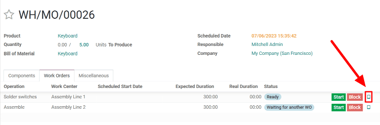
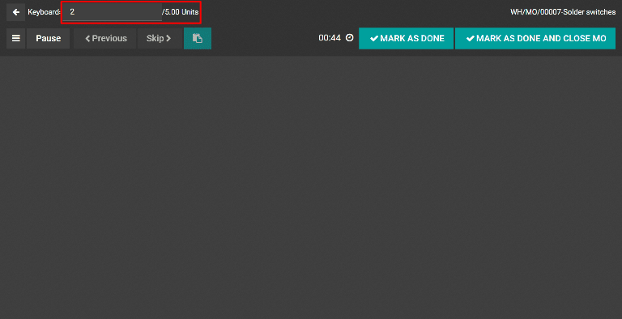
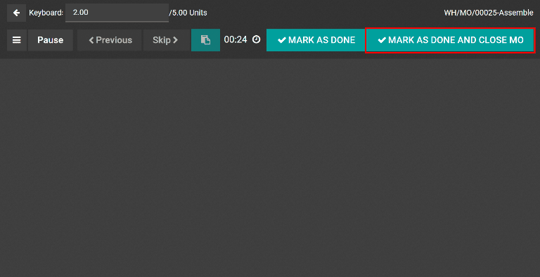
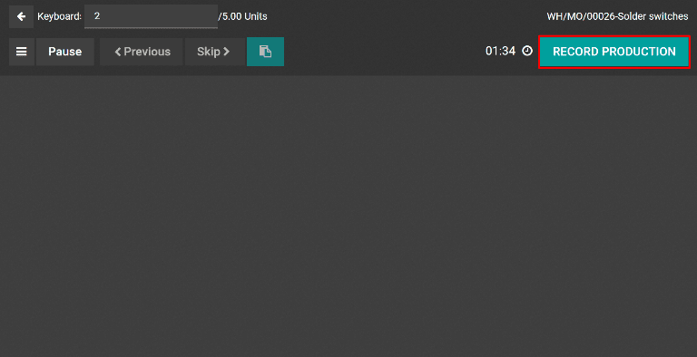

========================
Manufacturing backorders
========================

In some cases, the full quantity of a manufacturing order cannot be produced immediately. When this
happens, Odoo *Manufacturing* allows for the manufacturing of partial quantities of the order and
creates a *backorder* for the remaining amount.

In the *Manufacturing* app, creating a backorder splits the original manufacturing order into two
orders. The reference tag for each order is the tag used for the original order, followed by a
hyphen and then an additional number to indicate that it's a backorder.

.. example::
   A company creates a manufacturing order with the reference tag *WH/MO/00175*, for 10 units of
   *Product X*. After starting work on the manufacturing order, the employee working the production
   line realizes there are only enough components in stock to produce five units of the product.

   Instead of waiting for additional stock of the components, they manufacture five units and create
   a backorder for the remaining five. This splits the manufacturing order into two separate orders:
   *WH/MO/00175-001* and *WH/MO/00175-002*.

   Order *001* contains the five units that have been manufactured, and is immediately marked as
   :guilabel:`Done`. Order *002* contains the five units that still need to be manufactured and is
   marked as :guilabel:`In Progress`. Once the remaining components are available, the employee
   returns to order *002* and manufactures the remaining units before closing the order.

Create a manufacturing backorder
================================

To create a backorder for part of a manufacturing order, begin by navigating to
:menuselection:`Manufacturing --> Operations --> Manufacturing Orders`. Select a manufacturing order
with a quantity of two or more or create one by clicking :guilabel:`Create`.

If a new manufacturing order is created, select a product from the :guilabel:`Product` drop-down
menu and enter a quantity of two or more in the :guilabel:`Quantity` field, then click
:guilabel:`Confirm` to confirm the order.

After manufacturing the quantity that is being produced immediately, enter that number in the
:guilabel:`Quantity` field at the top of the manufacturing order.

.. image:: manufacturing_backorders/quantity-field.png
   :align: center
   :alt: The quantity field on a manufacturing order.

Next, click :guilabel:`Validate`, and a :guilabel:`You produced less than initial demand` pop-up
window appears, from which a backorder can be created. Click :guilabel:`Create Backorder` to split
the manufacturing order into two separate orders, with the reference tags *WH/MO/XXXXX-001* and
*WH/MO/XXXXX-002*.

.. image:: manufacturing_backorders/create-backorder-button.png
   :align: center
   :alt: The Create Backorder button on the "You produced less than initial demand" pop-up window.

Order *001* contains the items that have been manufactured, and is closed immediately. Order *002*
is the backorder that contains the items that have yet to be manufactured, and remains open, to be
completed at a later date.

Once the remaining units can be manufactured, navigate to :menuselection:`Manufacturing -->
Operations --> Manufacturing Orders`, and then select the backorder manufacturing order. If all of
the remaining units are manufactured immediately, simply click :guilabel:`Validate` to close the
order.

If only some of the remaining units are manufactured immediately, create another backorder for the
remainder by following the steps detailed in this section.

Create a backorder from tablet view
===================================

Backorders for manufacturing orders can also be created from the work order tablet view.

.. note::
   In order to use tablet view, the *Work Orders* setting must be enabled. To enable it, navigate to
   :menuselection:`Manufacturing --> Configuration --> Settings`. On the :guilabel:`Settings` page,
   enable the checkbox next to :guilabel:`Work Orders`, then click :guilabel:`Save` to save the
   change. This makes the :guilabel:`Work Orders` tab appear on manufacturing orders, from which the
   tablet view can be opened.

   .. image:: manufacturing_backorders/work-orders-setting.png
      :align: center
      :alt: The Work Orders setting on the Manufacturing settings page.

To create a backorder from the tablet view, begin by navigating to :menuselection:`Manufacturing -->
Operations --> Manufacturing Orders`. Select a manufacturing order with a quantity of two or more or
create one by clicking :guilabel:`Create`.

If a new manufacturing order is created, select a product from the :guilabel:`Product` drop-down
menu and enter a quantity of two or more in the :guilabel:`Quantity` field, then click
:guilabel:`Confirm` to confirm the order.

After confirming the manufacturing order, select the :guilabel:`Work Orders` tab and click the
:guilabel:`📱 (tablet view)` button located on the line of the first work order to enter the tablet view.

Once in tablet view, enter the quantity being manufactured immediately in the :guilabel:`Units`
field at the top left of the tablet view.

The steps for the rest of the workflow depend on whether the manufacturing order being processed
requires the completion of a single work order or multiple work orders.

Single work order
-----------------

If the manufacturing order only requires the completion of a single work order, complete the work
order, then click :guilabel:`Mark As Done And Close MO`. The manufacturing order is closed and a
backorder for the units that still need to be manufactured is created automatically.

Once the remaining units are ready to be manufactured, navigate to :menuselection:`Manufacturing -->
Operations --> Manufacturing Orders`, then select the backorder manufacturing order, which is titled
using the reference tag of the original backorder with *002* added to the end.

On the backorder manufacturing order, select the :guilabel:`Work Orders` tab and click the
:guilabel:`📱 (tablet view)` button located on the line of the work order to open the tablet view.
If all of the units in the backorder will be completed immediately, simply click :guilabel:`Mark As
Done And Close MO` after completing the work order.

If only some of the remaining units will be manufactured immediately, enter the number in the
:guilabel:`Units` field at the top left of the tablet view, then click :guilabel:`Mark As Done And
Close MO` to create another backorder for the remaining units. The new backorder can be processed
using the steps detailed in this section.

Multiple work orders
--------------------

If the manufacturing order requires the completion of multiple work orders, complete the first work
order, and then click :guilabel:`Record Production`. This splits the manufacturing order into two
separate orders, titled *WH/MO/XXXXX-001* and *WH/MO/XXXXX-002*, with *XXXXX* being the number of
the original order.

The tablet view defaults to showing the first work order for the *002* manufacturing order. Since
this manufacturing order will not be completed immediately, back out of tablet view by clicking the
:guilabel:`⬅️ (back)` button twice. Doing so will take you to the *001* order.

To finish the *001* order, select the :guilabel:`Work Orders` tab and click the :guilabel:`tablet
view` button located on the line of the next work order. Finally, complete the remaining work
orders, then click :guilabel:`Mark As Done And Close MO` to close the manufacturing order.

Once the remaining units are ready to be manufactured, navigate to :menuselection:`Manufacturing -->
Operations --> Manufacturing Orders`, then select the *002* order. Select the :guilabel:`Work
Orders` tab and click the :guilabel:`tablet view` button located on the line of the first work
order.

If all of the units in the backorder will be completed immediately, simply click :guilabel:`Mark As
Done And Close MO` after completing all of the work orders.

If only some of the remaining units will be manufactured immediately, enter the number in the
:guilabel:`Units` field at the top left of the tablet view, then click :guilabel:`Record Production`
to create an additional backorder for the remaining units, with *003* at the end of its reference
tag.

The *002* backorder and *003* backorder can be completed by following the steps detailed in this
section.

.. tip::
   It is also possible to create a backorder in the middle of a manufacturing order, when some but
   not all of the work orders have already been completed. Doing so marks the completed work
   order(s) as :guilabel:`Finished` on the backorder.

   .. example::
      A manufacturing order for four chairs requires the completion of two work orders: *Paint* and
      *Assemble*. While the paint step can be completed immediately for all four chairs, there are
      only enough screws to assemble two of them.

      As a result, the employee responsible for producing the chairs begins by painting all four,
      and marking the *Paint* work order as :guilabel:`Finished` for all of them. Then, they move on
      to the *Assemble* work order. They assemble two of the four chairs, enter that number in the
      :guilabel:`Units` field of the tablet view, and click :guilabel:`Record Production`.

      A backorder manufacturing order is created for the remaining two chairs. On the backorder, the
      *Paint* work order is already marked as :guilabel:`Finished`, and only the *Assemble* work
      order is left to be completed.

      Once more screws are available, the manufacturing employee assembles the remaining chairs and
      clicks :guilabel:`Mark As Done And Close MO` to complete the *Assemble* work order and close
      the backorder manufacturing order.
