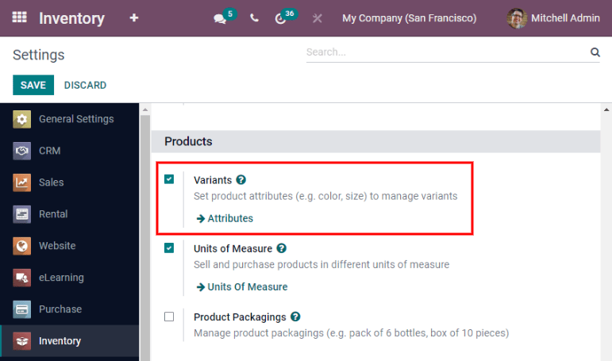
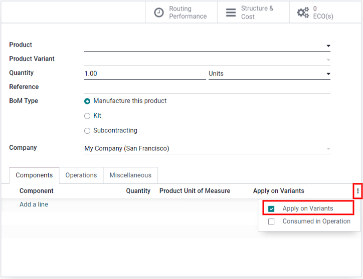
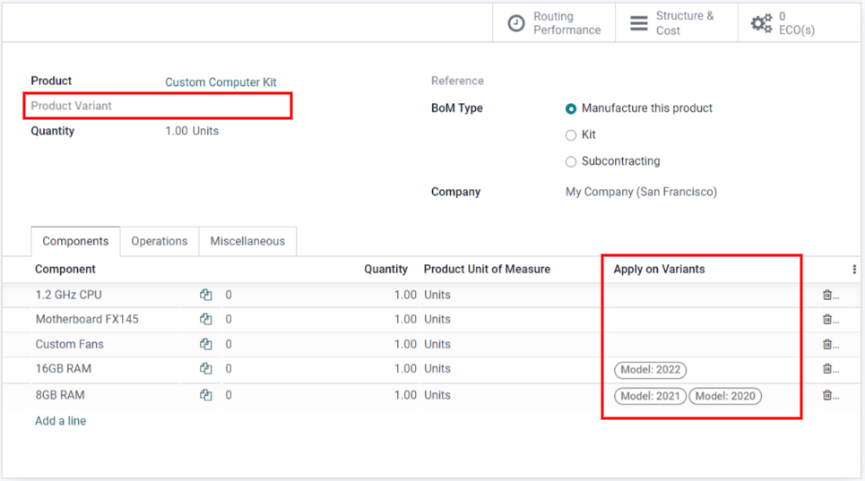

==================================
Managing BoMs for product variants
==================================

Odoo allows one bill of materials (BoM) to be used for multiple variants of the same product.
Having a consolidated BoM for a product with variants saves time by preventing the need to manage
multiple BoMs.

Activate product variants
=========================

To activate variants, simply navigate to :menuselection:`Inventory --> Configuration --> Settings
--> Products`, and then enable the :guilabel:`Variants` option. After that, click :guilabel:`Save`
to apply the setting. For more information on configuring product variants, refer to :doc:`this
page <../../../sales/sales/products_prices/products/variants>`.

Apply BoM components to product variants
========================================

Next, create a new BoM or edit an existing one by going to :menuselection:`Manufacturing -->
Products --> Bills of Materials`. Then, click :guilabel:`Edit`. The :guilabel:`Apply on Variants`
option to assign components to specific product variants on the BoM is available once the
:guilabel:`Variants` setting is activated from the :guilabel:`Inventory` application. If the
:guilabel:`Apply on Variants` field is not immediately visible, activate it from the additional
options menu.

Each component can be assigned to multiple variants. Components with no variants specified are used
in every variant of the product. The same principle applies when configuring operations and
by-products.

When defining variant BoMs by component assignment, the :guilabel:`Product Variant` field in the
main section of the BoM should be left blank, as shown below. This field is used only when creating
a BoM specifically for one product variant.

