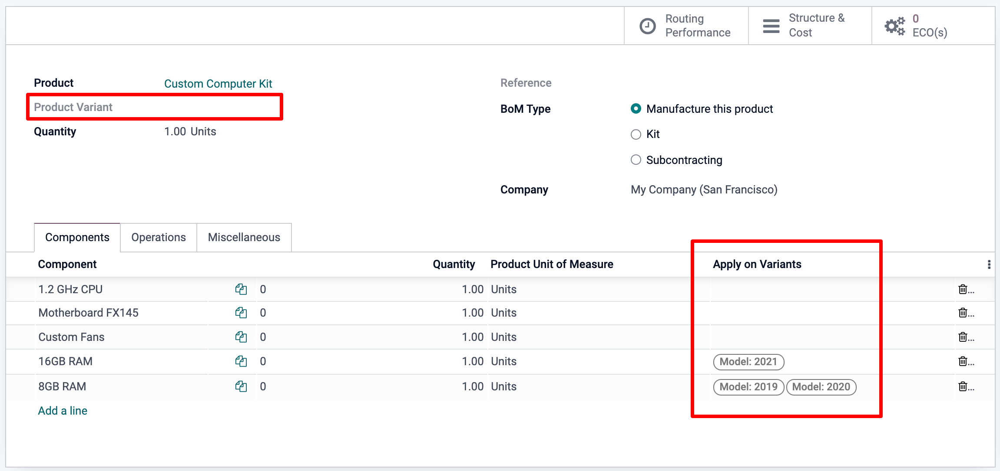
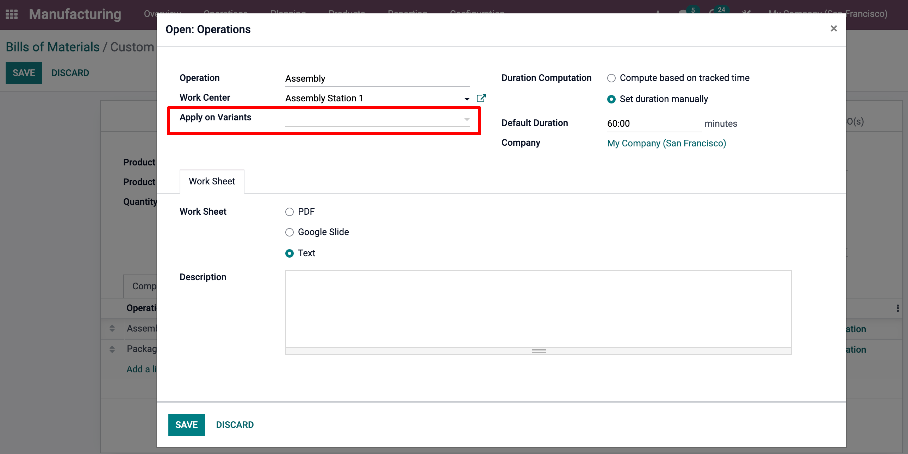
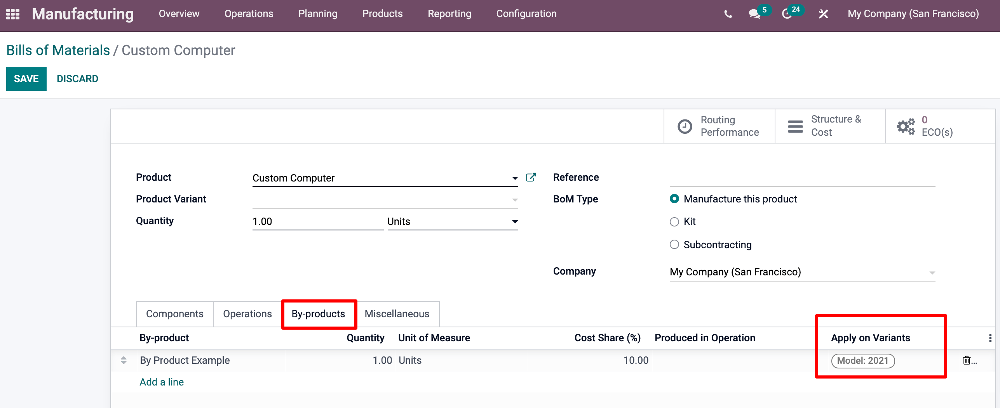

=======================
Variants BOM Management
=======================

Odoo allows you to use one bill of materials for multiple variants of
the same product. To activate variants, simply go to :menuselection:`Configuration --> Settings
--> Variants`.

.. image:: media/bom-variants1.png
    :align: center

You will then be able to specify which BOM component lines are to be used in
the manufacture of each product variant. You may specify multiple
variants for each line. If no variant is specified on a component line,
then this component will be used in the BOM of all variants. 

When defining variant BoMs on a line-item-basis, the **Product
Variant** field in the main section of the BoM should be left blank as shown 
below. This field is used when creating a BoM for one specific variant
of a product only.

Note that the same principle applies for the configuration 
of operations.

And for the production of by-products. 

