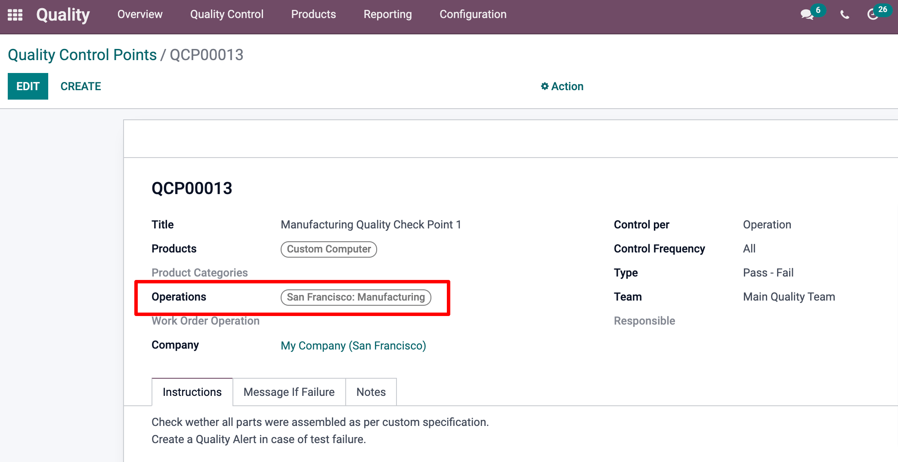
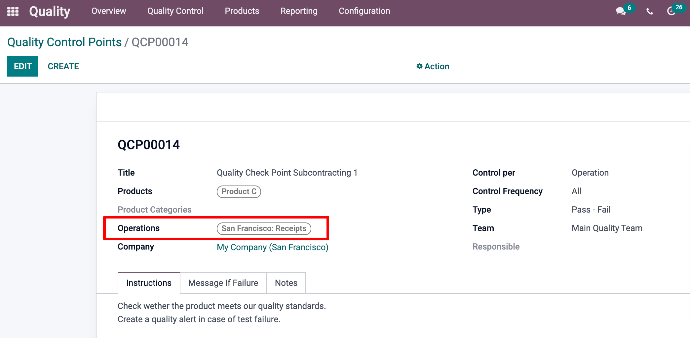

=================
Quality Control
=================

Whether you want to control the quality of your production, or the production
of your subcontractor, before registering the products into your stock, you can
rely on Odoo's Quality module.

To control the quality of your production, you need to set a *Quality Control Point* 
on the Manufacturing Operation Type, as shown below. To create it, Go to :menuselection:`Quality
--> Quality Control --> Control Points`, and click **Create**.
If the check only applies to specific products, or product categories, you can specify these during
the setup as well.

Regarding the reception of subcontracted products, instead of the Manufacturing Operation Type, 
you need to select the 'Receipts' Operation type. For the rest, the same principles apply. 

By doing so, a quality check is automatically created each time a
finished product is made and/or received. Note that several Quality Check 
*Types* can be chosen from the dropdown. Note also that several Quality
Check Points can be set up for the same Operation Type. 