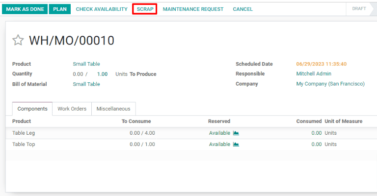
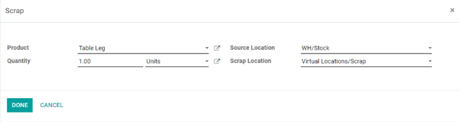
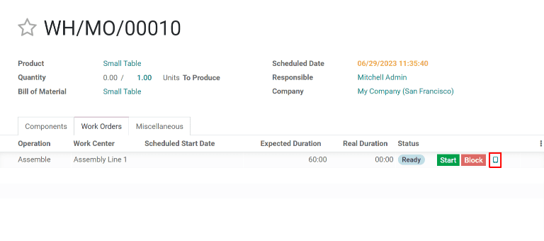
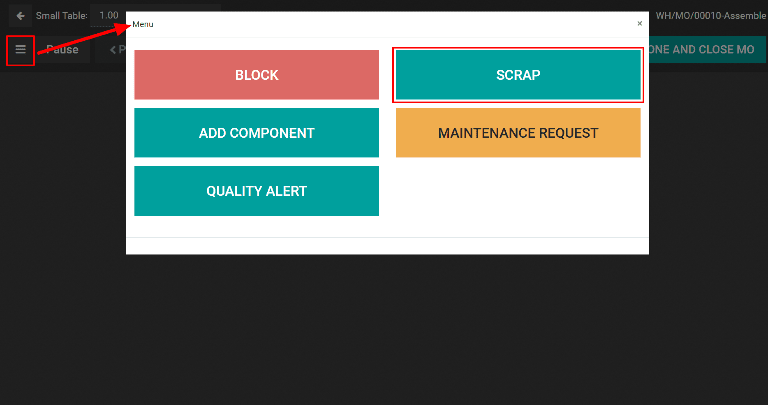

==========================
Scrap during manufacturing
==========================

During the manufacturing process, the need to scrap manufacturing components or finished products
may arise. This can be necessary if a component or product is damaged, or unusable for any other
reason.

By default, scrapping a component or finished product removes it from physical inventory and places
it in a virtual location titled *Virtual Locations/Scrap*. A virtual location is **not** a physical
space, but rather a designation in Odoo that is used to track items that are no longer in physical
inventory.

.. seealso::
   For more information about virtual locations, see the documentation about the different types of
   :ref:`locations <inventory/management/difference-warehouse-location>`.

Odoo *Manufacturing* allows for both components and finished products to be scrapped within a
manufacturing order. The specific type of item that can be scrapped during a manufacturing order
depends on the stage of the manufacturing process.

.. tip::
   Scrap orders can be viewed by navigating to :menuselection:`Inventory --> Operations --> Scrap`.
   Each scrap order shows the date and time the order was created, along with the product and
   quantity that was scrapped.

   To view the total quantity of each item scrapped, navigate to :menuselection:`Inventory -->
   Configuration --> Locations`, then remove the :guilabel:`Internal` filter from the
   :guilabel:`Search...` bar to display all virtual locations. From the list, select the
   :guilabel:`Virtual Locations/Scrap` location.

Scrap manufacturing components
==============================

To scrap components during the manufacturing process, begin by navigating to
:menuselection:`Manufacturing --> Manufacturing Orders`, then select a manufacturing order or click
:guilabel:`Create` to configure a new one. If a new manufacturing order is created, select a product
from the :guilabel:`Product` drop-down menu, then click :guilabel:`Confirm`.

Once the manufacturing order has been confirmed, a :guilabel:`Scrap` button appears at the top of
the page. Click the button and a :guilabel:`Scrap` pop-up window appears.

From the :guilabel:`Product` drop-down menu on the :guilabel:`Scrap` pop-up window, select the
component that is being scrapped, then enter the quantity in the :guilabel:`Quantity` field.
Finally, click :guilabel:`Done` to scrap the component.

.. important::
   Before clicking :guilabel:`Mark As Done` on a manufacturing order, only the components of the
   finished product can be scrapped, **not** the finished product itself. This is because Odoo
   recognizes that the finished product cannot be scrapped before it has been manufactured.

After scrapping a component, continue the manufacturing process using the required quantity of the
component that was scrapped. The on-hand stock count for the component that was scrapped updates to
reflect both the scrapped quantity and the quantity consumed during manufacturing.

.. example::
   If the manufacturing of a table requires four units of a table leg, and two units of the table
   leg were scrapped during the manufacturing process, the total quantity of table legs consumed
   will be six: four units used to manufacture the table plus two units scrapped.

Scrap components from tablet view
=================================

Components can also be scrapped from the manufacturing tablet view. To do so, select the
:guilabel:`Work Orders` tab on a manufacturing order, then click the :guilabel:`📱 (tablet view)`
icon for a work order.

With tablet view open, click the :guilabel:`☰ (menu)` button at the top left of the screen, then
select the :guilabel:`Scrap` button on the :guilabel:`Menu` pop-up window. The :guilabel:`Scrap`
pop-up window then appears.

Finally, select a component from the :guilabel:`Product` drop-down menu and enter the quantity being
scrapped in the :guilabel:`Quantity` field. Click :guilabel:`Done` to scrap the component.

Scrap finished products
=======================

Odoo also allows for finished products to be scrapped from a manufacturing order once the order is
completed. After clicking :guilabel:`Mark as Done`, click the :guilabel:`Scrap` button to make the
:guilabel:`Scrap` pop-up window appear.

Since the components have been consumed to create the finished product, they will no longer appear
in the :guilabel:`Product` drop-down menu. Instead, the finished product will be available as an
option. Select the finished product and enter the quantity to be scrapped in the
:guilabel:`Quantity` field. Click :guilabel:`Done` to scrap the finished product.

The on-hand stock count for the product that was scrapped will update to reflect both the scrapped
quantity and the quantity produced during manufacturing.

.. example::
   If five units of a chair were manufactured, but two units were scrapped after manufacturing was
   completed, then the on-hand inventory of the chair will increase by three: five units
   manufactured minus two units scrapped.
