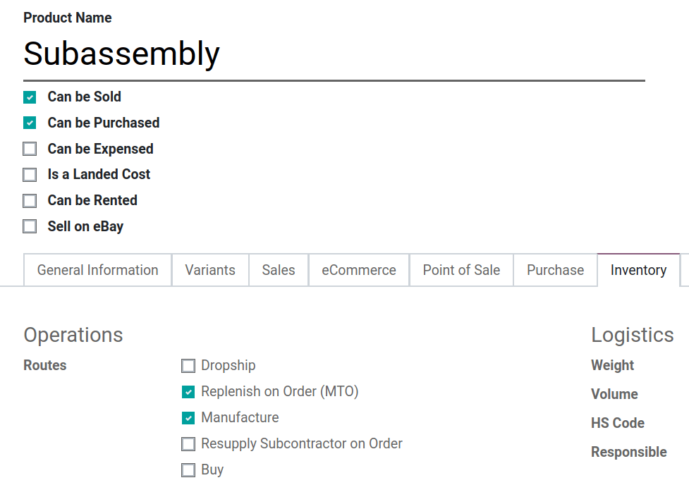
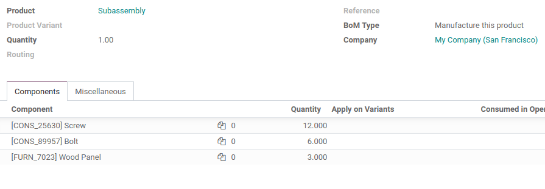
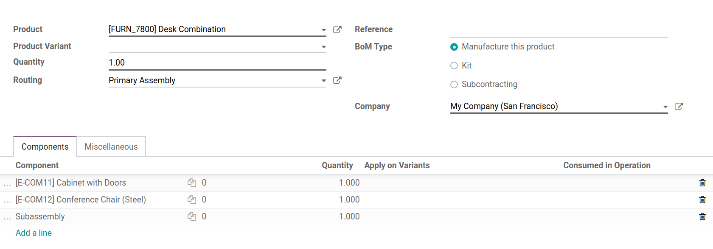
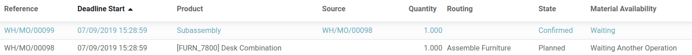

=============================
Manage semi-finished products
=============================

In Odoo, you can use subassembly products to simplify a complex *Bill
of Materials* or to represent your manufacturing flow more accurately.
A *subassembly product* is a manufactured product that is used as a
component to make another one.

A *BoM* that employs *subassemblies* is referred to as a multi-level
BoM. Those are accomplished by creating a *top-level BoM* and
*subassembly ones*. This process requires a route that will ensure
that every time a manufacturing order for the top-level product is
created, another one will be for subassemblies.

Configure the Subassembly Product
=================================

To configure a *multi-level BoM*, you will need a top-level product
but also its subassemblies. The first step is to create a product form
for each of the subassemblies. Select the routes *Manufacture* and
*Replenish on Order*. Now, hit save.

In the *Bill of Materials* menu, under *Master Data*, create a new
*Bill of Materials*. Choose the product you just created and add its
components.

Configure the Main BoM
======================

Now, you can configure the top-level product and its *BoM*. Include
any subassemblies in the list of components.

Now, each time you will plan a manufacturing order for the top-level
product, a manufacturing order will be created for the subassembly one.
Then, you will have to manufacture the subassembly in order to make it
available before manufacturing the finished product.

