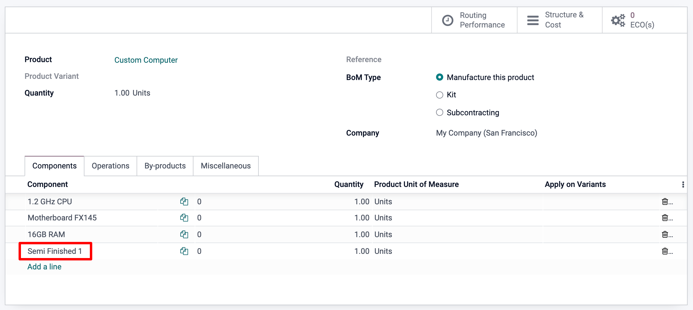
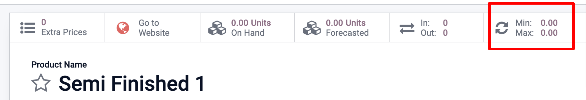

=============================
Manage semi-finished products
=============================

With Odoo MRP, you can use semi-finished products to simplify a complex *Bill
of Materials* or to represent your manufacturing flow more accurately.
A *semi-finished product* is a manufactured product that is used as a
component in a Bill of Material.

A *BoM* that employs *semi-finished products* is referred to as
a multi-level BoM, where we distinguish between the *top level Product*
and the *sub-assemblies*.

Configure a Multi Level BoM
============================

To configure a *multi-level BoM*, you will need the top-level product
and its sub-assemblies. Therefore, you must first create the sub-assembly
products and their respective Bill of Materials. Please refer to
:doc:`bill_configuration` for more details on how to create a BOM.

.. image:: sub_assemblies/sf_1.png
    :align: center

Configure the Main BoM
======================

Then on the final product form, simply add your semi-finished
products to the Bill of Material.

Manage your production planning
=================================

There are several methods to manage the triggering of the various manufacturing orders.

If every time a manufacturing order is confirmed for the main product, you'd like one for
the semi-finished products as well, you have two options:

Option 1 : Create re-ordering rules for the semi-finished products, with both the minimum
and maximum desired stock quantities at 0.

Option 2 : Use the Replenish on Order (MTO) route on the semi-finished product, as well as
the manufacturing one.

Note that Option 1 is usually recommended over Option 2 as it is more flexible. The MTO route
creates a unique link between the semi-finished and the top level product, whereas the
re-ordering rule allows you to simply unreserve that production from the top level product
production and redirect it to another, more pressing demand, for example.

In any case, as soon as the semi-finished product is produced, it will become
available in the manufacturing order of the final product, as shown below.

.. image:: sub_assemblies/sf_4.png
    :align: center
