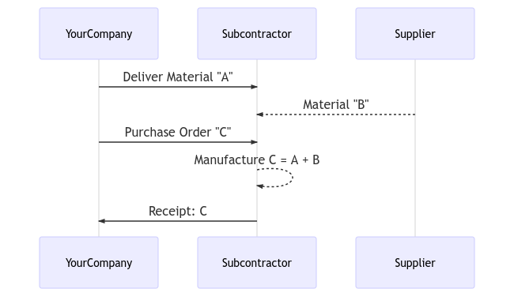
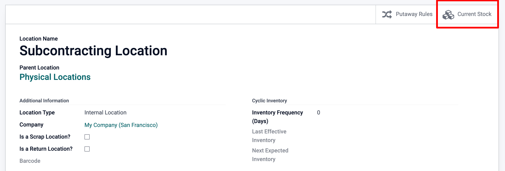

==============================
Subcontract your Manufacturing
==============================

Outsourcing a portion or all of your company’s manufacturing needs
is not easy. To make it work correctly, you have to:

- Manage the inventory of raw materials at your subcontractor
- Ship raw material to your subcontractors, at the right time
- Control incoming goods quality
- Control subcontractors bills

Here is an example of subcontracting the manufacturing of “C”, which is
produced out of raw materials “A” and “B”.

With its MRP subcontracting feature, Odoo helps you handle this flow easily.

Configuration
=============

To use the subcontracting feature, go to :menuselection:`Manufacturing
--> Configuration --> Settings` and tick the box *Subcontracting*.

.. image:: subcontracting/sbc_1.png
    :align: center
    :alt:

To define if a product must be subcontracted, use a *Bill of Materials
(BoM)* of type *Subcontracting*.

To create a new *BoM*, go to :menuselection:`Manufacturing --> Products -->
Bill of Materials` and hit create. Then, list the components
your subcontractor needs to manufacture the product. For costing
purposes, you might want to register all the components, even the ones
that are sourced directly from the subcontractor.

Once you have set the *BoM Type* to *Subcontracting*, specify one or
several subcontractors.

.. image:: subcontracting/sbc_2.png
    :align: center
    :alt:

Basic Subcontracting Flow
=========================

To let your subcontractor know how many products you need, create and
send them purchase orders (PO). To do so, go to the *Purchase* app and
create a new purchase order. Be sure to send the PO to a vendor that is
defined as a subcontractor on the *BoM* of these products.

.. image:: subcontracting/subcontracting_04.png
    :align: center
    :alt:

Once the *PO* is validated (1), a pending receipt is created. When the
products are received, validate the receipt (2), with the actual
quantity received. As a result, Odoo does the following things for you:

- Consumes the respective components at the subcontractor’s location, based on the *BoM* and your input (3);

- Produces the finished goods at the subcontractor’s location (4);

- Moves products from that subcontractor’s location to YourCompany
  via the validated receipt (5).

.. note::
      The *PO* is optional. If you create a receipt manually, with the right
      subcontractor, Odoo still performs all the moves. This can be useful if
      the subcontractor does not bill a fixed price per item, but rather the time
      and materials used.

Inventory Valuation
===================

The cost of the manufactured product “C” is defined as:

**C = A + B + s**

With:

-  **A**: Cost of raw materials coming from YourCompany;

-  **B**: Cost of raw materials sourced directly from the
       subcontractor;

-  **s**: Cost of the subcontracted service.

Sending raw materials to your subcontractors (**A**) does not impact
the inventory valuation, as the components are still valued as part of
your stock. This is managed by making the *Subcontracting Location* an
*Internal Location*.

Then, the vendor price set on the product C form has to be what has to
be paid to the subcontractor for his parts and service time: **B +
s**. The product cost has to be: **A + B + s**, how much the
product is valued in the accounting.

Finally, the subcontractor bill then matches the purchase order, with
the proposed price coming from the finished products C.

.. note::
      If managing the replenishment of raw materials **B** at your
      subcontractor’s location is not needed, simply include the cost of
      **B** in the subcontractor’s price **s** and remove the products
      *B* from the *BoM*.

Traceability
============

In case the received products from the subcontractor contain tracked
components, their serial or lot numbers need to be specified during the
receipt.

In that case, on the receipt of the subcontracted product, a *Record Components*
button appears. Click on it to open a dialog box and record the serial/lot numbers of
the components. If the finished product is also tracked, its serial/lot number can
be registered here too.

.. image:: subcontracting/sbc_3.png
    :align: center
    :alt:

For audit purposes, it is possible to check the lot numbers recorded on
a receipt by using the icon on the right of the finished products:

.. image:: subcontracting/sbc_4.png
    :align: center
    :alt:

Also note that in case flexible consumption has been selected on the subcontracted
BOM for a non-tracked product, the record components option will also appear
optionally on each move line, if you want to register more or less component consumption
at your subcontracting location, when receiving your final product.

.. image:: subcontracting/sbc_5.png
    :align: center
    :alt:

As you can see, the reception of both of these non-tracked products can either be executed
by selecting the 'Set Quantities' Option or via the move line hamburger menus.

Automate Replenishment of Subcontractors
========================================

There are two ways to automate the supply of raw materials to your
subcontractors when purchasing the final product. The chosen method
depends on whether or not you want the materials to transit through your
warehouse. Both of these methods are described as pull style mechanisms as
their trigger is the inital PO to the subcontractor, which creates a need
at the subcontracting location, for raw material.

If you are supplying your subcontractor with raw material from your own warehouse,
you must activate the 'Resupply Subcontractor on Order' route as shown
below. If this is a component that you buy from a vendor, the buy route
should also be activated.

.. image:: subcontracting/sbc_6.png
    :align: center
    :alt:

Now, if you want your vendor to resupply your subcontractor directly, you
must choose the 'Dropship Subcontractor on Order' option instead. In order
for this option to be active on the product form, you must first activate the
dropship option from :menuselection:`Purchase --> Configuration --> Settings -->
Dropshipping`.
Once the PO to the subcontractor is validated, this route will create a dropship
RFQ from your vendor to that subcontractor. You then just need to review and validate it.

.. image:: subcontracting/sbc_7.png
    :align: center
    :alt:

Note that the buy route is not selected in this case, as the dropship route is
a buy route already.

Finally, if you want to track the stock of these raw materials at your subcontracting
location(s), then you must activate *Multi-locations* in :menuselection:`Inventory -->
Configuration --> Settings --> Storage locations`.

From the location form, you are then able to access the Current Stock.

Manual Replenishment
--------------------

You can also choose to replenish your subcontractors manually.

If you want to send components to your subcontractor at your own convenience,
select the 'Resupply Subcontractor' Operation Type from the *Inventory* Module,
and create a picking, specifying to which subcontractor you are delivering to.

.. image:: subcontracting/sbc_9.png
    :align: center
    :alt:

Alternatively, you can also manually ask your vendor to resupply your subcontractor
by creating a dropship type PO, with your subcontractor set as the delivery address.

.. image:: subcontracting/sbc_10.png
    :align: center
