==============================
Subcontract your Manufacturing
==============================

Outsourcing a portion of some or all your company’s manufacturing needs
is not easy. To make it work right, you have to:

- Manage the inventory of raw materials at your subcontractor;
- Ship new materials to your subcontractors based on your forecasted
  demand;
- Keep track of manufacturing operations done at the subcontractor
  location;
- Control incoming goods quality;
- Control subcontractors bills.

Here is an example of subcontracting the manufacturing of “C”, which is
produced out of raw materials “A” and “B”.

With its subcontracting feature, Odoo helps you handle this flow easily.

Configuration
=============

To use the subcontracting feature, go to :menuselection:`Manufacturing
--> Configuration --> Settings` and tick the box *Subcontracting*.

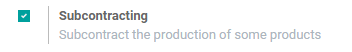

To define if a product must be subcontracted, use a *Bill of Materials
(BoM)* of type *Subcontracting*.

To create a new *BoM*, go to :menuselection:`Manufacturing --> Master
Data --> Bill of Materials` and hit create. Then, list the components
your subcontractor needs to manufacture the product. For costing
purposes, you might want to register all the components, even the ones
that are sourced directly from the subcontractor.

Once you have set the *BoM Type* to *Subcontracting*, specify one or
several subcontractors.

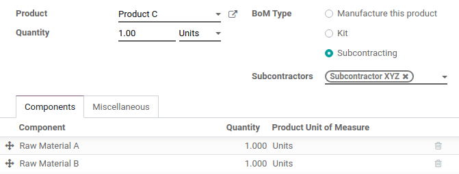

Basic Subcontracting Flow
=========================

To let your subcontractor know how many products you need, create and
send them purchase orders (PO). To do so, open the *Purchase* app and
create a new one. Be sure to send the PO to a vendor that is defined as
a subcontractor on the *BoM*.

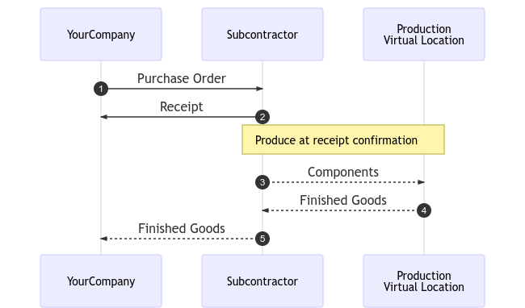

Once the *PO* is validated (1), a pending receipt is created. When the
products are received, validate the receipt (2), with the actual
quantity received. Then Odoo automatically created several inventory
moves:

- Consume the components at the subcontractor’s location, based on the
  *BoM* (3);
- Produce finished goods at the subcontractor’s location (4);
- Move products from the subcontractor’s location to YourCompany
  through the validated receipt (5).

Of course, Odoo does all the transactions for you, automatically. Simply
control the vendor bill with the usual matching process with the
purchase order.

.. note::
      The *PO* is optional. If you create a receipt manually, with the right
      subcontractor, Odoo still performs all the moves. Useful if the
      subcontractor does not bill a fixed price per item, but rather the time
      and materials used.

Inventory Valuation
===================

The cost of the manufactured product “C” is defined as:

**C = A + B + s**

With:

-  **A**: Cost of raw materials coming from YourCompany;

-  **B**: Cost of raw materials sourced directly from the
       subcontractor;

-  **s**: Cost of the subcontracted service.

Sending raw materials to your subcontractors (**A**) does not impact
the inventory valuation, the components still belonging to your company.
To manage this, the *Subcontracting Location* is configured as an
*Internal Location* so that the components are still valued in the
inventory.

Then, the vendor price set on the product C form has to be what has to
be paid to the subcontractor for his parts and service time: **B +
s**. The product cost has to be: **A + B + s**, how much the
product is valued in the accounting.

Finally, the subcontractor bill matches the purchase order, with the
proposed price coming from the finished products C.

.. note::
      If managing the replenishment of raw materials **B** at your
      subcontractor’s location is not needed, simply include the cost of
      **B** in the subcontractor’s price **s** and remove the products
      *B* from the *BoM*.

Traceability
============

In case the products received from the subcontractor contain tracked
components, their serial or lot numbers need to be specified during the
receipt.

On the receipt of the subcontracted product, a *Record Components*
button appears when necessary. Click on it to open a dialog and record
the serial/lot numbers of the components. If the finished product is
also tracked, its serial/lot number can be registered here too.

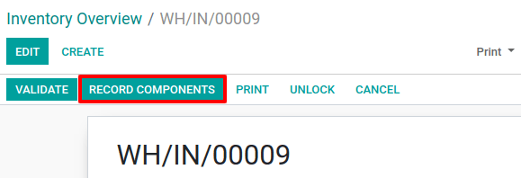

For audit purposes, it is possible to check the lot numbers recorded on
a receipt by using the icon on the right of the finished products:

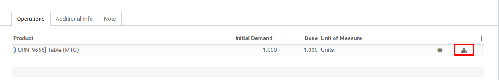

Automate Replenishment of Subcontractors
========================================

To manage the resupply of your subcontractor, activate
*Multi-locations* in :menuselection:`Inventory --> Configuration -->
Configuration`. Then, the inventory at the subcontractor location can
be tracked.

It is possible to resupply subcontractors by sending products from the
company locations, or by sending products from another supplier to the
subcontractors.

Replenishment from the warehouse
--------------------------------

Resupplying subcontractors manually is the simplest approach. To do so,
create delivery orders in which the subcontractor is set as a delivery
address and fill the components to deliver.

To automate the subcontractors’ replenishment propositions, there are
two approaches:

- Reordering rules;
- Replenish on order flow.

For the first one, just define a reordering rule on the subcontracting
location, with a minimum and maximum inventory level. When the
reordering rule is triggered, a delivery order is created to ship the
components to the subcontractor.

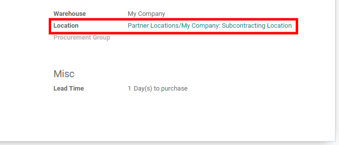

The second approach is to use a “pull” flow. Here, the demand in the
finished product (real demand or forecasted one through the Master
Production Schedule) triggers the replenishment of the subcontractor. To
do so, select the route *Resupply Subcontractor on Order* on the
wanted components.

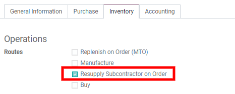

Replenishment from another supplier
-----------------------------------

When purchasing items to another supplier, it is possible to ask him to
deliver the subcontractor directly. To do so, activate the *Drop
Shipping* feature in :menuselection:`Purchase --> Configuration -->
Configuration`.

Now, set the *Dropship* option in the *Deliver To* field of the
*Other Information* tab. Then, provide the address of the
subcontractor for the shipping.

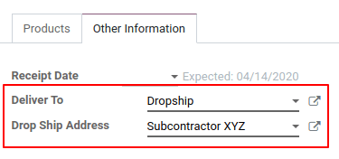

That way, the supplier can ship items directly and you simply receive
and pay the bill. However, it is still required to validate receipts for
the subcontractor.

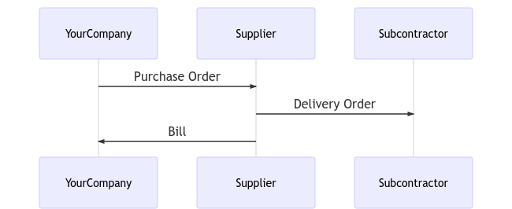

Quality Control
---------------

Controlling the quality of the products manufactured by subcontractors
is possible thanks to the Odoo Quality app. Quality checks can be made
on a manufacturing step but, because the manufacturing process is
handled by an external party, it can be defined on the product
reception.

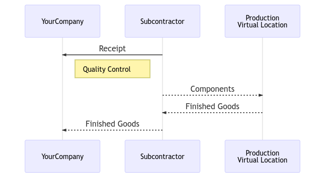

To create a quality check at the receipt, open the *Quality* app and
create a new *Control Point* on the reception.

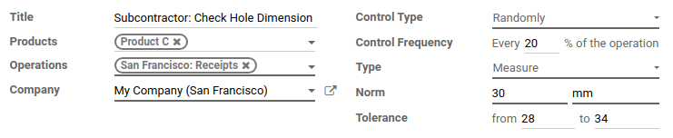

By doing so, a quality check is automatically created each time a
finished product is received.