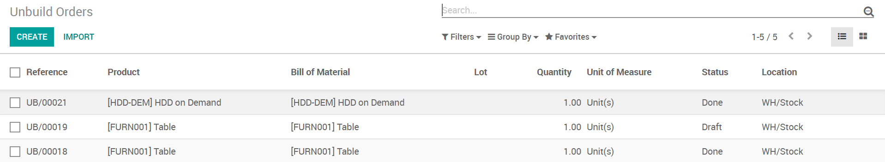
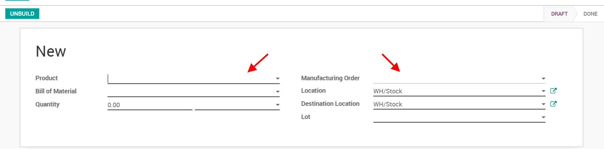

=================
Unbuild a product
=================

In Odoo Manufacturing App, you can *Unbuild* products. Two use cases
can be managed: (1) you can unbuild products you have built yourself or
(2) you can unbuild products you have received.

Let's take the first case, you are manufacturing products yourself. If
one of your product presents some defect, you might want to unbuild it
instead of scrapping it completely, allowing you to reuse some
components of the product.

In the second case, you are buying products for the sole purpose of
unbuilding them and recycling them.

Unbuild Order
=============

While in the Manufacturing App, under the *Operations* tab you will
find the menu *Unbuild Orders*.

When creating a new one, you can either select a MO if you are
unbuilding something you manufactured or only select a product if you
are unbuilding something you received.

When you are done, just click unbuild and the process will be over.

If you unbuild a product that you manufactured before, you will get the
components from the MO back in stock.

If you unbuild a product you bought, you will get the components from
the BoM back in stock.
