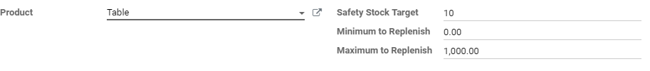
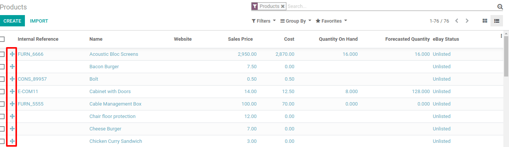

==================================
Use the Master Production Schedule
==================================

.. _manufacturing/management/use_mps:

The Master Production Schedule (MPS) is a valuable tool to plan your
production based on your demand forecast.

Configuration
=============

Go to the :menuselection:`Manufacturing app --> Configuration --> Settings` and activate the Master
Production Schedule feature before hitting save.

.. image:: use_mps/use_mps_01.png
    :align: center

.. tip::
        In the manufacturing settings, you can define the time range of your MPS (month/week/day) and the number of periods you want to display.

Now, go in :menuselection:`Planning --> Master Production Schedule` and click on add a
product. You can now define your safety stock target (= the stock you
want to have on hand at the end of the period) and the minimum and
maximum quantities to replenish.

.. tip::
        The products are ordered in the MPS based on their sequence. You can
        rearrange that sequence by going on the list of your products and
        reorganize them with drag and drop.

In the MPS view, you can decide which information you would like to show
by clicking on *rows*. Some fields can be added to the view, such as
*Actual demand*, which will show which quantity of products has
already been ordered for the period, or *Available to Promise*, which
allows you to know what can still be sold during the period (what you
plan to replenish - what is already sold during the period). You can
also decide to hide some information if it isn’t necessary.

.. image:: use_mps/use_mps_04.png
    :align: center

Estimate your demand and launch replenishment
=============================================

The next step is to estimate the demand for the period. This estimation
should be entered in the row *Demand Forecast*. You can easily, at any
time, compare the demand forecast with the actual demand (= confirmed
sales). The demand forecast for a finished product will impact the
indirect demand for its components.

.. image:: use_mps/use_mps_05.png
    :align: center

Then, the quantity to replenish for the different periods will be
automatically computed. The replenishments you are supposed to launch
based on your lead times (vendor lead time or manufacturing lead time)
are displayed in green. You can now launch the replenishment by clicking
on the replenish button.

Depending on the configuration of the product (buy vs. manufacture),
requests for quotations or manufacturing orders will be created. You can
easily access those by clicking on the *Actual Replenishment* cell.

.. image:: use_mps/use_mps_06.png
    :align: center

.. image:: use_mps/use_mps_07.png
    :align: center

In case you manually edit the *To replenish* quantity, a small cross
will appear on the left. In case you want to go back to the
automatically computed value given by Odoo, you can click the cross.

.. image:: use_mps/use_mps_08.png
    :align: center

Cells color signification
=========================

The cells, which are part of the *To replenish* line, can take
different colors depending on the situation:

-  **Green**: quantity of products which should be replenished to reach the expected safety stock considering the demand forecast and the indirect demand forecast.

-  **Grey**: replenishment order has already been generated, and its quantity still matches current data.

-  **Red**: replenishment order has already been generated, and its quantity was too high considering current data.

-  **Orange**: replenishment order has already been generated, and its quantity was too low considering current data.

The *Forecasted stock* line can also contain red cells, which means
the stock will be negative during the period in question.

What if I have underestimated the demand?
-----------------------------------------

You can still increase the demand forecast. It will impact the quantity
to replenish. The cell will become orange, and you’ll be able to launch
a new replenishment.

What if I have overestimated the demand?
----------------------------------------

You can decrease the demand forecast. The cell will become red to inform
you that you’ve ordered more than planned. If you’re still able to do
it, you can cancel some RFQ or MO manually.

What if I wrongly added a product to the MPS?
---------------------------------------------

You can easily remove a product from the MPS by clicking the small bin
on the right of its name.

.. image:: use_mps/use_mps_09.png
    :align: center
