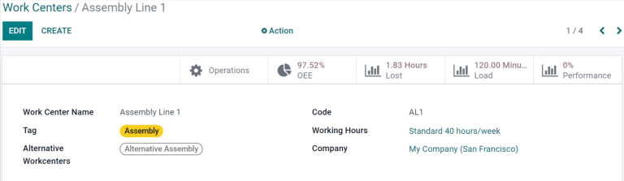
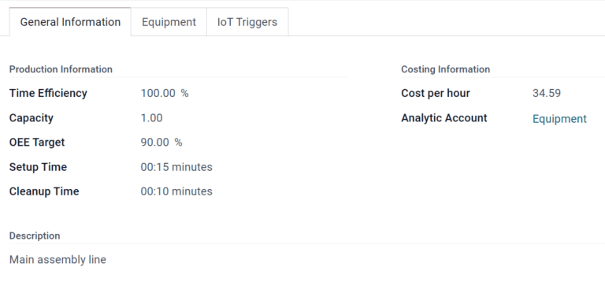
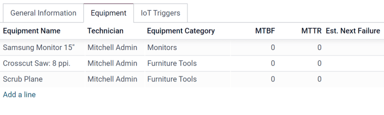
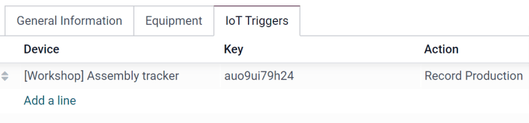
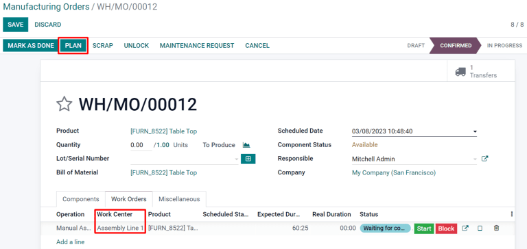
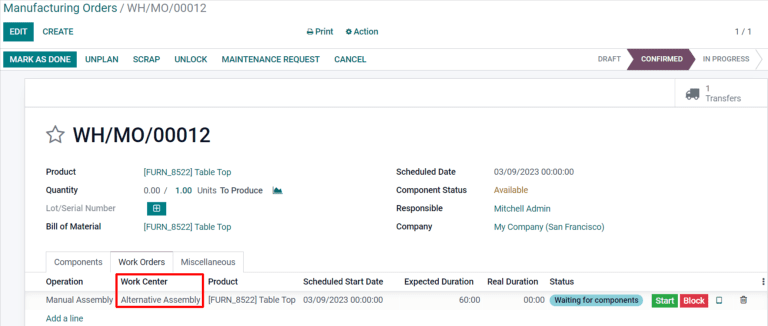

=====================================
Manage work orders using work centers
=====================================

Odoo Manufacturing allows for work orders to be carried out at specific work centers. When a
manufacturing order is created for a product, any work orders listed in the :guilabel:`Operations`
tab of the product bill of materials (BoM) will be automatically created as well and assigned to the
specified work center. Work orders can be managed in the :guilabel:`Manufacturing` module by
selecting :menuselection:`Operations --> Work Orders`.

In order to use work centers, the :guilabel:`Work Orders` feature must first be enabled. To do so,
go to the :guilabel:`Manufacturing` module, select :menuselection:`Configuration --> Settings`, and
activate the checkbox next to :guilabel:`Work Orders`. Work centers can then be created and managed
by selecting :menuselection:`Configuration --> Work Centers`.

Create a work center
====================

Within the :guilabel:`Manufacturing` module, select :menuselection:`Configuration --> Work Centers
--> Create`. The work center form can then be filled out as follows:

- :guilabel:`Work Center Name`: give the work center a concise name that describes the type of
  operations it will be used for
- :guilabel:`Alternative Workcenters`: specify an alternative work center for operations to be
  carried out at if the main work center is not available
- :guilabel:`Code`: assign the work center a reference code
- :guilabel:`Working Hours`: define the number of hours that the work center can be in use each week
- :guilabel:`Company`: select the company that the work center belongs to

Set standards for work center productivity
------------------------------------------

The :guilabel:`General Information` tab on the work center form allows for productivity goals to be
assigned to a work center:

- :guilabel:`Time Efficiency`: used to calculate the expected duration of a work order at the work
  center; for example, if a work order normally takes one hour and the efficiency is set to 200%,
  the work order will take 30 minutes
- :guilabel:`Capacity`: the number of operations that can be performed at the work center
  simultaneously
- :guilabel:`OEE Target`: the target for efficiency at the work center
- :guilabel:`Time before prod.`: setup time required before work can commence
- :guilabel:`Time after prod.`: breakdown or cleanup time required after work is finished
- :guilabel:`Cost per hour`: the cost of operating the work center for one hour
- :guilabel:`Analytic Account`: the account where the cost of the work center should be recorded

Assign equipment to a work center
---------------------------------

Using the :guilabel:`Equipment` tab, it is possible for specific pieces of equipment to be assigned
to a work center. The following information will be displayed for each piece of equipment added:

- :guilabel:`Equipment Name`: the name of the piece of equipment
- :guilabel:`Technician`: the technician responsible for servicing the equipment
- :guilabel:`Equipment Category`: the category the equipment belongs to
- :guilabel:`MTBF`: mean time between failures; the average time that the piece of equipment will
  operate before failing
- :guilabel:`MTTR`: mean time to recovery; the average time it takes for the equipment to become
  fully operational again
- :guilabel:`Est. Next Failure`: an estimate of when the next equipment failure will occur

.. note::
    :guilabel:`MTBF`, :guilabel:`MTTR`, and :guilabel:`Est. Next Failure` are all calculated
    automatically based on past failure data, if any exists.

.. _workcenter_iot:

Integrate IoT devices
---------------------

The :guilabel:`IoT Triggers` tab enables the integration of :abbr:`IoT (Internet of Things)` devices
with a work center:

- :guilabel:`Device`: specifies the IoT device to be triggered
- :guilabel:`Key`: the security key for the device
- :guilabel:`Action`: the IoT device action triggered

Use case: configure an alternative work center
==============================================

When a work center is at capacity, it cannot accept any new work orders. Instead of waiting for the
work center to become available, it is possible to specify an alternative work center where surplus
work orders should be carried out.

Begin by creating a new work center. Configure the :guilabel:`Equipment` tab so that it has all of
the same equipment as the main work center. This will ensure that the same tasks can be carried out
at both work centers. Navigate to the main work center and include the new work center in the
:guilabel:`Alternative Workcenters` selection field.

Now, create a new manufacturing order that uses the main work center for one of its operations. The
main work center will automatically be selected for the operation in the :guilabel:`Work Orders`
tab. After confirming the manufacturing order, click the :guilabel:`Plan` button that appears at the
top left of the form.

If the main work center is at capacity, the work center selected for the operation will be
automatically changed to the alternative work center.

Monitor work center performance
===============================

Performance for an individual work center can be viewed by selecting
:menuselection:`Configuration --> Work Centers`, and clicking on a work center. A variety of metrics
showing work center performance can be viewed at the top right of the form:

- :guilabel:`OEE`: overall effective efficiency, the percentage of time that the work center has
  been fully productive
- :guilabel:`Lost`: the amount of time lost due to work stoppages
- :guilabel:`Load`: the amount of time it will take to complete the current workload
- :guilabel:`Performance`: the real duration of work time, shown as a percentage of the expected
  duration
