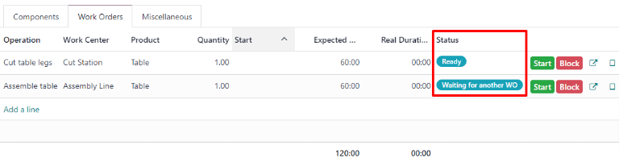
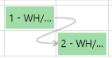

=======================
Work order dependencies
=======================

.. |BOM| replace:: :abbr:`BoM (Bill of Materials)`

When manufacturing certain products, specific operations may need to be completed before others can
begin. In order to ensure operations are carried out in the correct order, Odoo *Manufacturing*
features a *work order dependencies* setting. Enabling this setting allows for operations on a Bill
of Materials (BoM) to be *blocked* by other operations that should occur first.

Configuration
=============

The *work order dependencies* setting is not enabled by default. To enable it, begin by navigating
to :menuselection:`Manufacturing --> Configuration --> Settings`. Then, enable the :guilabel:`Work
Orders` setting, if it is not already active.

After enabling the :guilabel:`Work Orders` setting, the :guilabel:`Work Order Dependencies` setting
appears below it. Enable :guilabel:`Work Order Dependencies`, then click :guilabel:`Save` to confirm
the changes.

Add dependencies to BoM
=======================

Work order dependencies are configured on a product's |BOM|. To do so, navigate to
:menuselection:`Manufacturing --> Products --> Bills of Materials`, then select a |BOM|, or create a
new one by clicking :guilabel:`New`.

.. admonition:: Learn more

   For a complete guide on how to properly configure a new |BOM|, see the documentation on
   :ref:`creating a bill of materials <manufacturing/management/bill-configuration>`.

On the |BOM|, click on the :guilabel:`Miscellaneous` tab, then enable the :guilabel:`Operation
Dependencies` checkbox. This makes a new :guilabel:`Blocked By` option available in the settings of
the :guilabel:`Operations` tab.

.. image:: work_order_dependencies/operation-dependencies.png
   :align: center
   :alt: The Operation Dependencies checkbox on the Miscellaneous tab of a BoM.

Next, click on the :guilabel:`Operations` tab. On the top-right of the tab, click on the tab's
:guilabel:`settings` button, then enable the :guilabel:`Blocked By` checkbox. This makes a
:guilabel:`Blocked By` field appear for each operation on the :guilabel:`Operations` tab.

.. image:: work_order_dependencies/operations-settings.png
   :align: center
   :alt: The settings for the Operations tab on a BoM.

In the line of the operation that should be blocked by another operation, click the
:guilabel:`Blocked By` field, and an :guilabel:`Open: Operations` pop-up window appears. In the
:guilabel:`Blocked By` drop-down field on the pop-up window, select the blocking operation that must
be completed *before* the operation that is blocked.

.. image:: work_order_dependencies/blocked-by.png
   :align: center
   :alt: The Blocked By drop-down field for an operation on a BoM.

Finally, save the |BOM| by clicking :guilabel:`Save`.

Plan work orders using dependencies
===================================

Once work order dependencies have been configured on a |BOM|, Odoo *Manufacturing* is able to plan
when work orders are scheduled, based on their dependencies. To plan the work orders for a
manufacturing order, begin by navigating to :menuselection:`Manufacturing --> Operations -->
Manufacturing Orders`.

Next, select a manufacturing order for a product with work order dependencies set on its |BOM|, or
create a new manufacturing order by clicking :guilabel:`New`. If a new manufacturing order is
created, select a |BOM| configured with work order dependencies from the :guilabel:`Bill of
Material` drop-down field, then click :guilabel:`Confirm`.

After confirming the manufacturing order, select the :guilabel:`Work Orders` tab to view the work
orders required to complete it. Any work orders that are *not* blocked by a different work order
display a `Ready` tag in the :guilabel:`Status` section.

Work orders that are blocked by one or more work orders display a `Waiting for another WO` tag
instead. Once the blocking work order(s) are completed, the tag updates to `Ready`.

To schedule the manufacturing order's work orders, click the :guilabel:`Plan` button at the top of
the page. After doing so, the :guilabel:`Scheduled Start Date` field for each work order on the
:guilabel:`Work Orders` tab auto-fills with the scheduled start date and time. A blocked work order
is scheduled at the end of the time period specified in the :guilabel:`Expected Duration` field of
the work order that precedes it.

.. image:: work_order_dependencies/scheduled-start-date.png
   :align: center
   :alt: The Scheduled Start Date field for work orders on a manufacturing order.

.. example::
   A manufacturing order is created for Product A. The manufacturing order has two operations: Cut
   and Assemble. Each operation has an expected duration of 60 minutes, and the Assemble operation
   is blocked by the Cut operation.

   The :guilabel:`Plan` button for the manufacturing order is clicked at 1:30 pm, and the Cut
   operation is scheduled to begin immediately. Since the Cut operation has an expected duration of
   60 minutes, the Assemble operation is scheduled to begin at 2:30 pm.

Planning by workcenter
----------------------

To see a visual representation of how work orders are planned, navigate to the :guilabel:`Work
Orders Planning` page by going to :menuselection:`Manufacturing --> Planning --> Planning by
Workcenter`. This page shows a timeline of all the work orders scheduled for each operation.

If one work order is blocked by the completion of another, the work order that is blocked is shown
as scheduled to start after the work order blocking it. In addition, an arrow connects the two work
orders, leading from the blocking operation to the blocked operation.

