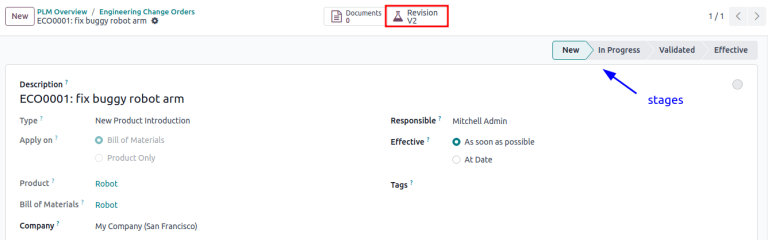
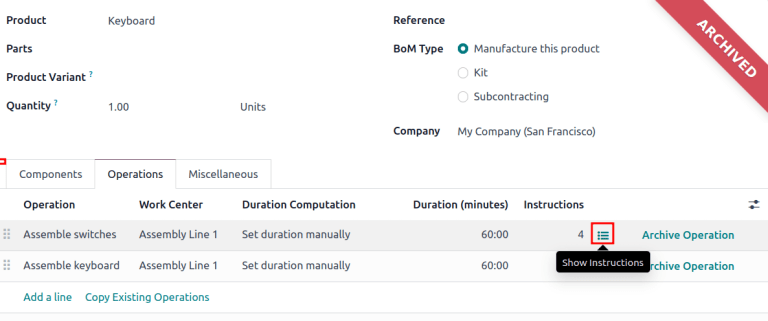

=========================
Engineering change orders
=========================

.. _plm/eco:

Utilize *engineering change orders* (ECO) to track and implement changes to products and :ref:`bill
of materials <manufacturing/management/bill-configuration>`. View and create :abbr:`ECOs
(engineering change orders)` within each *ECO type*, a project pipeline in Gantt view that consists
of stages, ensuring progress tracking for collaborators and stakeholders.

Engineering change orders can be created:

#. :ref:`directly in the ECO type <plm/create-eco>`
#. by an operator in the :ref:`tablet view <plm/eco/tablet-view>` of an operation
#. automatically from feedback submitted to the :ref:`ECO type's email alias <plm/eco/eco-type>`.

.. _plm/create-eco:

Create new ECO
==============

To create a new :abbr:`ECO (engineering change order)`, begin by navigating to the
:menuselection:`PLM app` and select the ECO type card that will be used to track the progress of the
change. On the :guilabel:`Engineering Change Orders` page, click on the :guilabel:`New` button at
the top left.

On the :abbr:`ECO (engineering change order)` form, type in a short :guilabel:`Description` of the
change and select the :guilabel:`Product` from the drop-down field. The default :guilabel:`Apply on`
radio selection is :guilabel:`Bill of Materials`, making the field required.

Optionally, set a particular deadline for the completion of the change with an :guilabel:`Effective`
date, or add :guilabel:`Tags` for categorization.

Finally, click :guilabel:`Start Revision` after filling out the form to begin implementing the
changes. Clicking the button unveils the stages of the ECO type, :guilabel:`Documents` smart button,
the :guilabel:`Revision` smart button and the product's version number.

Change components
=================

To modify the components in a :abbr:`BoM (Bill of Material)`, click the :guilabel:`Revision` smart
button on an active :abbr:`ECO (engineering change order)` to access the archived, new version of
the :abbr:`BoM (Bill of Material)`. In the new version of the :abbr:`BoM (Bill of Material)`, switch
to and make changes in the :guilabel:`Components` tab. In the editable components list, modify the
:guilabel:`Quantity` of existing components or click the :guilabel:`Add a line` button to add new
components.

.. example::
   In version 2 of the :abbr:`BoM (Bill of Material)` for a keyboard, the component quantities are
   reduced, and an additional component, `Stabilizers`, is added.

   .. image:: engineering_change_orders/version-2-BOM.png
      :align: center
      :alt: Make changes to components by going to the new BoM with the *Revision* smart button.

Once the changes are complete, navigate back to the :abbr:`ECO (engineering change order)` itself by
clicking `ECO00X` in the breadcrumbs in the top left. On the :abbr:`ECO (engineering change order)`
form, a new :guilabel:`BoM Changes` tab displays the differences between the current production
:abbr:`BoM (Bill of Material)` and the new version. This ensures changes and tests are encapsulated
in the revised :abbr:`BoM (Bill of Material)` and do not affect :abbr:`BoM (Bill of Material)` used
in production. That is, until the :ref:`changes are applied <plm/eco/apply-changes>`.

.. example::
   View the summary of the differences between the current and revised keyboard :abbr:`BoMs (Bill of
   Materials)` in the :guilabel:`BoM Changes` tab of the :abbr:`ECO (engineering change order)`.

   .. image:: engineering_change_orders/BoM-changes.png
      :align: center
      :alt: View summary of component changes in the *BoM Changes* tab.

Change operations
=================

To modify the work orders in a :abbr:`BoM (Bill of Material)`, click the :guilabel:`Revision` smart
button on an active :abbr:`ECO (engineering change order)` to access the archived, new version of
the :abbr:`BoM (Bill of Material)`. In the new :abbr:`BoM (Bill of Material)` version, switch to the
:guilabel:`Operation Changes` tab and make changes to existing operations by selecting each
operation line item and opening the corresponding :guilabel:`Open: Operations` pop-up window. Make
changes to any of the fields in the pop-up and click :guilabel:`Save` once completed. Create new
operations by clicking the :guilabel:`Add a line` button, and remove new operations by clicking the
:guilabel:`Archive` button.

.. note::
   The :guilabel:`Operations` tab is not available by default. To enable it, navigate to
   :menuselection:`Manufacturing --> Configuration --> Settings` and check the :guilabel:`Work
   Orders` box.

Once the changes are complete, navigate back to the :abbr:`ECO (engineering change order)` itself by
clicking `ECO00X` in the breadcrumbs in the top left. On the :abbr:`ECO (engineering change order)`
form, a new :guilabel:`Operation Changes` tab displays the differences between the current
production :abbr:`BoM (Bill of Material)` and the new version. Modifications to the :abbr:`BoM (Bill
of Material)` in an :abbr:`ECO (engineering change order)` will not affect the :abbr:`BoM (Bill of
Material)` used in production. That is, until the :ref:`changes are applied
<plm/eco/apply-changes>`.

.. _plm/eco/apply-changes:

Apply changes
=============

After verifying the changes, move the :abbr:`ECO (engineering change order)` to a :ref:`verification
stage <plm/eco/stage-config>`. Once the approvers accept the changes, the :guilabel:`Apply Changes`
button will become available. Click this button, and the :abbr:`ECO (engineering change order)`
will be automatically closed.

To ensure the changes are live, navigate to the :guilabel:`Revision` smart button. The :abbr:`BoM
(Bill of Material)` will have the large red :guilabel:`Archived` tag removed. Additionally, navigate
to the product form, switch to the :guilabel:`Miscellaneous` tab, and the :guilabel:`Version` field
will be incremented.

.. _plm/eco/tablet-view:

Create ECO from tablet view
===========================

:abbr:`ECOs (engineering change orders)` created in *tablet view* are intended for operators to
directly suggest clearer assembly instructions. To create an :abbr:`ECO (engineering change order)`,
navigate to the :guilabel:`Work Orders` tab on an ongoing manufacturing order. Click the
:guilabel:`tablet icon` for the desired work order to open the tablet view of the operation.

.. image:: engineering_change_orders/tablet-icon.png
   :align: center
   :alt: Find the tablet icon for each operation, second from the far right.

Next, add an instructional step by clicking the :guilabel:`☰ (three horizontal lines)` icon in
tablet view of an operation. Then, click the :guilabel:`Add a step` button.

.. image:: engineering_change_orders/additional-options-menu.png
   :align: center
   :alt: Navigate to the "Add a Step" pop-up by clicking the three horizontal lines icon in tablet
         view.

In the :guilabel:`Title` field, enter a short step description. Next, in the
:guilabel:`Instructions` text field, type the instructions of the step in greater detail.
Optionally, add an image to the :guilabel:`Document` field. Once completed, finish by clicking the
:guilabel:`Propose Change` button.

.. example::
   To propose an additional check for broken components, enter the details in the :guilabel:`Add a
   Step` pop-up. Doing so creates an instructional quality control point that will be reviewed in
   the following section.

   .. image:: engineering_change_orders/add-a-step.png
      :align: center
      :alt: Fill out the *Add a Step* form to suggest an additional quality control point.

View ECO
--------

To review the proposed changes, go to the `BOM Changes` ECO type from :menuselection:`PLM app -->
Overview` and click on the card to view the contained :abbr:`ECOs (engineering change orders)`.
Click on the newly created :abbr:`ECO (engineering change order)` in the `New` stage, and view a
summary of the proposed changes in the :guilabel:`Operation Changes` tab. To implement the changes,
click the :guilabel:`Revision` smart button.

.. example::
   The :abbr:`ECO (engineering change order)` adding another check for broken components is created
   in the `BOM Changes` ECO type found in :menuselection:`PLM app --> Overview`. By default,
   :abbr:`ECOs (engineering change orders)` created from tablet view are named with the
   manufacturing order number  as a suggested form of reference.

   .. image:: engineering_change_orders/view-BOM-change.png
      :align: center
      :alt: alt text

In the new :abbr:`BoM (Bill of Material)`, switch to the :guilabel:`Operations` tab and select the
:guilabel:`Show Instructions` icon (:guilabel:`☰ (three horizontal lines)`). Doing so opens a list
of :guilabel:`Steps` to perform the operation, with the newest instruction titled `New Step
Suggestion:` followed by the user-entered title. Click the line item to view the suggested changes.

In opened the :ref:`quality control point <quality/quality_control_points>` form, ensure the
following form fields are accurately filled out to give detailed instructions for operators:

- :guilabel:`Title`: rename to give a concise description of the new instruction
- :guilabel:`Control per`: using the drop-down menu, determine whether this instruction applies
  broadly for the :guilabel:`Product`, specifically for this :guilabel:`Operation` only, or a
  particular :guilabel:`Quantity` of the product
- :guilabel:`Type`: categorizes the control point type. From the drop-down menu, select
  :guilabel:`Instructions` to detail an instruction for the worker. To receive input from the
  workers, select the :guilabel:`Take a Picture`, :guilabel:`Register Consumed Materials`,
  :guilabel:`Print Label`, or other :ref:`quality check options <quality/quality_control_points>`.

Once the quality control point is configured, return to the :guilabel:`Steps` list using the
breadcrumbs. Finally, drag the last quality control line item to its intended order of instructions.

.. example::
   Drag and reorder the `Check for broken switches` instruction by clicking and dragging its "6
   dots" icon to move it from the bottom to the second position.

   .. image:: engineering_change_orders/reorder.png
      :align: center
      :alt: Drag and reorder instructions by selecting the "6 dots" icon on the far left.

.. _plm/eco/eco-type:

Create ECO type
===============

To access and manage ECO types, navigate to :menuselection:`PLM app --> Configuration --> ECO
Types`. Create a new ECO type by clicking :guilabel:`New`, and fill in the :guilabel:`Name`. The
:guilabel:`Email Alias` field is optional, but feedback submitted to the filled-in email address
will automatically create an :abbr:`ECO (engineering change order)` in this ECO type. Modify
existing ECO type names and email aliases by clicking on the respective ECO type in the list.

Existing ECO types are displayed in task form on the :guilabel:`PLM Overview` page, accessible by
navigating to :menuselection:`PLM app --> Overview`.

.. _plm/eco/stage-config:

Stage configuration
-------------------

Click an ECO type from :menuselection:`PLM app --> Overview` to open a kanban view of the
:abbr:`ECOs (engineering change orders)` of this type. In the pipeline, ensure there is at least one
*verification* stage, where :abbr:`ECO (engineering change order)` changes can be applied, and a
*closing stage*, for storing completed :abbr:`ECOs (engineering change orders)`. To configure a
stage, hover over the intended stage and select the :guilabel:`⚙️ (gear)` icon. Then, click
:guilabel:`Edit` to open a pop-up window.

Configure the verification stage in the edit stage pop-up by checking the box for :guilabel:`Allow
to apply changes`. Optionally, add :guilabel:`Approvals` to automatically notify people to verify
the changes before they go live. Once finished, select the :guilabel:`Save & Close` button.

.. example::
   The stage named `Validated` is intended to store :abbr:`ECOs (engineering change orders)` that
   are to be reviewed by the main approver, the engineering manager, before the changes are applied
   to production. To reflect this, the engineering manager is listed in the :guilabel:`Approvals`
   section. Additionally, the :guilabel:`Allow to apply changes` option is checked.

   .. image:: engineering_change_orders/verification-stage.png
      :align: center
      :alt: Show "Allow to apply changes" option is checked.

Next, hover over the closing stage and select the corresponding :guilabel:`⚙️ (gear)` icon to open
the edit stage pop-up. Ensure that the :guilabel:`Folded in kanban view`, :guilabel:`Allow to apply
changes`, and :guilabel:`Final Stage` options are checked.

.. image:: engineering_change_orders/closing-stage.png
   :align: center
   :alt: Show configurations of the closing stage.

