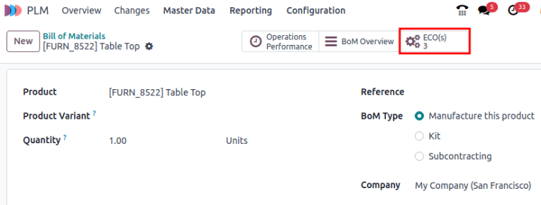
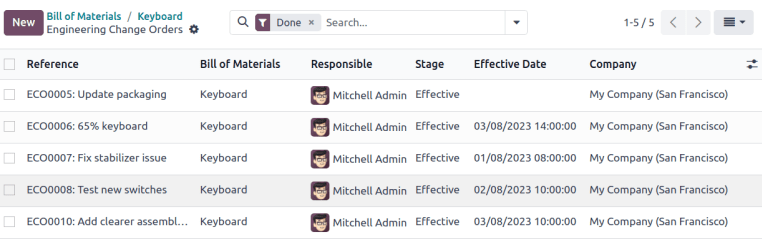
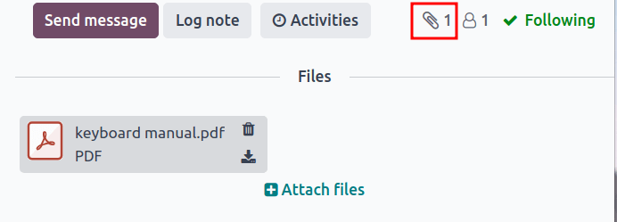

===============
Version control
===============

.. |BOM| replace:: :abbr:`BoM (Bill of Material)`
.. |BOMs| replace:: :abbr:`BoMs (Bill of Materials)`
.. |ECO| replace:: :abbr:`ECO (Engineering change order)`
.. |ECOs| replace:: :abbr:`ECOs (Engineering change orders)`

Note: any suggestions on a more suitable document name that reflects a specific feature in Odoo? I
couldn't think of one ):

Easily manage bill of materials (BoM) revision history with :menuselection:`PLM`.  Access previous
BOM versions, assembly instructions, component details, and past product design files. |BOM|
effective dates are recorded for error tracking. Changes are compartmentalized in an
:ref:`engineering change order <plm/eco>`, which makes merging |ECOs| back to the production |BOM|
simple.

Current BoM version
===================

To see the current version of the |BOM| used in production, go to :menuselection:`PLM app --> Master
Data --> Bill of Materials`. Select the desired |BOM| from the list. Then, switch to the
:guilabel:`Miscellaneous` tab, where the currently live :guilabel:`Version` of the |BOM| is
displayed.

.. note::
   |BOMs| can also be accessed from :menuselection:`Manufacturing app --> Products --> Bill of
   Materials`.

Version history
===============

To view all |ECOs| linked to a |BOM|, click the :guilabel:`ECO` smart button on a |BOM|. Click the
:guilabel:`≣ (four horizontal lines)` icon to switch to list view.

In the list of |ECOs|, navigate to the search bar and click the :guilabel:`▼ (down arrow)` icon to
access a drop-down menu of :guilabel:`Filters`. Next, filter by :guilabel:`Done` |ECOs| to view the
revision history of the |BOM|, the :guilabel:`Responsible` who applied the change, and the
:guilabel:`Effective Date` of the |BOM|. Click each |ECO| to view the past components, operations,
and design files associated with the |BOM|.

.. tip::
   If no date is displayed in the :guilabel:`Effective Date` field, this means the
   :guilabel:`Effective` date of the |ECO| was set to :guilabel:`As soon as possible`.
   Alternatively, check when the |BOM| went live by navigating to the chatter and hovering over the
   time the |ECO| was moved to the :ref:`closing stage <plm/eco/stage-config>`.

   .. image:: version_control/effective-asap.png
      :align: center
      :alt: Show *Effective* as soon as possible field.

Design files
============

Attach CAD files, PDFs, images, or other design material to the |BOM| itself. To do so, navigate to
:menuselection:`PLM app --> Master Data --> Bill of Materials` and select the desired |BOM|. On the
|BOM|, navigate to the *chatter* and click the :guilabel:`📎 (paperclip)` icon. The files associated
to the |BOM| are displayed in the :guilabel:`Files` section. To add more design files, select the
:guilabel:`Attach files` button.

Manage design files in an ECO
-----------------------------

After creating a :ref:`new Engineering Change Order <plm/create-eco>` (ECO), all files stored
in the :guilabel:`Files` section of the |BOM| are automatically copied over the
:guilabel:`Documents` smart button. Click on the button to open the :guilabel:`Attachments` page.

Hover over each attachment to reveal the :guilabel:`︙ (three vertical dots)` icon. From there,
choose whether to :guilabel:`Edit`, :guilabel:`Remove`, and :guilabel:`Download` the file. Any
changes made to these files are contained within the |ECO|, and will only apply to the production
|BOM| once the :ref:`changes are applied <plm/eco/apply-changes>`.

.. example::
   Replace the keyboard PDF in an active |ECO| by first selecting the :guilabel:`Documents` smart
   button.

   .. image:: version_control/documents-smart-button.png
      :align: center
      :alt: Show *Documents* smart button from an active ECO.

   On the :guilabel:`Attachments` page, hover over the design file and click the :guilabel:`︙ (three
   vertical dots)` icon, then the :guilabel:`Edit` option. Rename the file something specific to
   express why the file is about to be archived in this active |ECO|. In this case, the |BOM| is for
   a smaller keyboard, so the manual for a larger keyboard is no longer relevant. Rename `100%
   keyboard manual`, and then save and click back to the :guilabel:`Attachments` page using the
   breadcrumbs. Click on the :guilabel:`︙ (three vertical dots)` icon again, and then select the
   :guilabel:`Remove` option to archive the file.

   Next, click the :guilabel:`Upload` button to upload the new design file, named `60% keyboard
   manual`.

   .. image:: version_control/attachments.png
      :align: center
      :alt: View of *Attachments* page from the *Documents* smart button. Displays one archived and
            one newly added attachment.

.. note::
   Archived files are not permanently deleted— they can still be accessed in the previous |ECO| or
   as an archived file in the latest ECO where the archival occurred.

Apply rebase
============

Odoo simplifies the process of merging different versions of a |BOM| when multiple |ECOs| are open
for the same product. If the |BOM| used in production is updated while an |ECO| is still open and in
testing, review the differences between the production |BOMs| in the newly appeared
:guilabel:`Previous Eco Bom Changes` tab. Then, click the :guilabel:`Apply Rebase` button to update
the |BOM| and make it cohesive with the production |BOM|.

.. example::

   Two |ECOs|, `ECO0011` and `ECO0012`, are created when the current |BOM| version is `5`. In
   `ECO0011`, a new component, `Space stabilizer` is added, and the changes are applied. This means
   the current |BOM| version has become `6`.

   .. image:: version_control/branch-change.png
      :align: center
      :alt: Apply changes to an ECO to update the production BOM.

   This means that `ECO0012`'s |BOM| is missing the `Space stabilizer`, as shown in the
   :guilabel:`Previous Eco Bom Changes` tab. To ensure the changes applied by `ECO0011`
   are kept when the changes in `ECO0012`, click the :guilabel:`Apply Rebase` button to apply the
   previous |ECO| changes without affecting the changes already made to `ECO0012`.

   .. image:: version_control/merge-change.png
      :align: center
      :alt: Click *Apply Rebase* button to update the BOM to match the production BOM.

