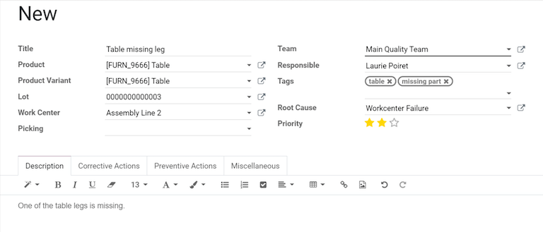
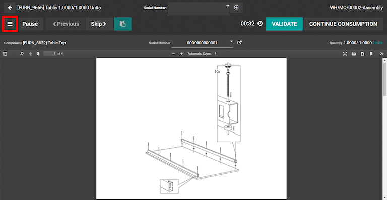

=====================
Create quality alerts
=====================

:doc:`Configuring quality control points <quality_control_points>` is a great way to ensure that
quality checks are performed at routine stages during specific operations. However, quality issues
can often appear outside of these scheduled checks. Using Odoo Quality, users can create quality
alerts for issues that are not detected by automated processes.

Creating quality alerts from the quality module
===============================================

In some situations, it is necessary to create quality alerts within the :guilabel:`Quality` module.

.. example::
   A helpdesk user who is notified of a product defect through a customer ticket can manually create
   an alert that brings the issue to the attention of the relevant quality team.

To create a new quality alert, navigate to the Quality module and select :menuselection:`Quality
Control --> Quality Alerts --> Create`. The quality alert form can then be filled out as follows:

- :guilabel:`Title`: Choose a concise, yet descriptive title for the quality alert that can be
  easily understood by quality teams.
- :guilabel:`Product`: select the product about which the quality alert is being created.
- :guilabel:`Product Variant`: specify if the quality issue only applies to a single variant of the
  product.
- :guilabel:`Lot`: specify if the quality issue applies to all products within a lot number.
- :guilabel:`Work Center`: add the work center where the quality issue originated.
- :guilabel:`Picking`: include the picking operation during which the quality issue originated.
- :guilabel:`Team`: choose the quality team that will be notified by the quality alert.
- :guilabel:`Responsible`: select an individual responsible for managing the quality alert.
- :guilabel:`Tags`: classify the quality alert based on user-created tags.
- :guilabel:`Root Cause`: include the cause of the quality issue, if known.
- :guilabel:`Priority`: assign a priority between one and three stars to ensure more
  urgent issues are prioritized.

The tabs at the bottom of the form can be used to provide additional information to quality teams:

- :guilabel:`Description`: provide additional details about the quality issue.
- :guilabel:`Corrective Actions`: detail the method for fixing affected products.
- :guilabel:`Preventive Actions`: specify procedures for preventing the issue from occurring in
  the future.
- :guilabel:`Miscellaneous`: include the product vendor (if applicable), the company that produces
  the product, and the date assigned.

Creating quality alerts during the manufacturing process
========================================================

Odoo enables manufacturing employees to create quality alerts within a work order without accessing
the quality module. From the work order tablet view, click the menu button in the top left corner
and select :guilabel:`Quality Alert`. The quality alert form can then be filled out in the same way
as detailed in the previous section. After saving the form, a new alert will appear in the
:guilabel:`Quality Alerts` tab of the Quality module.

Managing existing quality alerts
================================

By default, quality alerts are organized in a Kanban board view. The stages of the Kanban board are
fully configurable and alerts can be moved from one stage to the next by dragging and dropping or
from within each alert. Additional options are available for viewing alerts, including graph,
calendar, and pivot table views.

.. tip::
   Users can filter alerts based on criteria like date assigned or date closed. Alerts can also be
   grouped by quality team, root cause, or other details.
