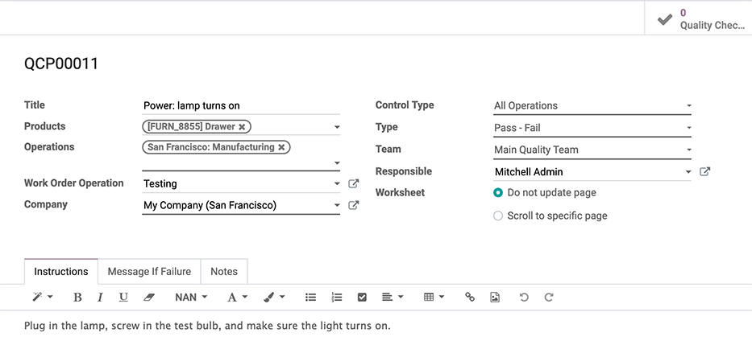
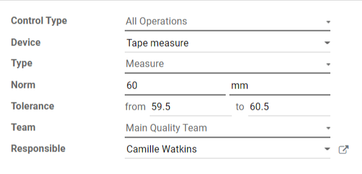

====================
Add quality controls
====================

.. _quality/quality_control_points:

Use **Odoo Quality** to control the quality of products before they are registered into stock,
during picking operations, and when leaving the warehouse for a delivery order. By creating
*quality control points*, manufacturers can set up quality checks that automatically trigger at
specific points during production.

Configure quality control points
================================

To create a new quality control point, go to :menuselection:`Quality Control --> Control Points -->
Create`. Then, fill in the following form fields, accordingly:

- :guilabel:`Title`: give the quality control point a simple, but informative title so production
  floor and quality check teams can understand it easily
- :guilabel:`Products`: indicate which product(s) should pass through the specific quality control
  point
- :guilabel:`Operations`: determine which operations team(s) should perform the quality control
  check (e.g., `Manufacturing`, `Receipts`, `Delivery Orders`, etc.)
- :guilabel:`Work Order Operation`: for manufacturing operations, use the drop-down menu to
  indicate which type of work order the quality control point applies to: :guilabel:`Manual
  Assembly`, :guilabel:`Packing`, :guilabel:`Assembly`, :guilabel:`Testing` or :guilabel:`Long time
  assembly`
- :guilabel:`Company`: add the company that will implement the quality control point. Usually this
  will be the company that owns the Odoo database. However, a multi-company or vendor profile can
  be selected, as well, for cases where there are multiple manufacturing or engineering locations
- :guilabel:`Control Type`: using the drop-down menu, choose from :guilabel:`All Operations`,
  :guilabel:`Randomly` or :guilabel:`Periodically` to determine how often the control point should
  executed
- :guilabel:`Type`: using the drop-down menu, choose the control point type:
  :guilabel:`Instructions`, :guilabel:`Take a Picture`, :guilabel:`Pass - Fail`, or
  :guilabel:`Measure`
- :guilabel:`Team`: decide which quality team should receive the results of the quality control
  point check
- :guilabel:`Responsible`: add a point person to manage the status and evolution of the quality
  control point over time

The tabs at the bottom of the form can be used to provide additional information to quality teams:

- :guilabel:`Instructions`: describe the quality check to be performed
- :guilabel:`Message If Failure`: detail what should be done if the check fails
- :guilabel:`Notes`: use to include any additional information

Once a control point has been configured, a quality check will be automatically created and
assigned when the specified operation or work order has been reached. Quality checks can be managed
by selecting :menuselection:`Quality Control --> Quality Checks`.

.. tip::
   To see all of the quality checks created by a control point, go to :menuselection:`Quality
   Control --> Control Points`, select a control point, and click :guilabel:`Quality Checks` in the
   top right corner.

Use case: configure a measure quality check
===========================================

To ensure that a product meets specific measurement requirements, select :guilabel:`Measure` from
the :guilabel:`Type` drop-down menu. Selecting the :guilabel:`Measure` quality check type reveals
three new fields: :guilabel:`Device`, :guilabel:`Norm`, and :guilabel:`Tolerance`. These fields can
be configured so that only products within a certain tolerance will pass the check:

- :guilabel:`Device`: select the measuring device that should be used to take the measurement
  (e.g., measuring tape).
- :guilabel:`Norm`: specify the desired measurement that the product should conform to and the unit
  of measurement that should be used
- :guilabel:`Tolerance`: select the range that a measurement can be within while still passing the
  check (e.g., :guilabel:`from` 59.5 mm :guilabel:`to` 60.5 mm)

When the quality control points form is complete, click :guilabel:`Save`. Now, this
measurement-based test will trigger for products that were specified on the form.

When production of the specified product reaches the operation that requires a measure quality
check, the manufacturing employee responsible will be prompted to record and validate the measured
value in the tablet view. For products that measure within the values indicated in the
:guilabel:`Tolerance` fields, the test will pass. However, for products that measure outside of
those values, the test will fail. In that case, the worker who performed the check would create a
quality alert from the tablet view. That quality alert can then be addressed by the quality
management team.
