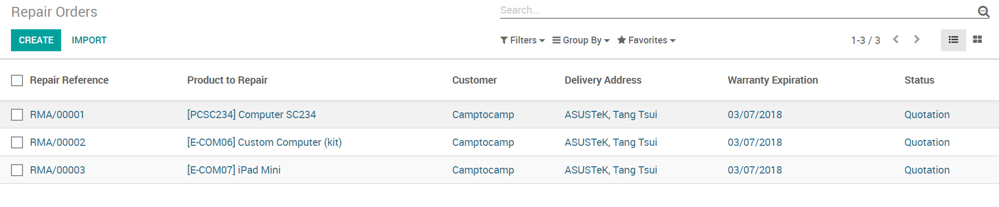
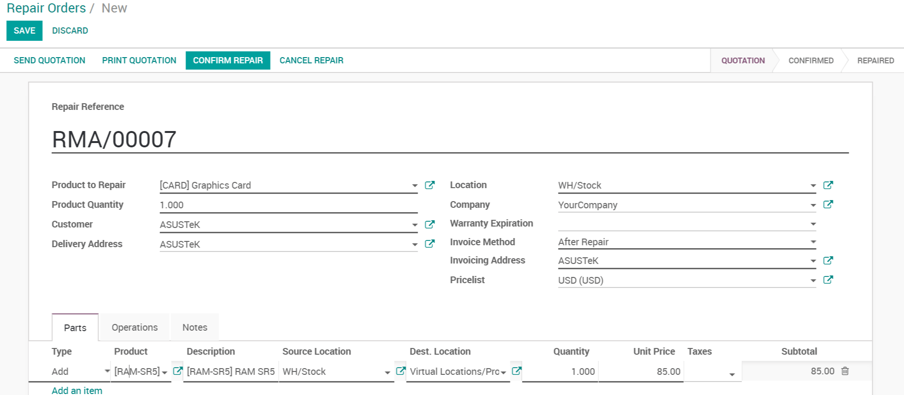
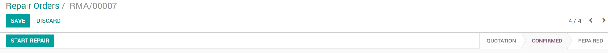
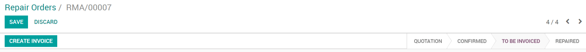

===============
Repair products
===============

The Odoo *Repair* app allows you to manage a complete after sales
process but also to simply repair products you have manufactured, if
they present a defect.

Create a Repair Order
=====================

Once in the app, you can access your existing *Repair Orders* and
create a new one.

Manage a repair
---------------

When a customer sends you a product for repair, create a new *Repair
Order*. Fill it in with all the information you may need such as the
product, the customer, if it has to be invoiced after or before the
repair, the parts you might need, etc.

Once everything is done, you can then send the repair quotation to your
customer. If it is approved, you can confirm the repair. You will then
be able to start & end the repair when it is completed.

You can now invoice the repair.

