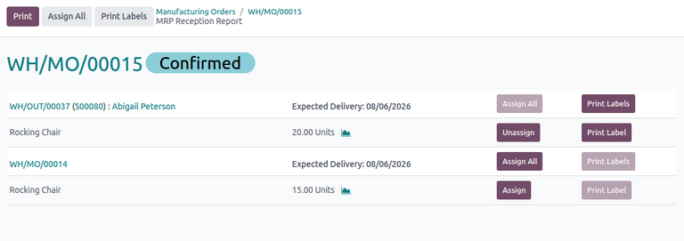
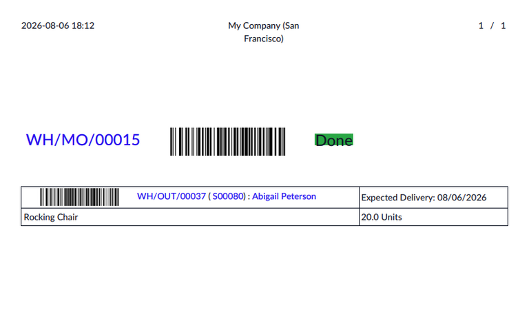
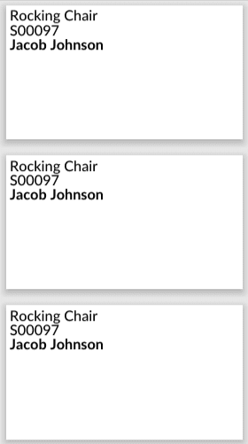

==================
Allocation reports
==================

.. |SO| replace:: :abbr:`SO (sales order)`
.. |SOs| replace:: :abbr:`SOs (sales orders)`
.. |MO| replace:: :abbr:`MO (manufacturing order)`
.. |MOs| replace:: :abbr:`MOs (manufacturing orders)`
.. |RfQ| replace:: :abbr:`RfQ (request for quotation)`

In Odoo **Manufacturing**, users can use allocation reports to reserve units of manufactured
products from manufacturing orders (MOs) for outgoing demands, such as sales orders (SOs) or
components on other |MOs|.

While Odoo normally automatically reserves existing stock for outgoing demands, users may sometimes
need to manually prioritize specific outgoing orders over competing demands, especially when
existing stock for a product does not adequately fulfill those demands.

The following documentation covers the process of using an allocation report to manually assign
planned units of a product from a confirmed |MO| to fulfill either an |SO| containing the purchased
product or an |MO| with the product as a component.

.. _manufacturing/allocation_report/configuration:

Configuration
=============

To use allocation reports, the *Allocation Report for Manufacturing Orders* feature **must** be
enabled. To do so, navigate to :menuselection:`Manufacturing app --> Configuration --> Settings`,
and select the checkbox next to :guilabel:`Allocation Report for Manufacturing Orders`. Then, click
:guilabel:`Save`.

Enabling this feature automatically displays the option to view an allocation report on a confirmed
|MO|.

.. _manufacturing/allocation_report/workflow:

Workflow
========

To use allocation reports, users must first confirm customer demand from existing |SOs| or component
demand from existing |MOs|, then replenish the necessary stock through an |MO|. After confirming
this replenishment order, users can access the allocation report and reserve units from the |MO| to
fulfill those demands.

.. important::
   |SOs|/|MOs| with products that can be fulfilled with existing on-hand stock do **not** appear in
   reception reports.

The following process outlines the necessary steps for allocating units of a manufactured product
using allocation reports:

#. Verify that demand exists for the product in one or more originating |SOs|/|MOs|. If not,
   :ref:`create them <manufacturing/allocation_report/workflow/confirm-demand>`.
#. If existing stock cannot fulfill the demand, :ref:`create and confirm an MO
   <manufacturing/allocation_report/workflow/confirm-mo>` for the demand products.
#. Open the confirmed |MO| and :ref:`use the allocation report
   <manufacturing/allocation_report/workflow/report>` to allocate units.
#. :ref:`Validate the replenished units
   <manufacturing/allocation_report/workflow/validate-replenishment>` into stock.
#. :ref:`Validate the outgoing units <manufacturing/allocation_report/workflow/validate-outgoing>`
   to fulfill the original demand.

The process begins by ensuring that an outstanding demand for the product exists. Confirming an |MO|
manufactures the stock necessary to meet the demand in the originating |SO|/|MO|.

On the confirmed |MO|, users can open the allocation report, which displays the incoming product.
Next to the product is a list of all applicable outgoing transfers (i.e., originating |SOs|/|MOs|
containing the product) to which the manufactured units can be assigned. Assigning these units does
not move any inventory but instead allows the user to flexibly choose which demands to prioritize
before fulfilling them.

.. note::
   If multiple products are manufactured through the |MO|, the allocation report lists all products
   with originating |SOs|/|MOs| available for reservation.

.. _manufacturing/allocation_report/workflow/confirm-demand:

Create and confirm demand
-------------------------

Manufactured stock can only be reserved through an allocation report for previously confirmed |SOs|
or |MOs| where the product is used as a component. If no such record exists, create it.

.. important::
   To ensure that Odoo can properly create allocations, verify that the product has the
   :guilabel:`Track Inventory` option enabled on the product form as well as a :doc:`bill of
   materials <../basic_setup/bill_configuration>` configured.

Create |SOs|
~~~~~~~~~~~~

If no confirmed |SO| exists for the product, :doc:`create it
<../../../sales/sales/sales_quotations/create_quotations>` by opening a new sales quotation form. In
the order lines, ensure that the requested :guilabel:`Product` and its :guilabel:`Quantity` are
specified. Then, confirm the quotation by clicking :guilabel:`Confirm Order`. This turns the
quotation into a confirmed |SO| and generates a delivery order, accessible via the :icon:`fa-truck`
:guilabel:`Delivery` smart button.

Repeat this process if there are multiple customers demanding the product.

Create |MOs|
~~~~~~~~~~~~

If there is no confirmed |MO| with the product as a component, create it by opening a new |MO| form.
In the component lines, add the requested :guilabel:`Product` and the quantity :guilabel:`To
Consume`, then confirm the |MO| by clicking :guilabel:`Confirm`.

Repeat this process if there are multiple |MOs| requiring the component.

.. _manufacturing/allocation_report/workflow/confirm-mo:

Create and confirm |MO|
-----------------------

After confirming existing demand for the product, replenish the necessary stock by manufacturing it
through an |MO|.

To do so, navigate to :menuselection:`Manufacturing app --> Operations --> Manufacturing Orders`.
Then, click :guilabel:`New` to open a new |MO| form. Select the :guilabel:`Product`, the
:guilabel:`Quantity` to replenish, and the :guilabel:`Bill of Materials`.

Finally, :guilabel:`Confirm` the |MO|.

.. _manufacturing/allocation_report/workflow/report:

Allocate using the report
-------------------------

After confirming the |MO| for the product, open the allocation report to assign the replenishment to
any available originating |SOs|/|MOs| requiring the product.

The :icon:`fa-list` :guilabel:`Allocation` smart button appears directly at the top of the |MO|.

.. note::
   The :icon:`fa-list` :guilabel:`Allocation` smart button also appears on an unconfirmed |MO|.
   However, units cannot be assigned unless the |MO| is confirmed.

.. _manufacturing/allocation_report/workflow/report/dashboard:

Allocation report dashboard
~~~~~~~~~~~~~~~~~~~~~~~~~~~

The *MRP Reception Report* page displays a list of products to which the units on this |MO| can be
allocated, grouped by the |SOs|/|MOs| on which they appear. A link to each |SO|/|MO| is included,
along with its :guilabel:`Expected Delivery`, and an option to assign all units to it. Under each
|SO|/|MO| header is a list of its products, including its name, quantity, and the option to assign
the quantity of units to this specific product.

.. note::
   |SOs|/|MOs| in the allocation report are listed in chronological order of their associated
   delivery or scheduled date (i.e., the |SO| with the oldest delivery order or the |MO| with the
   oldest scheduled date appears first).

.. _manufacturing/allocation_report/workflow/report/allocate:

Allocate units
~~~~~~~~~~~~~~

To allocate units for a product in an |SO|/|MO|, click :guilabel:`Assign` in the product's
corresponding row. To undo allocation, click :guilabel:`Unassign`.

Alternatively, to allocate all available units for all products in an |SO|/|MO|, click
:guilabel:`Assign All` in the corresponding row of the |SO|/|MO|. To assign all available units
across all |SOs|/|MOs|, click :guilabel:`Assign All` at the top.

The quantity of reservable units for each product is automatically calculated in order, starting
from the oldest |SO|/|MO|. This allows users to allocate as many units as available on the |MO| to
fulfill the quantity specified on the |SO|/|MO|.

After allocation, originating |SOs| with allocated units are automatically linked to the
replenishing |MO|. Users can access this directly from the |SO| via the :icon:`fa-wrench`
:guilabel:`Manufacturing` smart button. Similarly, the linked |SO| can also be accessed from the
|MO| via the :icon:`fa-dollar` :guilabel:`Sale` smart button.

.. _manufacturing/allocation_report/workflow/validate-replenishment:

Validate replenished units
--------------------------

After allocating the desired units, navigate to the replenishing |MO| and click :guilabel:`Produce
All` to produce the finished product.

Finished products from completed |MOs| become directly available in stock in the case of
:doc:`one-step <../basic_setup/one_step_manufacturing>` or :doc:`two-step
<../basic_setup/two_step_manufacturing>` manufacturing. For :doc:`three-step
<../basic_setup/three_step_manufacturing>` manufacturing, however, additional transfer moves must be
made to transfer the product from the manufacturing location to inventory.

To validate the incoming transfer on the |MO|, click the :icon:`fa-truck` :guilabel:`Transfers`
smart button at the top. Then, open the relevant order and click :guilabel:`Validate` to receive the
product into stock.

.. _manufacturing/allocation_report/workflow/validate-outgoing:

Validate outgoing move
----------------------

After validating the incoming stock (if applicable), fulfill the original |SO|/|MO| demand.

Fulfill |SO| order
~~~~~~~~~~~~~~~~~~

To fulfill the demand on an |SO|, navigate to the |SO|, then click :icon:`fa-truck`
:guilabel:`Delivery` to open the delivery order. Note that the *Operations* tab is populated with a
line showing the allocated :guilabel:`Product` and its allocated :guilabel:`Quantity`.

Finally, click :guilabel:`Validate` to confirm that the products have been delivered to the
customer.

Fulfill |MO| order
~~~~~~~~~~~~~~~~~~

To fulfill a component demand on an |MO|, navigate to the |MO|. The replenished components in the
previous step are now marked as :guilabel:`Available` for production on this |MO|. Click
:guilabel:`Produce` to manufacture the final product.

.. example::
   The following example demonstrates how an allocation report is used to assign stock for a
   customer |SO| of higher priority.

   Two |SOs| are created for separate customers. Customer A orders 75 units of a *Chair*. Customer B
   also orders 75 units of the same product but needs them as soon as possible.

   No stock exists for the *Chair*, so the company creates and confirms |MO| A to manufacture the
   product. Only 100 units of the *Chair* can be produced this week. So, another |MO| B is created
   to replenish the remaining 50 units next week.

   After confirming the |MOs|, the company uses the allocation reports for each |MO|. |MO| A's
   report lists the |SO| for Customer A with 75 reservable units, then Customer B's |SO| with 25
   reservable units. |MO| B's report lists the |SO| for Customer A with 50 reservable units.

   Because the company wants to prioritize Customer B's order, they want to ensure Customer B
   receives 75 units from |MO| A, which can guarantee faster delivery. To do so, they first open
   |MO| B's allocation report and assign 50 units to Customer A's |SO|. Odoo then recalculates |MO|
   A's allocation report, updating Customer A's previous quantity of 75 units to 25 units and
   Customer B's quantity to 75 units.

   The user can now assign all 75 units from |MO| A to fulfill Customer B's delivery.

.. _manufacturing/allocation_report/print-labels:

Print labels
============

Users can print labels for allocated products to ensure that they are correctly designated to the
appropriate customer.

After allocating the desired units, click :guilabel:`Print` at the top to download a PDF of the
allocation report for the allocated units. The report includes a scannable barcode at the top for
the receipt or |MO|.

If products are allocated to specific orders, users can also click :guilabel:`Print Labels` to print
an individual label for each unit of the allocated products. Each label displays the name of the
product, its associated |SO|/|MO| number, and its customer (for |SOs|).

