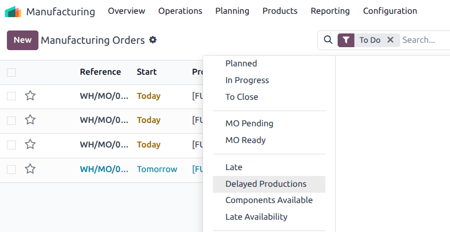
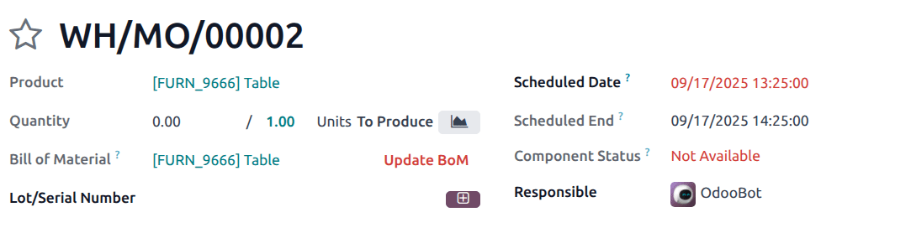

======
Delays
======

.. |SO| replace:: :abbr:`SO (sales order)`
.. |SOs| replace:: :abbr:`SOs (sales orders)`
.. |MO| replace:: :abbr:`MO (manufacturing order)`
.. |MOs| replace:: :abbr:`MOs (manufacturing orders)`
.. |RfQ| replace:: :abbr:`RfQ (request for quotation)`

Odoo's *Manufacturing* app displays *delays* in manufacturing orders through the :guilabel:`Delayed
Productions` filter. If the |MO|'s end date exceeds its deadline, the deadline is highlighted in red
to draw attention to the delay.

Deadline calculation
====================

The |MO| deadline depends on how the |MO| was created, and is calculated as follows:

- **Make To Order**: the |MO| deadline is the *Sales Order Delivery Date*.
- **Replenishment**: the |MO| deadline is *today + Manufacturing Lead Time*.
- **Manually created MO**: the deadline field remains empty.

.. important::
   The |MO| *deadline* is not the same as the |MO| *end date*.

   The end date is computed as:

   .. math::
      \text{End date} =
       \text{Scheduled start date}
       +\text{Total duration of all operations}

Filters
=======

Several additional filters are available to help track delays:

- :guilabel:`Delayed Productions`: the |MO|'s *scheduled start date* is later than the deadline.
- :guilabel:`Late`: the |MO|'s *scheduled end date* exceeds the deadline, highlighted in red.
- :guilabel:`Late Availability`: one or more required components are not available before the
  deadline. For example, a confirmed purchase order or manufacturing order for components is
  scheduled to end *after* the |MO| deadline.
- :guilabel:`Components Available`: all components are available to begin production.

Use case
========

Consider an |MO| with a deadline of **September 17th**:

- If production on the |MO| starts after September 17th, it appears in the :guilabel:`Delayed
  Productions` filter.
- If required components are scheduled to arrive after September 17th, the |MO| appears in the
  :guilabel:`Late Availability` filter.
- If the |MO| has a scheduled end date after September 17th, it appears in the :guilabel:`Late`
  filter.

By combining these indicators, planners can quickly identify where production is at risk of missing
delivery commitments.
