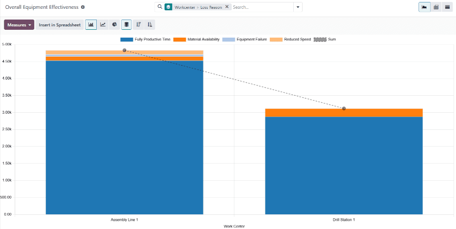

===============================
Overall equipment effectiveness
===============================

.. |MO| replace:: :abbr:`MO (manufacturing order)`
.. |OEE| replace:: :abbr:`OEE (overall equipment effectiveness)`
.. |BoM| replace:: :abbr:`BoM (Bill of Materials)`

In Odoo's *Manufacturing* app, *overall equipment effectiveness* (OEE) represents the amount of time
a work center is fully productive. |OEE| is displayed as a percentage of the total time a work
center is active.

Fully productive time is considered to be time when the work center is operational **and**
processing work orders that have not exceeded their *expected duration*.

|OEE| helps manufacturing teams understand the efficiency of work centers, and the causes of
manufacturing downtime.

.. important::
   Since |OEE| tracks work center productivity, using it requires enabling the work centers feature
   in the settings of the Manufacturing app.

   To do so, navigate to :menuselection:`Manufacturing app --> Configuration --> Settings`, and tick
   the checkbox next to :guilabel:`Work Orders`, under the :guilabel:`Operations` heading. Then,
   click :guilabel:`Save`.

Efficiency standards
====================

For |OEE| to accurately reflect the percentage of fully productive time for a work center, the work
center **must** be properly configured with the correct productivity metrics. These include the work
center's *time efficiency*, *capacity*, and *OEE target*.

Time efficiency
---------------

Time efficiency represents the efficiency of a work center when processing work orders, and is
represented as a percentage. A time efficiency value of 100% signifies that the work center
processes work orders at the speed of the expected duration, as listed on a product's |BoM|. A value
less than or greater than 100% signifies that the work center processes work orders slower or faster
than an operation's expected duration, respectively.

To set the time efficiency for a work center, navigate to :menuselection:`Manufacturing app -->
Configuration --> Work Centers`, and select a work center. On the :guilabel:`General Information`
tab, enter a numerical value in the :guilabel:`Time Efficiency` field.

.. example::
   Manufacturing a *chair* product requires two operations: *cut* and *assemble*. The product's
   |BoM| lists an expected duration of 30 minutes for each operation.

   The cut operation is carried out at the *cut station* work center, which has a time efficiency
   value of 50%. This means it takes twice as long to complete the operation, for a total time of
   one hour.

   The assemble operation is carried out at the *assembly line* work center, which has a time
   efficiency value of 200%. This means it takes half as long to complete the operation, for a total
   time of 15 minutes.

Capacity
--------

Capacity represents how many units of a product can be produced in parallel at a work center. The
duration of work orders for multiple units increases or decreases, based on how many units the work
center can handle.

To set the capacity for a work center, navigate to :menuselection:`Manufacturing app -->
Configuration --> Work Centers`, and select a work center. On the :guilabel:`General Information`
tab, enter a numerical value in the :guilabel:`Capacity` field.

.. example::
   A *drill station* work center has a capacity of one unit. An |MO| is confirmed for 10 units of a
   *chair*, a product manufactured using the drill station.

   Since there are ten times as many units to produce than the work center can handle at once, the
   operation time is ten times the duration listed on the product's |BoM|.

|OEE| target
------------

The |OEE| target is the goal for how much of a work center's operating time should be fully
productive time. It is displayed as a percentage, and should only be set as high as `100%`.

To set the |OEE| target for a work center, navigate to :menuselection:`Manufacturing app -->
Configuration --> Settings --> Work Centers`, and select a work center. On the :guilabel:`General
Information` tab, enter a numerical value of `100.00` or less in the :guilabel:`OEE Target` field.

Calculating |OEE|
=================

|OEE| is represented as a percentage value between zero and 100. The value signifies the amount of
time that a work center was fully productive. The remainder signifies the amount of time that the
work center was operating at less than full efficiency. This can occur for a number of reasons,
including *reduced speed*, *material availability*, and *equipment failure*.

Fully productive time
---------------------

For a work center to be considered fully productive, it must be able to receive work orders, have
the components necessary to process work orders, and be operating within the expected duration of
the work order it is processing.

.. example::
   An *assembly line* work center is not blocked, and receives a work order to assemble a *bicycle*.
   The required components are available, so production begins as soon as they are picked and
   delivered to the work center. The work order has an expected duration of 30 minutes, and is
   completed in 27 minutes. All of this time is considered fully productive time.

Reduced speed
-------------

When a work center is operating at reduced speed, it means that it is processing a work order that
has exceeded its expected duration. While the work center may be operational, this is not considered
fully productive time.

.. example::
   A *cutting station* work center receives a work order to cut boards for a *table*. The expected
   duration of the work order is 15 minutes. The work order ends up taking 18 minutes to complete.
   The work center is considered to have been operating at reduced speed during the three minutes
   that exceeded the expected duration.

Material availability
---------------------

Material availability refers to situations where a work center is able to accept a work order, but
the required components are not available. This can occur because the components are not in stock,
or are reserved for a different order.

.. example::
   Manufacturing of a *bench* requires 20 units of *wood*. A manufacturing order (MO) is confirmed
   for 10 units of the bench, but there is not enough wood in stock to begin manufacturing. The time
   it takes to acquire the wood is recorded as material availability downtime.

Equipment failure
-----------------

Equipment failure signifies any period of time when a work center is unusable due to maintenance
issues with its equipment. This can be due to equipment breaking down, or when a work center is shut
down for scheduled maintenance. In these cases, a work center can be blocked using a
:doc:`maintenance request <../../maintenance/maintenance_requests>`.

.. example::
   The drill at a *drill station* work center breaks down, causing the work center to be unusable. A
   maintenance request is created to fix the drill, and the work center is blocked from receiving
   work orders. It takes two hours to fix the drill, and make the work center available again. This
   two-hour period is recorded as equipment failure downtime.

|OEE| reporting
===============

To view |OEE| reporting metrics for every work center, navigate to :menuselection:`Manufacturing app
--> Reporting --> Overall Equipment Effectiveness`. This page shows the metrics for each work center
with |OEE| data.

Alternatively, to see |OEE| reporting metrics for a single work center, navigate to
:menuselection:`Manufacturing app --> Configuration --> Work Centers`, and select a work center. At
the top of the work center's form, click the :icon:`fa-pie-chart` :guilabel:`OEE` smart button.

By default, the main |OEE| reporting page shows data in a bar chart, while the page for a specific
work center shows it in a pie chart. To select a different chart type on either page, click the
:icon:`fa-bar-chart` :guilabel:`(bar chart)`, :icon:`fa-line-chart` :guilabel:`(line chart)`, or
:icon:`fa-pie-chart` :guilabel:`(pie chart)` button above the displayed chart.

It is also possible to see |OEE| data in a pivot view, or a list displaying each time entry, by
clicking the :icon:`oi-view-pivot` :guilabel:`(pivot view)` or :icon:`oi-view-list` :guilabel:`(list
view)` buttons at the top-right corner of the page.

