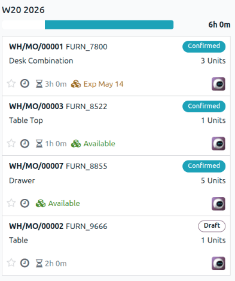

===================
Production overview
===================

Odoo **Manufacturing** can display an overview of manufacturing order production to help monitor
ongoing and future manufacturing orders.

The :icon:`oi-view-kanban` :guilabel:`(Kanban)` view on the *Manufacturing Orders* page functions as
this production overview. Production managers can use it to filter and group manufacturing orders
according to their needs and to monitor the time remaining on each order to ensure production
remains on schedule.

Manufacturing Orders page
=========================

Navigate to :menuselection:`Manufacturing app --> Operations --> Manufacturing Orders`. The
*Manufacturing Orders* page opens.

Views
-----

The *Manufacturing Orders* page can be viewed in different ways:

- :icon:`oi-view-list` :guilabel:`(List)`: View, search, and edit manufacturing orders. This is the
  default view.
- :icon:`oi-view-kanban` :guilabel:`(Kanban)`: Move manufacturing orders across stages or display
  them inside cards.
- :icon:`fa-tasks` :guilabel:`(Gantt)`: Forecast and examine the overall progress of manufacturing
  orders. Manufacturing orders are represented by a bar under a time scale.
- :icon:`fa-calendar` :guilabel:`(Calendar)`: View and manage manufacturing orders inside a
  calendar.

Work in the Kanban view
-----------------------

On the *Manufacturing Orders* page, click the :icon:`oi-view-kanban` :guilabel:`(Kanban)` icon.

.. tip::
   By default, this view is filtered by manufacturing orders in :guilabel:`To Do` status. The
   filters can be changed from the search bar.

Manufacturing orders are displayed in card form. Each grouping of manufacturing orders lists the
expected time remaining to produce all the orders in the stage. A progress bar is visible above each
stage, displaying the percentage breakdown of every status type for all the cards within that stage.
Each status type has an assigned color that appears within the bar.

By default, the cards in each stage are sorted by priority, then scheduled date.

Each card lists the manufacturing order number, the product and amount being manufactured, the
manufacturing order's status, priority, activities, the remaining work order time, component
availability, and the responsible user. If a work order is in progress, the active work center is
visible. If there are child manufacturing orders created from a subassembly in a product's bill of
materials, their statuses display in the card.

By default, this view is grouped by weekly production. The orders can be grouped in several
different ways from the search bar:

- :guilabel:`Product`: Manufacturing orders are grouped by the products being produced.
- :guilabel:`Status`: Manufacturing orders are sorted by status (such as :guilabel:`Confirmed` or
  :guilabel:`Draft`).
- :guilabel:`Material Availability`: Manufacturing orders are grouped by component availability.
  Manufacturing orders with all components available are listed in the :guilabel:`Ready` column, and
  those awaiting component availability are listed in the :guilabel:`Waiting` column.
- :guilabel:`Date`: Group by :guilabel:`Year`, :guilabel:`Quarter`, :guilabel:`Month`,
  :guilabel:`Week`, or :guilabel:`Day`.
- :guilabel:`Deadline`: If deadlines are assigned to the manufacturing orders, they can be grouped
  by :guilabel:`Year`, :guilabel:`Quarter`, :guilabel:`Month`, :guilabel:`Week`, or :guilabel:`Day`.

.. seealso::
   - :doc:`../../../essentials/stages`
   - :doc:`../../../essentials/activities`
   - :doc:`../../../essentials/reporting`
   - :doc:`../../../essentials/search`
   - :doc:`delayed`
   - :doc:`../basic_setup/manufacturing_work_orders`
