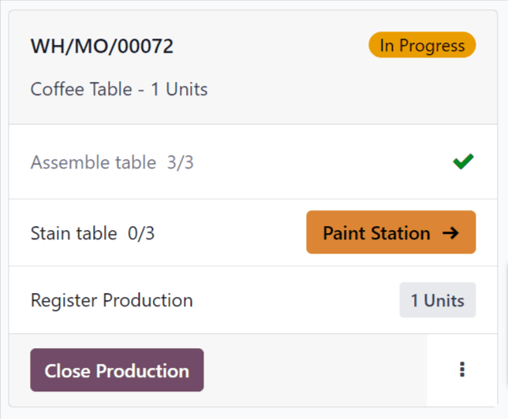
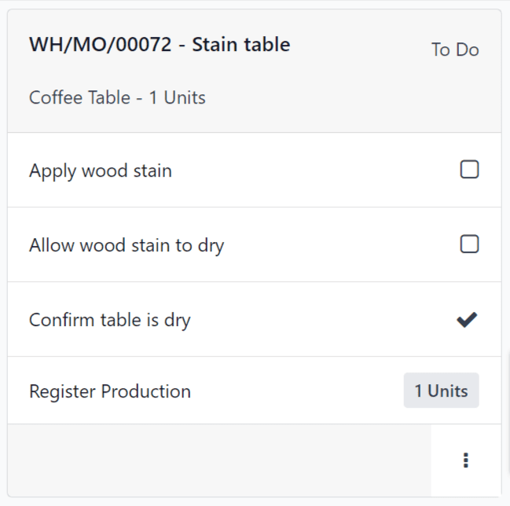
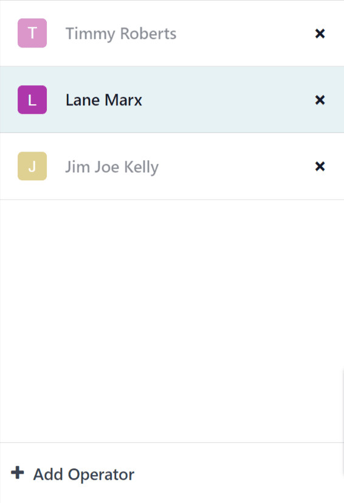

===================
Shop Floor overview
===================

.. _manufacturing/shop_floor/shop_floor_overview:
.. |MO| replace:: :abbr:`MO (Manufacturing Order)`
.. |MOs| replace:: :abbr:`MOs (Manufacturing Orders)`

The *Shop Floor* module is a companion module to the *Manufacturing* app. *Shop Floor* provides a
visual interface for processing manufacturing orders (MOs) and work orders. It also allows
manufacturing employees to track the amount of time spent working on manufacturing and work orders.

The *Shop Floor* module is installed alongside the *Manufacturing* app. It cannot be installed by
itself. To install the *Manufacturing* app, navigate to :menuselection:`Apps`, search for
`manufacturing` in the :guilabel:`Search...` bar, and then click :guilabel:`Install` on the
:guilabel:`Manufacturing` app card.

.. important::
   The *Shop Floor* module replaces the tablet view functionality of the *Manufacturing* app, and is
   only available in Odoo versions 16.4 and later.

   To check the version number of an Odoo database, navigate to :menuselection:`Settings` and scroll
   down to the :guilabel:`About` section at the bottom of the page. The version number is displayed
   there.

   To switch to a newer version of Odoo, see the documentation on :ref:`upgrading a database
   <administration/upgrade>`.

Navigation
==========

*Shop Floor* is broken down into three main views, which can be selected from the navigation bar at
the top of the module:

- The :guilabel:`All` page serves as the main dashboard for the module, and displays information
  cards for |MOs|.
- Each work center also has a dedicated page, which shows information cards for work orders assigned
  to that work center. Work center pages can be toggled on or off by clicking the :guilabel:`+
  (plus)` button in the navigation bar, selecting or deselecting them on the pop-up window that
  appears, and then clicking :guilabel:`Confirm`.
- The :guilabel:`My` page shows information cards for all work orders assigned to the employee whose
  profile is currently active in the operator panel on the left side of the module. Other than only
  showing work orders assigned to the active employee, this page functions the same as the pages for
  each work center.

.. tip::
   To isolate an |MO| or work order, so that no other orders appear, simply search the reference
   number of the |MO| in the :guilabel:`Search...` bar at the top of the module. This search filter
   remains active while switching between the different module views.

On the left side of the module is the operator panel, which shows all of the employees currently
signed in to *Shop Floor*, and allows new employees to sign in. The operator panel is always
available in the module, regardless of which view is selected. It can be toggled on or off by
clicking the :guilabel:`sidebar` button at the extreme left of the navigation bar.

.. image:: shop_floor_overview/sidebar-button.png
   :align: center
   :alt: The "sidebar" button, which is used to toggle the operator panel on or off.

All page
--------

By default, the :guilabel:`All` page shows an information card for every |MO| that is *ready to
start*. An |MO| is considered ready to start once it has been confirmed, and all required components
are available.

To view every confirmed |MO| regardless of readiness, click the :guilabel:`x` button on the
:guilabel:`Ready to Start` filter to remove it from the :guilabel:`Search...` bar.

MO information card
~~~~~~~~~~~~~~~~~~~

An |MO| information card on the :guilabel:`All` page shows all of the relevant details of the
associated |MO|, and also provides employees with options for processing the |MO|.

The header for an |MO| card shows the |MO| number, the product and number of units being produced,
and the status of the |MO|. If work has not yet begun on the |MO|, the status appears as
:guilabel:`Confirmed`. Once work has begun, the status updates to :guilabel:`In Progress`. If all
work orders for an |MO| have been completed and the |MO| is ready to close, the status updates to
:guilabel:`To Close`.

The main body of an |MO| card shows a line for each completed work order, if any, followed by the
current work order that needs to be completed. Completed work orders are indicated by a green check
mark to the right of title of the work order. The current work order is indicated by a button that
opens the page for the work center to which the order is assigned.

Below the current work order is a line titled :guilabel:`Register Production`, which is used to
record the number of product units produced. To manually enter the number of units produced, click
on the :guilabel:`Register Production` line, enter a value in the :guilabel:`Units` field of the
resulting pop-up window, then click :guilabel:`Validate`.

Alternatively, click the :guilabel:`# Units` button on the right side of the line, which
automatically records the number of units the |MO| was created for as the number of units produced.
For example, if an |MO| is created for 10 units of a dining table, clicking the :guilabel:`10 units`
button records that 10 units were produced.

The footer of the |MO| card displays a :guilabel:`Close Production` button. This is used to close
the |MO| once production is completed. However, if there are any quality checks required for the
|MO| as a whole (not the work orders within it), a :guilabel:`Quality Checks` button appears
instead. Clicking :guilabel:`Quality Checks` opens a pop-up window, from which any required quality
checks can be completed.

After clicking :guilabel:`Close Production`, the |MO| card begins to fade away, and an
:guilabel:`Undo` button appears on the footer. Clicking :guilabel:`Undo` causes the |MO| to remain
open. Once the |MO| card disappears completely, the work order is closed.

On the right side of the footer is an :guilabel:`⋮ (options)` button, which opens a pop-up window
with additional options for the |MO|:

- :guilabel:`Scrap` is used to send components to a scrap location when they are found to be
  defective.
- :guilabel:`Add Work Order` is used to add an additional work order to the |MO|.
- :guilabel:`Add Component` is used to add an additional component to the |MO|.
- :guilabel:`Open Backend MO` opens the |MO| in the Manufacturing app.

Work center pages
-----------------

By default, the page for each work center shows an information card for every work order assigned to
it that is *ready to start*. A work order is considered ready to start once the |MO| it is a part of
is ready to start, and any preceding work orders have been completed.

To view every confirmed work order assigned to a work center regardless of readiness, click the
:guilabel:`x` button on the :guilabel:`Ready to Start` filter to remove it from the
:guilabel:`Search...` bar.

Work order information card
~~~~~~~~~~~~~~~~~~~~~~~~~~~

A work order information card on a work center's page shows all of the relevant details of the
associated work order, and also provides employees with options for processing the work order.

The header for a work order card shows the reference number of the |MO| that the work order is a
part of, the product and number of units being produced, and the status of the work order. If work
has not yet begun on the work order, the status appears as :guilabel:`To Do`. Once work has begun,
the status updates to display a timer showing the total time the work order has been worked on.

The main body of a work order card shows a line for each step required to complete the work order.
Work order steps can be completed by clicking on the line, then following the instructions on the
pop-up window that appears. Alternatively, clicking the checkbox on the right side of each line
automatically marks the step as completed.

Below the final step of the work order is a line titled :guilabel:`Register Production`, which
functions the same as the :guilabel:`Register Production` line on an |MO| card. Registering the
number of units produced using the :guilabel:`Register Production` line on a work order card also
completes the step for the associated |MO| card.

If the work order being processed is the final work order for the |MO|, a :guilabel:`Close
Production` button appears on the footer of the work order card. Clicking :guilabel:`Close
Production` closes both the work order and the |MO|, unless a quality check is required for the
|MO|. In this case, the quality check must be completed from the |MO| card before the |MO| can be
closed.

Alternatively, if the |MO| requires the completion of additional work orders, a :guilabel:`Mark as
Done` button appears instead. Clicking :guilabel:`Mark as Done` marks the current work order as
completed, and causes the next work order to appear on the page for the work center it is assigned
to.

After clicking :guilabel:`Close Production` or :guilabel:`Mark as Done`, the work order card begins
to fade away, and an :guilabel:`Undo` button appears on the footer. Clicking :guilabel:`Undo` causes
the work order to remain open. Once the work order card disappears completely, the work order is
marked as :guilabel:`Finished` on the |MO|.

On the right side of the footer is an :guilabel:`⋮ (options)` button, which opens a pop-up window
with additional options for the work order:

- :guilabel:`Scrap` is used to send components to a scrap location when they are found to be
  defective.
- :guilabel:`Add Component` is used to add an additional component to the |MO|.
- :guilabel:`Move to work center` is used to transfer the work order to a different work center.
- :guilabel:`Suggest a Worksheet improvement` allows the user to propose a change to the work
  order's instructions or steps.
- :guilabel:`Create a Quality Alert` opens a quality alert form that can be filled out to alert a
  quality team about a potential issue.

Operator panel
--------------

The operator panel is used to manage the employees that are signed in to the *Shop Floor* module.
The panel shows the name and profile picture of every employee that is currently signed in across
all instances of the database.

To interact with *Shop Floor* as a specific employee, click the employee's name to activate their
profile. Profiles that are not active appear with their names and profile pictures greyed-out.

When an employee is selected in the operator panel, they can begin working on a work order by
clicking the work order's heading. If an employee is working on one or more work orders, the work
order title(s) appear under their name, along with a timer showing how long they've been working on
each order.

To add a new employee to the operator panel, click the :guilabel:`+ Add Operator` button at the
bottom of the panel. Then, select an employee from the :guilabel:`Select Employee` pop-up window.

To remove an employee from the operator panel, simply click the :guilabel:`x` button next to their
name in the panel.

