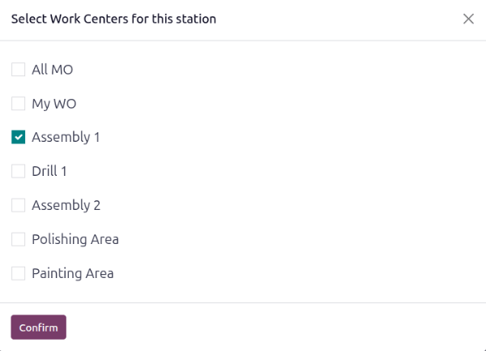
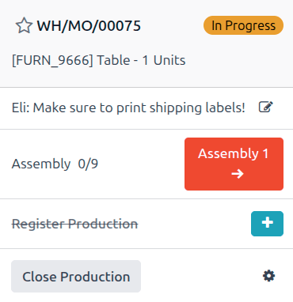
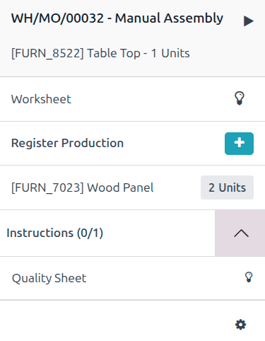
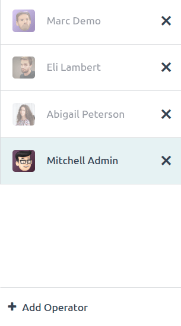
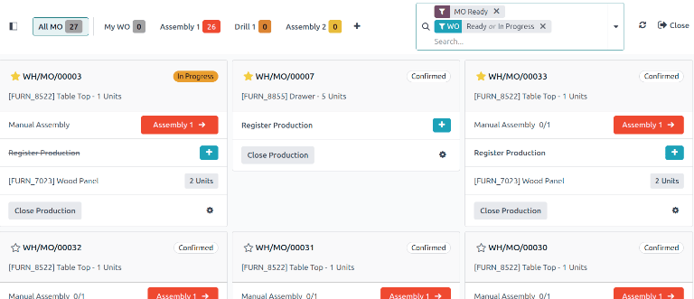

===================
Shop Floor overview
===================

.. _manufacturing/shop_floor/shop_floor_overview:
.. |MO| replace:: :abbr:`MO (Manufacturing Order)`
.. |MOs| replace:: :abbr:`MOs (Manufacturing Orders)`

The *Shop Floor* module is a companion module to the *Manufacturing* app. *Shop Floor* provides a
visual interface for processing manufacturing orders (MOs) and work orders. It also allows
manufacturing employees to track the amount of time spent working on manufacturing and work orders.

The *Shop Floor* module is :ref:`installed <general/install>` alongside the *Manufacturing* app.

Opening Shop Floor
==================

*Shop Floor* can be opened in the following ways:

- Click the :guilabel:`Shop Floor` module icon from the main Odoo dashboard.
- Click the :icon:`oi-view-kanban` :guilabel:`Shop Floor` smart button on a manufacturing order.
  This will open the manufacturing order in the *Shop Floor* module.

Selecting work centers
======================

When *Shop Floor* is opened on a workstation, it is possible to select work centers to assign to it.

Open the *Shop Floor* app from either the main Odoo dashboard or from the :icon:`oi-view-kanban`
:guilabel:`Shop Floor` smart button on a manufacturing order.

If it is the workstation's first time opening *Shop Floor*, a window may open to allow a user to
select work centers. If the window does not open, click the :icon:`fa-plus` :guilabel:`(Add)` icon
next to the list of work centers.

Select the work centers to assign to the workstation, then click :guilabel:`Confirm`.

Installing Shop Floor on a workstation
======================================

*Shop Floor* can be installed in the Chrome browser of a workstation to limit its access to other
Odoo applications.

First, open the *Shop Floor* app from either the main Odoo dashboard or from the
:icon:`oi-view-kanban` :guilabel:`Shop Floor` smart button on a manufacturing order.

On the *Shop Floor* overview, a pop-up window to select work centers for the workstation may open.
If it does not open, click the :icon:`fa-plus` :guilabel:`(Add)` icon next to the list of work
centers.

Click the :guilabel:`Install App` button. A new window will open. In this window, click the
:guilabel:`Install` button to install the app in the workstation's browser.

Navigation
==========

*Shop Floor* is broken down into three main views, which can be selected from the navigation bar at
the top of the module:

- The :guilabel:`All MO` page serves as the module's main dashboard and displays information cards
  for |MOs|.
- Each work center also has a dedicated page that displays information cards for the work orders
  assigned to it. Work center pages can be toggled on or off by clicking the :icon:`fa-plus`
  :guilabel:`(plus)` icon in the navigation bar, selecting or deselecting them on the pop-up window
  that appears, and then clicking :guilabel:`Confirm`.
- The :guilabel:`My WO` page shows information cards for all work orders assigned to the employee
  whose profile is currently active in the operator panel on the left side of the module. This page
  functions largely the same as the pages for each work center, but it only shows work orders
  assigned to the active employee.

.. tip::
   To isolate an |MO| or work order so that no other orders appear, search the reference number of
   the |MO| in the :guilabel:`Search` bar at the top of the module. This search filter remains
   active when switching between the different module views.

On the left side of the module is the operator panel, which shows all of the employees currently
signed in to *Shop Floor* and allows new employees to sign in. The operator panel is always
available in the module, regardless of the selected view. It can be toggled on or off by clicking
the :icon:`oi-panel-right` :guilabel:`(sidebar)` button in the navigation bar.

All MO page
-----------

By default, the *All MO* page shows an information card for every |MO| that is *ready to start*. An
|MO| is considered ready to start once it has been confirmed, and all required components are
available.

To view every confirmed |MO| regardless of readiness, click the :icon:`oi-close`
:guilabel:`(close)` icon on the :guilabel:`MO Ready` filter to remove it from the :guilabel:`Search`
bar.

MO information card
~~~~~~~~~~~~~~~~~~~

An |MO| information card on the :guilabel:`All MO` page displays all the relevant details of the
associated |MO|, and also provides employees with options for processing the |MO|.

The header for an |MO| card shows the |MO| number, the product and number of units being produced,
and the |MO| status. If work on the MO has not yet begun, the status appears as
:guilabel:`Confirmed`. Once work has begun, the status updates to :guilabel:`In Progress`. If all
work orders for an |MO| have been completed and the |MO| is ready to close, the status updates to
:guilabel:`To Close`.

The main body of an |MO| card shows a line for each completed work order, if any, followed by the
current work order to be completed. Completed work orders appear in grey and are struck out. The
current work order is indicated by a button that opens the page for the work center to which the
order is assigned.

Below the current work order is a line titled :guilabel:`Register Production`, which records lot or
serial numbers for the units produced. Click the :guilabel:`Register Production` line to specify a
lot or serial number for the produced units, then click :guilabel:`Validate`.

To register the quantity of products being produced, click the :guilabel:`# Units` button on the
right side of the line, which automatically records the number of units the |MO| was created for as
the number of units produced. For example, if an |MO| is created for 10 units of a dining table,
clicking the :guilabel:`10 units` button records that 10 units were produced.

The footer of the |MO| card displays a :guilabel:`Close Production` button. This is used to close
the |MO| once production is completed. However, if any quality checks are required for the |MO| as a
whole (not the work orders within it), a :guilabel:`Quality Checks` button appears instead. Clicking
:guilabel:`Quality Checks` opens a pop-up window where any required quality checks can be completed.

After clicking :guilabel:`Close Production`, the |MO| card begins to fade, and an :guilabel:`Undo`
button appears in the footer. Clicking :guilabel:`Undo` keeps the |MO| open. When the |MO| card
disappears completely, the work order is closed.

On the right side of the footer is a :icon:`fa-gear` :guilabel:`(gear)` button, which opens a pop-up
window with additional options for the |MO|:

- :guilabel:`Scrap`: Send components to a scrap location when they are found to be defective.
- :guilabel:`Add Work Order`: Add an additional work order to the |MO|.
- :guilabel:`Add Component`: Add an additional component to the |MO|.

  .. note::
   Additional components are consumed in the *Shop Floor* module, but their stock moves will not be
   validated until the |MO| is closed.

- :guilabel:`Open Manufacturing Order`: opens the |MO| in the *Manufacturing* app
- :guilabel:`Log Note`: Enter a note that will be visible on the backend and throughout all steps on
  the shop floor.

Work center pages
-----------------

By default, the page for each work center shows an information card for every work order assigned to
it that is *ready to start*. A work order is considered ready to start once the |MO| it is a part of
is ready to start, and any preceding work orders have been completed.

To view every confirmed work order assigned to a work center regardless of readiness, click the
:icon:`oi-close` :guilabel:`(remove)` icon on the :guilabel:`MO Ready` filter to remove it from the
:guilabel:`Search` bar.

Work order information card
~~~~~~~~~~~~~~~~~~~~~~~~~~~

The work order information cards on a work center's page show all of the relevant details of the
associated work order, and also provide employees with options for processing the work order.

The header for a work order card shows the reference number of the |MO| that the work order is a
part of, the product and number of units being produced. When work has begun, the status updates to
display a timer showing the total time the work order has been worked on. The instructions for each
work order open automatically when the timer starts.

The main body of a work order card shows a line for each step required to complete the work order.
Work order steps can be completed by clicking on the line, then following the instructions on the
pop-up window that appears.

Below the final step of the work order is a line titled :guilabel:`Register Production`, which
functions the same as the :guilabel:`Register Production` line on an |MO| card. Registering the
number of units produced using the :guilabel:`Register Production` line on a work order card also
completes the step for the associated |MO| card.

If there are instructions for a work order, the operator can expand the :guilabel:`Instructions`
header in the work order. To complete a step, click the instruction line and follow the instructions
in the pop-up window. The instructions that follow an individual instruction will automatically
open.

If the work order being processed is the final work order for the |MO|, a :guilabel:`Close
Production` button appears on the footer of the work order card. Clicking :guilabel:`Close
Production` closes both the work order and the |MO|, unless a quality check is required for the
|MO|. In this case, the quality check must be completed from the |MO| card before the |MO| can be
closed.

Alternatively, if the |MO| requires the completion of additional work orders, a :guilabel:`Mark as
Done` button appears instead. Clicking :guilabel:`Mark as Done` marks the current work order as
completed, and causes the next work order to appear on the page for the work center it is assigned
to.

After clicking :guilabel:`Close Production` or :guilabel:`Mark as Done`, the work order card begins
to fade away, and an :guilabel:`Undo` button appears on the footer. Clicking :guilabel:`Undo` causes
the work order to remain open. Once the work order card disappears completely, the work order is
marked as :guilabel:`Finished` on the |MO|.

On the right side of the footer is a :icon:`fa-gear` :guilabel:`(gear)` button, which opens a pop-up
window with additional options for the work order:

- :guilabel:`Scrap`: sends components to a scrap location when they are found to be defective.
- :guilabel:`Add Component`: adds an additional component to the |MO|.
- :guilabel:`Open Manufacturing Order`: opens the associated |MO| in the *Manufacturing* app.
- :guilabel:`Move to work center`: transfers the work order to a different work center.
- :guilabel:`Update instructions`: allows the user to propose a change to the work order's
  instructions or steps.
- :guilabel:`Create a Quality Alert`: opens a quality alert form that can be filled out to alert a
  quality team about a potential issue.
- :guilabel:`Request Maintenance`: creates a maintenance request for the work center.

Operator panel
--------------

The operator panel is used to manage the employees that are signed in to the *Shop Floor* module.
The panel shows the name and profile picture of every employee that is currently signed in across
all instances of the database.

To interact with *Shop Floor* as a specific employee, click the employee's name to activate their
profile. Profiles that are not active appear with their names and profile pictures greyed-out.

When an employee is selected in the operator panel, they can begin working on a work order by
clicking the work order's heading. If an employee is working on one or more work orders, the work
order titles appear under their name, as well as a timer showing how long they've been working on
each order.

To add a new employee to the operator panel, click the :icon:`fa-plus` :guilabel:`Add Operator`
button at the bottom of the panel. Then, select an employee from the *Select Employee* pop-up
window.

To remove an employee from the operator panel, click the :icon:`oi-close` :guilabel:`(log out)`
button next to their name in the panel.

MO/WO prioritization
====================

The *Shop Floor* module prioritizes orders based on their *scheduled date*. An order can be moved to
the top of the list by clicking the :icon:`fa-star-o` :guilabel:`(star)` icon in the |MO| form.
|MOs| and work orders scheduled sooner are more highly prioritized and appear before orders which
are scheduled further out.

To specify the scheduled date on an |MO|, begin by navigating to :menuselection:`Manufacturing app
--> Operations --> Manufacturing Orders`, and click :guilabel:`New` to create a new |MO|.

Click on the :guilabel:`Scheduled Date` field to open a calendar popover window. By default, the
:guilabel:`Scheduled Date` field and its corresponding pop-up window show the current date and time.

Use the calendar to select the date on which processing should begin for the |MO|. In the two fields
at the bottom of the popover window, enter the hour and minute at which processing should begin,
using the 24-hour clock format.

Finally, click :guilabel:`Apply` at the bottom of the popover window to set the date and time for
the :guilabel:`Scheduled Date` field. Then, click the :guilabel:`Confirm` button at the top of the
|MO| to confirm it.

To prioritize a manufacturing order and its work orders in the *Shop Floor* app, click the
:icon:`fa-star-o` :guilabel:`(star)` icon in the |MO| form.

Once the |MO| is confirmed, it appears in the *Shop Floor* module, as long is it has the
:guilabel:`Ready` status, which means all components are available.

On the Odoo dashboard, click on the :menuselection:`Shop Floor` module to open it. The *All MO #*
page of the dashboard displays *Ready* |MOs|, organized in order of their scheduled dates.

If a manufacturing order should be prioritized above the standard date scheduling, click the
:icon:`fa-star-o` :guilabel:`(star)` icon next to its number.

At the top of the module, select a work center to see the work orders assigned to it. The page for
each work center organizes work orders, based on the scheduled dates of their corresponding |MOs|.

.. example::
   Three |MOs| are confirmed for a *Table* product:

   - WH/MO/00076 has a :guilabel:`Scheduled Date` of April 2.
   - WH/MO/00077 has a :guilabel:`Scheduled Date` of March 31.
   - WH/MO/00078 has a :guilabel:`Scheduled Date` of April 1.

   On the :guilabel:`All MO #` page of the *Shop Floor* module, the cards for each |MO| appear in
   this order: WH/MO/00077, WH/MO/00078, WH/MO/000076.

   .. image:: shop_floor_overview/mo-order.png
      :alt: MOs in the Shop Floor module, ordered by their scheduled date.

   Each |MO| requires one work order, carried out at :guilabel:`Drill 1`. Clicking on the
   :guilabel:`Drill 1` button at the top of the screen opens the page for the work center, which
   displays one card for each work order, appearing in the same order as their corresponding |MOs|.
