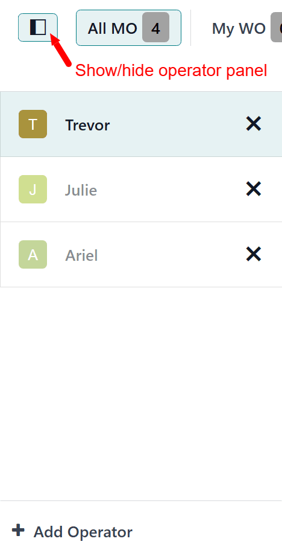
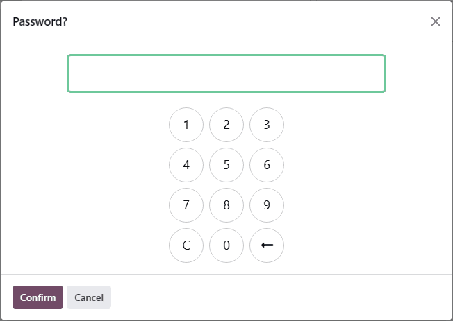
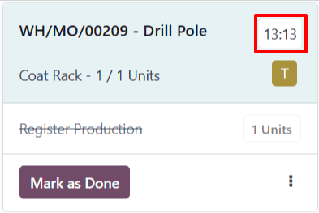
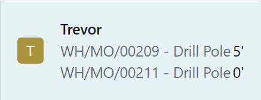

========================
Shop Floor time tracking
========================

.. |MO| replace:: :abbr:`MO (Manufacturing Order)`
.. |MOs| replace:: :abbr:`MOs (Manufacturing Orders)`

By signing in to the Odoo *Shop Floor* module as *operators*, employees are able to track the amount
of time they spend working on each work order.

Odoo tracks the time it takes to complete each work order, as well as the time each operator spends
on each work order.

Operator sign in
================

To sign in to the *Shop Floor* module as an operator, sign in to the Odoo database, and open the
:menuselection:`Shop Floor` module. The employee profile that is signed in to the database is
automatically signed in as an operator.

All active operators are listed in the operator panel on the left side of the module. The panel can
be opened or collapsed by clicking the :guilabel:`show/hide panel (white square with black column on
left side)` button, located in the top-left corner of the module.

To sign in to *Shop Floor* as a different employee, click the :guilabel:`+ Add Operator` button at
the bottom of the panel. Doing so opens the :guilabel:`Select Employee` pop-up window, which lists
every employee that is able to sign in to the module.

Click on a specific employee to sign in using their profile. If no PIN code is required to sign in
as that employee, the profile will be signed in automatically.

If a PIN code is required, a :guilabel:`Password?` pop-up window appears, showing a number pad, from
which the code can be entered. Enter the code using the number pad, and click :guilabel:`Confirm` to
sign in to the *Shop Floor* module.

.. note::
   A PIN code can be set for each employee, which must be entered each time they sign in to the
   *Shop Floor* module, check in or out in the *Kiosk Mode* of the *Attendances* application, or
   sign in as a cashier in the *Point of Sale* application.

   To set an employee PIN, navigate to the :menuselection:`Employees` app, and select a specific
   employee. At the bottom of the employee's form, click on the :guilabel:`HR Settings` tab, and
   enter a numerical code in the :guilabel:`PIN Code` field.

Once an employee is signed in to the module, their name appears in the operator panel, along with
every other employee that has signed in. While the panel can list multiple employees, only one
employee can be active at any given time, on a single instance of the *Shop Floor* module.

Click on an employee's name to make their profile active. The active employee appears highlighted
in blue, while employees that are signed in, but not active, have their names faded out.

To sign out a specific employee from the module, click the :guilabel:`X (remove)` button next to
their name, in the operator panel.

Track work order duration
=========================

To track time spent working on a work order, begin by selecting the employee working on it from the
operator panel.

Next, navigate to the page for the work center where the work order is scheduled to be carried out.
This can be done by selecting the work center from the top navigation in the *Shop Floor* module, or
by clicking the name of the work center on the card for the manufacturing order (MO) that the work
order is a part of.

On the page for the work center, find the card for the work order. Once work begins, click the
header of the work order card to start timing the duration it takes to complete. This duration is
displayed by a timer on the header of the work order card, which tracks the collective time spent
working on the work order, by all employees.

In addition, the reference number of the work order appears in the operator panel, under the name of
the employee working on it, along with a second timer, which tracks the amount of time the employee
has spent on the work order individually. This timer only reflects work done during the current
session, even if the employee has previously worked on the work order.

Employees are able to work on multiple work orders simultaneously, and track their time for each.
The reference number for each work order being worked on appears below the employee's name, along
with a timer.

To pause the timer on the work order card, and remove the work order from below the employee's name
on the operator panel, click the header a second time.

Once the work order is completed, click the :guilabel:`Mark as Done` button at the bottom of the
work order card, which causes the card to fade away. If the timer is still active, it stops once the
card disappears completely.

View work order duration
========================

To view the duration of a work order, navigate to :menuselection:`Manufacturing app --> Operations
--> Manufacturing Orders`, and select an |MO|.

To view and select |MOs| that have been completed and marked as *Done*, remove the :guilabel:`To Do`
filter from the :guilabel:`Search...` bar, by clicking on the :guilabel:`X (close)` button on the
right side of the filter.

On the page for the |MO|, click on the :guilabel:`Work Orders` tab to see a list of all work orders
included in the |MO|. The time it took to complete each work order is displayed in the
:guilabel:`Real Duration` column of the tab.

The *Real Duration* represents the total time spent working on the work order by all workers who
worked on it. It includes time tracked in the *Shop Floor* module, as well as time tracked on the
:guilabel:`Work Orders` tab of the |MO| itself.
