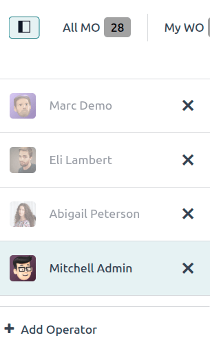
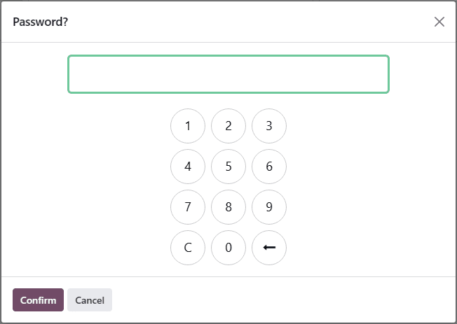
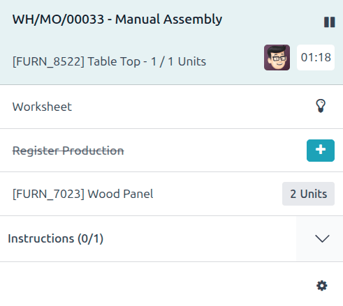
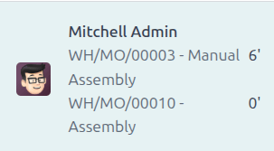

========================
Shop Floor time tracking
========================

.. |MO| replace:: :abbr:`MO (Manufacturing Order)`
.. |MOs| replace:: :abbr:`MOs (Manufacturing Orders)`

By signing in to the Odoo *Shop Floor* module as *operators*, employees can track the amount of time
they spend working on each work order. Odoo tracks the time it takes to complete each work order, as
well as the time each operator spends on it.

Manage operators
================

When the *Shop Floor* module is first opened, the employee profile that is signed in to the database
is automatically signed in as an operator.

All operators for the current session are listed in the operator panel next to the main content
area. While the panel can list multiple employee profiles, only one employee can be active at once.
The active profile highlighted in the operator panel is used for time tracking. The panel can be
opened or collapsed by clicking the :icon:`oi-panel-right fa-flip-horizontal` :guilabel:`(employee
panel)` icon located next to the view list.

Add an operator
---------------

To add employees to the operator panel, click the :icon:`fa-plus` :guilabel:`Add Operator` button at
the bottom of the panel. In the *Select Employee* pop-up window, click on a specific employee to
sign in using their profile. If no PIN code is required to sign in as that employee, the profile
is automatically signed in and selected as the active operator.

If a PIN has been set for the employee, a *Password?* pop-up window opens. Enter the code using the
number pad or keyboard, then click :guilabel:`Confirm` to sign in to the *Shop Floor* module.

.. note::
   Each employee can be assigned a PIN, which must be entered when signing in to the *Shop Floor*
   module. Badges can also be generated and printed for checking in and out with *Kiosk Mode* in the
   *Attendances* app. See the :ref:`employees/hr-settings` section for more details.

Switch profiles
---------------

Click an employee's name to make their profile active. The active employee appears highlighted in
blue, while employees who are signed in but not active appear faded out.

Log out an operator
-------------------

To sign out a specific employee from the module, click the :icon:`oi-close` :guilabel:`(logout)`
icon next to their name in the operator panel.

Track work order duration
=========================

To track time spent on a work order, begin by selecting the employee assigned to it from the
operator panel.

Next, select the work center where the work order is scheduled to be carried out. This can be done
by selecting the work center in the *Shop Floor* module. Alternatively, open the manufacturing order
(MO), open the *Work Orders* tab, and click the :icon:`fa-external-link` :guilabel:`(Open Work
Order)` icon. In the *Work Orders* pop-up window, click :icon:`oi-view-kanban` :guilabel:`Open Shop
Floor`.

In the work center view, find the card for the work order. The assigned operator's avatar is listed
on the work order. When work begins, click the :icon:`fa-play` :guilabel:`(play)` icon to start
tracking the duration. This duration tracks the collective time spent working on the work order by
all employees. The operator's avatar is displayed on the work order to indicate that work has begun
and is assigned to an operator.

In addition, the work order reference number appears in the operator panel under the employee's
name, along with another timer that tracks the time the employee has spent individually on the work
order. This timer only reflects work done during the current session, even if the employee has
previously worked on the work order.

View active profile work orders
-------------------------------

The operator panel displays the work center location and the individual time spent for each work
order an operator is working on. This timer only reflects work done during the current session, even
if the operator has previously worked on the work order.

Operators can work on multiple work orders simultaneously and track their time for each. Click
:guilabel:`My WO` at the top of the page to see all of the work orders the active profile is working
on.

Pause and stop timer
--------------------

To pause the timer on a work order, click the :icon:`fa-pause` :guilabel:`(pause)` icon.

When a work order is complete, click the :guilabel:`Mark as Done` button at the bottom of the work
order card to remove it from the work center page.

.. note::
   If there are no additional work orders for the |MO|, the button says :guilabel:`Close Production`
   instead. Clicking :guilabel:`Close Production` marks the entire |MO| as *Done* and removes it
   from the *Shop Floor* module.

   The :guilabel:`Close Production` button is always visible on the |MO| card in the *All MO* view.

View work order duration
========================

By individual work order
------------------------

To view the duration of a work order, navigate to :menuselection:`Manufacturing app --> Operations
--> Work Orders`.

By default, the search bar has a filter applied to display incomplete work orders only. To view work
orders that have been completed and marked as *Done*, remove the filter from the search bar by
clicking on the :icon:`oi-close` :guilabel:`(Remove)` icon next to the filter.

The actual time it took to complete each work order is displayed in the :guilabel:`Real Duration`
column. This value represents the total time spent on the work order by all operators who worked on
it. It includes time tracked in the *Shop Floor* module as well as time tracked in the work order
form or the *Work Orders* tab of the |MO|.

To view detailed time tracking information, select a work order. In the work order form, go to the
*Time Tracking* tab to see a detailed list of all operators who have worked on the work order and
the amount of time they spent on it.

By manufacturing order
----------------------

To view the duration of all work orders in a specific |MO|, navigate to
:menuselection:`Manufacturing app --> Operations --> Manufacturing Orders`.

By default, the search bar has a filter applied to display incomplete |MOs| only. To view |MOs| that
have been completed and marked as *Done*, remove the filter from the search bar by clicking the
:icon:`oi-close` :guilabel:`(Remove)` icon next to the filter.

Select an |MO|. In the |MO| form, go to the *Work Orders* tab to see a list of all work orders
included in the |MO|.

The actual time it took to complete each work order is displayed in the :guilabel:`Real Duration`
column. This value represents the total time spent on the work order by all operators who worked on
it. It includes time tracked in the *Shop Floor* module as well as time tracked in the work order
form or the *Work Orders* tab of the |MO|.

To view details for a specific work order, click the :icon:`fa-external-link` :guilabel:`(Open Work
Order)` icon. The work order form opens.
