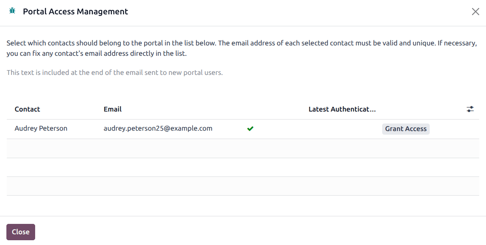

===============================
Basic subcontracting lead times
===============================

.. |PO| replace:: :abbr:`PO (Purchase Order)`
.. |RfQ| replace:: :abbr:`RfQ (Request for Quotation)`
.. |MOs| replace:: :abbr:`MOs (Manufacturing Orders)`
.. |MO| replace:: :abbr:`MOs (Manufacturing Order)`
.. |MTO| replace:: :abbr:`MTO (Make to Order)`

In Odoo, lead times are used to predict how long it takes to complete a certain action. For example,
a *delivery lead time* can be set for a purchased product, which specifies the number of days it
usually takes for the product's vendor to delivery the product to the purchasing company.

For subcontracted products specifically, delivery lead times can be configured to take into account
the amount of time required for the subcontractor to manufacture a product. Doing so allows the
contracting company to better predict the delivery dates of subcontracted products.

.. important::
   Like all lead times in Odoo, lead times for subcontracted products are only an estimate, and are
   based on how long actions are *expected* to take.

   Unforeseen circumstances can impact the completion of these actions, which means that lead times
   should not be viewed as guarantees.

Lead times for subcontracting
=============================

When using the :doc:`basic subcontracting <subcontracting_basic>` workflow to manufacture a product,
a company is not responsible for supplying the subcontractor with the necessary components. This
means that the only factors affecting the delivery date of a product are the amount of time it takes
the subcontractor to manufacture and deliver it.

By assigning a product's subcontractor a delivery lead time that considers both of these factors,
the *Expected Arrival* date displayed on purchase orders (POs) for the product more accurately
reflects the amount of time required for both manufacturing and delivery.

Product delivery lead time
--------------------------

To set a delivery lead time for a product's subcontractor, navigate to :menuselection:`Inventory app
--> Products --> Products`, and select a subcontracted product.

Then, select the :guilabel:`Purchase` tab on the product's page. If the subcontractor has not
already been added as a vendor, do so now by clicking :guilabel:`Add a line`, and selecting the
subcontractor in the :guilabel:`Vendor` column.

Once the subcontractor has been added, enter the number of days it takes them to manufacture and
deliver the product, in the :guilabel:`Delivery Lead Time` column.

.. image:: basic_subcontracting_lead_times/delivery-lead-time.png
   :alt: The Delivery Lead Time field for a subcontractor, on the Purchase tab of a product page.

.. note::
   Multiple subcontractors can be added to the :guilabel:`Purchase` tab on a product's page, and a
   different :guilabel:`Delivery Lead Time` can be set for each.

Customer lead time
------------------

For subcontracted products, the customer lead time must account for all the stages involved, not
just the subcontractor's production. It must always be longer than the combined total of the
following:

- Component delivery time: the time required for all necessary materials or components to reach the
  subcontractor, whether shipped by the business or procured directly by the subcontractor.
- Subcontractor production time: the time the subcontractor needs to manufacture or assemble the
  product once the materials are available.
- Delivery to the business: the time required to ship the finished product from the subcontractor
  back to the business that requested it.
- In-house manufacturing time: if the subcontracted product is only one part of a larger assembly,
  this includes the time needed for the business to complete its own in-house production.
- Delivery to the customer: the time required for the business to ship the final product to the end
  customer.

This ensures that the subcontractor has sufficient time to receive all the necessary materials, and
complete the production before the final delivery date.

.. seealso::
   - For flexibility and quality control in raw materials, see :doc:`subcontracting_resupply`.
   - To shorten the delivery-to-customer timeline, see :doc:`subcontracting_dropship`.

Purchase security lead time
---------------------------

The purchase security lead time is a buffer that adds extra days to the expected delivery time of
purchased products. Its purpose is to protect against unforeseen delays in receiving shipments from
vendors.

This lead time adds a margin of error to the subcontractor's delivery lead time. This is a general
setting and applies to all products that are purchased or subcontracted.

.. example::
  If a subcontractor ships the finished product through a carrier, such as UPS or FedEx, and the
  carrier experiences unexpected delays, the Purchase Security Lead Time ensures that Odoo still
  plans the purchase order early enough to reduce the risk of late delivery.

Days to purchase
----------------

The Days to Purchase Lead Time defines the time between sending a |RfQ| and validating the |PO|.

In a subcontracting context, this period represents:

The time it takes for the subcontractor to confirm they can accept the work (i.e., when they approve
the |RfQ| in Odoo).

The time needed to prepare the components that will be sent to the subcontractor, so they are ready
by the time production begins.

Once the subcontractor approves the |RfQ|, it is safe for the company to validate the |RfQ| and
convert it into a |PO|.

This is a general setting in Odoo, meaning only one value can be configured for the entire company.
It applies to all subcontracted products, but not to directly purchased products.

Manufacturing security lead time
--------------------------------

In a subcontracting flow, products configured with |MTO| do not generate a Manufacturing Order in
Odoo. Instead, Odoo creates a |PO| to the subcontractor. The subcontractor's production is managed
outside of Odoo, but lead times are still important for scheduling.

- Manufacturing Lead Time: This field represents the subcontractor's production lead time (the time
  the subcontractor needs to manufacture the product once they have all the necessary components).
- Manufacturing Security Lead Time: This setting applies **only** to in-house manufacturing. It does
  not buffer subcontractor production. However, if a subcontracted product is used as a component in
  an in-house Manufacturing Order, then manufacturing security lead time applies to that downstream
  in-house process.

For products configured with |MTO|, Odoo calculates scheduling as follows:

.. code-block::

   PO Scheduled Date (subcontractor delivery) = Delivery Order Scheduled Date
   - Vendor Lead Time (subcontractor)
   - Purchase Security Lead Time

How lead times affect scheduling
--------------------------------

- Component Lead Time: the longest component lead time determines how early Odoo triggers the |PO|
  to ensure all materials are ready for the subcontractor.
- Vendor Lead Time (subcontractor): set on the subcontractor's vendor record. This defines how long
  it takes for the subcontractor to deliver the finished product once they receive the |PO|.
- Purchase Security Lead Time: a general buffer that shifts the |PO| creation date earlier,
  protecting against potential vendor or shipping delays.
- Manufacturing Security Lead Time: only applies if the subcontracted product is later used in an
  in-house |MO|, where it adds a buffer to internal production scheduling.

.. example::
  Stealthy Wood subcontracts the product *Desk Combination* with the following lead times:

 - Longest component lead time: **5 days** (*Drawer Black*)
 - Subcontractor (Vendor) lead time: **3 days**
 - Purchase Security Lead Time: **2 days**

  In this scenario:

  - Odoo schedules the PO for *Desk Combination* based on the 5-day component lead time.
  - The |PO| is created **2 days earlier** than the calculated date due to the purchase security
    lead time.
  - The expected delivery date from the subcontractor is **3 days** after the |PO| date, reflecting
    the subcontractor's vendor lead time.
  - If *Desk Combination* is used in a downstream in-house |MO|, any additional manufacturing
    security lead time would apply to that in-house operation.

  This example shows how each lead time contributes to scheduling, rather than simply summing them
  into a single customer lead time.

Lead time workflow
==================

After setting a delivery lead time for a product's vendor, create an |RfQ| by navigating to
:menuselection:`Purchase app --> Orders --> Purchase Orders`, and clicking :guilabel:`New`.

Specify the subcontractor in the :guilabel:`Vendor` field. Then, add the product in the
:guilabel:`Products` tab by clicking :guilabel:`Add a product`, selecting the product in the
:guilabel:`Product` column, and adding a quantity in the :guilabel:`Quantity` column.

Once a product has been added, the :guilabel:`Expected Arrival` field on the |RfQ| auto-populates
with a date that reflects the vendor's delivery lead time, as specified on the product's page.

If the date needs to be adjusted, click on the :guilabel:`Expected Arrival` field to open a calendar
popover, and select the desired date. Make sure not to choose a date sooner than the one that was
auto-populated, unless the subcontractor has confirmed that they are able to deliver the product by
that date.

Finally, click :guilabel:`Confirm Order` on the |RfQ| to turn it into a |PO|. At this point, the
subcontractor should begin manufacturing the subcontracted product, before delivering it to the
contracting company.

.. example::
   Bike retailer *Mike's Bikes* works with a subcontractor — *Bike Friends* — to produce units of
   their *Tricycle* product.

   On average, Bike Friends requires three days to manufacture a tricycle, plus an additional two
   days to deliver it to Mike's Bikes.

   As a result, Mike's Bikes sets a delivery lead time of five days for tricycles manufactured by
   Bike Friends: three days for manufacturing, plus two days for delivery.

   On September 24th, Mike's Bikes confirms a |PO| to purchase one tricycle from Bike Friends.

   The :guilabel:`Expected Arrival` date listed on the |PO| is September 29th, five days after the
   :guilabel:`Confirmation Date`.

   .. image:: basic_subcontracting_lead_times/expected-arrival.png
      :alt: The Expected Arrival date on a PO for a subcontracted product.

   Bike Friends begins manufacturing the tricycle on May 3rd — the day that the |PO| is confirmed —
   and finishes on May 6th, three days later.

   The tricycle is then shipped to Mike's Bikes the same day, and they receive it on May 8th, two
   days later.

Subcontracting portal
=====================

The *Subcontracting Portal* feature allows subcontractors to record the components they have used
for a subcontracted product. This provides greater visibility and accuracy when managing
subcontracted |MOs|.

To allow subcontractors access to the portal, navigate to the :menuselection:`Contacts` app, and
open a contact record. Then click the :icon:`fa-cog` :guilabel:`(Actions)` icon, and select
:guilabel:`Grant portal access`.

.. warning::
  Only users who are in the :ref:`group <access-rights/groups>` *Extra Rights/Contact Creation* can
  grant portal access.

From there, click :guilabel:`Grant Access` next to the name of the appropriate contact.

The contact receives an email invitation with instructions on how to access the portal and setup
their password.
