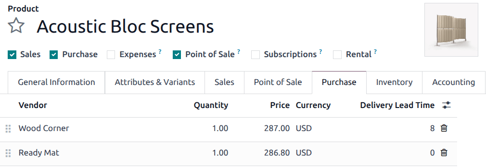

===============================
Basic subcontracting lead times
===============================

.. |PO| replace:: :abbr:`PO (Purchase Order)`
.. |RfQ| replace:: :abbr:`RfQ (Request for Quotation)`

In Odoo, lead times are used to predict how long it takes to complete a certain action. For example,
a *delivery lead time* can be set for a purchased product, which specifies the number of days it
usually takes for the product's vendor to delivery the product to the purchasing company.

For subcontracted products specifically, delivery lead times can be configured to take into account
the amount of time required for the subcontractor to manufacture a product. Doing so allows the
contracting company to better predict the delivery dates of subcontracted products.

.. important::
   Like all lead times in Odoo, lead times for subcontracted products are only an estimate, and are
   based on how long actions are *expected* to take.

   Unforeseen circumstances can impact the completion of these actions, which means that lead times
   should not be viewed as guarantees.

Configuration
=============

When using the :doc:`basic subcontracting <subcontracting_basic>` workflow to manufacture a product,
a company is not responsible for supplying the subcontractor with the necessary components. This
means that the only factors affecting the delivery date of a product are the amount of time it takes
the subcontractor to manufacture and deliver it.

By assigning a product's subcontractor a delivery lead time that considers both of these factors,
the *Expected Arrival* date displayed on purchase orders (POs) for the product more accurately
reflects the amount of time required for both manufacturing and delivery.

Product delivery lead time
--------------------------

To set a delivery lead time for a product's subcontractor, navigate to :menuselection:`Inventory app
--> Products --> Products`, and select a subcontracted product.

Then, select the :guilabel:`Purchase` tab on the product's page. If the subcontractor has not
already been added as a vendor, do so now by clicking :guilabel:`Add a line`, and selecting the
subcontractor in the :guilabel:`Vendor` column.

Once the subcontractor has been added, enter the number of days it takes them to manufacture and
deliver the product, in the :guilabel:`Delivery Lead Time` column.

.. note::
   Multiple subcontractors can be added to the :guilabel:`Purchase` tab on a product's page, and a
   different :guilabel:`Delivery Lead Time` can be set for each.

Lead time workflow
==================

After setting a delivery lead time for a product's vendor, create an |RfQ| by navigating to
:menuselection:`Purchase app --> Orders --> Purchase Orders`, and clicking :guilabel:`New`.

Specify the subcontractor in the :guilabel:`Vendor` field. Then, add the product in the
:guilabel:`Products` tab by clicking :guilabel:`Add a product`, selecting the product in the
:guilabel:`Product` column, and adding a quantity in the :guilabel:`Quantity` column.

Once a product has been added, the :guilabel:`Expected Arrival` field on the |RfQ| auto-populates
with a date that reflects the vendor's delivery lead time, as specified on the product's page.

If the date needs to be adjusted, click on the :guilabel:`Expected Arrival` field to open a calendar
popover, and select the desired date. Make sure not to choose a date sooner than the one that was
auto-populated, unless the subcontractor has confirmed that they are able to deliver the product by
that date.

Finally, click :guilabel:`Confirm Order` on the |RfQ| to turn it into a |PO|. At this point, the
subcontractor should begin manufacturing the subcontracted product, before delivering it to the
contracting company.

.. example::
   Bike retailer *Mike's Bikes* works with a subcontractor — *Bike Friends* — to produce units of
   their *Tricycle* product.

   On average, Bike Friends requires three days to manufacture a tricycle, plus an additional two
   days to deliver it to Mike's Bikes.

   As a result, Mike's Bikes sets a delivery lead time of five days for tricycles manufactured by
   Bike Friends: three days for manufacturing, plus two days for delivery.

   On May 3rd, Mike's Bikes confirms a |PO| to purchase one tricycle from Bike Friends.

   The :guilabel:`Expected Arrival` date listed on the |PO| is May 8th, five days after the
   :guilabel:`Confirmation Date`.

   .. image:: basic_subcontracting_lead_times/expected-arrival.png
      :align: center
      :alt: The Expected Arrival date on a PO for a subcontracted product.

   Bike Friends begins manufacturing the tricycle on May 3rd — the day that the |PO| is confirmed —
   and finishes on May 6th, three days later.

   The tricycle is then shipped to Mike's Bikes the same day, and they receive it on May 8th, two
   days later.
