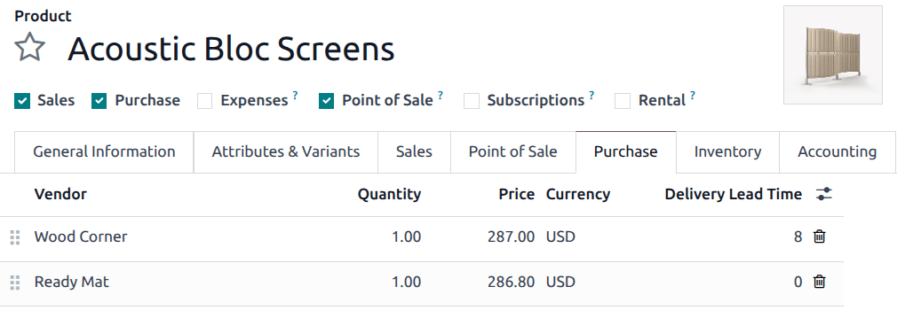
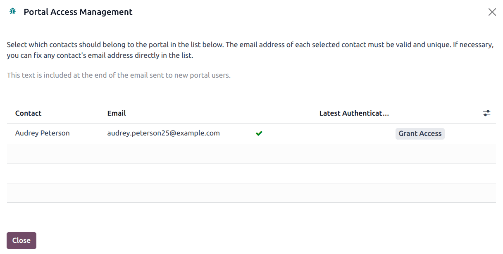

===============================
Basic subcontracting lead times
===============================

.. |PO| replace:: :abbr:`PO (Purchase Order)`
.. |RfQ| replace:: :abbr:`RfQ (Request for Quotation)`
.. |MOs| replace:: :abbr:`MOs (Manufacturing Orders)`

In Odoo, lead times are used to predict how long it takes to complete a certain action. For example,
a *delivery lead time* can be set for a purchased product, which specifies the number of days it
usually takes for the product's vendor to delivery the product to the purchasing company.

For subcontracted products specifically, delivery lead times can be configured to take into account
the amount of time required for the subcontractor to manufacture a product. Doing so allows the
contracting company to better predict the delivery dates of subcontracted products.

.. important::
   Like all lead times in Odoo, lead times for subcontracted products are only an estimate, and are
   based on how long actions are *expected* to take.

   Unforeseen circumstances can impact the completion of these actions, which means that lead times
   should not be viewed as guarantees.

Lead times for subcontracting
=============================

When using the :doc:`basic subcontracting <subcontracting_basic>` workflow to manufacture a product,
a company is not responsible for supplying the subcontractor with the necessary components. This
means that the only factors affecting the delivery date of a product are the amount of time it takes
the subcontractor to manufacture and deliver it.

By assigning a product's subcontractor a delivery lead time that considers both of these factors,
the *Expected Arrival* date displayed on purchase orders (POs) for the product more accurately
reflects the amount of time required for both manufacturing and delivery.

Product delivery lead time
--------------------------

To set a delivery lead time for a product's subcontractor, navigate to :menuselection:`Inventory app
--> Products --> Products`, and select a subcontracted product.

Then, select the :guilabel:`Purchase` tab on the product's page. If the subcontractor has not
already been added as a vendor, do so now by clicking :guilabel:`Add a line`, and selecting the
subcontractor in the :guilabel:`Vendor` column.

Once the subcontractor has been added, enter the number of days it takes them to manufacture and
deliver the product, in the :guilabel:`Delivery Lead Time` column.

.. note::
   Multiple subcontractors can be added to the :guilabel:`Purchase` tab on a product's page, and a
   different :guilabel:`Delivery Lead Time` can be set for each.

Customer lead time
------------------

The customer lead time for subcontracted products must **always** be longer than the combined total
of:

- The delivery time of components to the subcontractor
- The production time required by the subcontractor

This ensures that the subcontractor has sufficient time to receive all the necessary materials, and
complete the production before the final delivery date.

Purchase security lead time
---------------------------

As subcontracting involves purchasing components, it is important to account for potential delays
from vendors. The *Purchase Security Lead Time* adds a buffer to the subcontractor's delivery lead
time. Odoo automatically schedules the |PO| to be created several days earlier, reducing the risk of
late deliveries due to unforseen delays.

This is a general setting, and applies to all products that are purchased or subcontracted.

Days to purchase
----------------

This setting defines the number of days the purchasing department requires to validate and process a
|PO|. This is a general setting, and applies to all products that are purchased or subcontracted.

Manufacturing security lead time
--------------------------------

This setting adds extra days to cover potentital delays in the manufacturing process.

For products configured with *Make To Order (MTO)*, the system calculates the *Manufacturing Order*
scheduled date as follows:

.. code-block::

   Manufacturing Order Scheduled Date
       = Delivery Order Scheduled Date
         - Manufacturing Lead Time
         - Manufacturing Security Lead Time

This is a general setting and applies to all manufactured products.

.. example::
   Stealthy Wood subcontracts the product, *Desk Combination*, with the following lead times:

   - The component with the longest lead time is *Drawer Black*: 5 days
   - Subcontractor lead time: 3 days
   - Purchase Security Lead time: 2 days

   In this scenario:

   - Odoo automatically computes the preperation lead time as **5 days** based on the longest
     component lead time.
   - The |PO| for the subcontractor is scheduled **2 days earlier** than usual, due to the Purchase
     Security Lead Time.
   - The total customer lead time for the product *Desk Combination* should be minimum **8 days**.

.. list-table::
   :header-rows: 1
   :widths: 25 55 20

   * - Lead Time
     - Description
     - Applies To
   * - Product delivery lead time
     - Time required to prepare and deliver components to the subcontractor. Computed automatically
       from the component with the longest lead time.
     - Subcontracted products
   * - Customer Lead Time
     - Must always be longer than the combined delivery time of components and subcontractor
       production time. Ensures delivery commitments are realistic.
     - Subcontracted products
   * - Purchase Security Lead Time
     - Buffer time to account for potential vendor delays. The system schedules the Purchase Order
       earlier than required.
     - All purchased or subcontracted products
   * - Days to Purchase
     - Number of days the purchasing team requires to validate and process a Purchase Order.
     - All purchased or subcontracted products
   * - Manufacturing Security Lead Time
     - Extra time to account for unexpected delays in production. For MTO, it is included in the
       calculation of the Manufacturing Order scheduled date.
     - All manufactured products

Lead time workflow
==================

After setting a delivery lead time for a product's vendor, create an |RfQ| by navigating to
:menuselection:`Purchase app --> Orders --> Purchase Orders`, and clicking :guilabel:`New`.

Specify the subcontractor in the :guilabel:`Vendor` field. Then, add the product in the
:guilabel:`Products` tab by clicking :guilabel:`Add a product`, selecting the product in the
:guilabel:`Product` column, and adding a quantity in the :guilabel:`Quantity` column.

Once a product has been added, the :guilabel:`Expected Arrival` field on the |RfQ| auto-populates
with a date that reflects the vendor's delivery lead time, as specified on the product's page.

If the date needs to be adjusted, click on the :guilabel:`Expected Arrival` field to open a calendar
popover, and select the desired date. Make sure not to choose a date sooner than the one that was
auto-populated, unless the subcontractor has confirmed that they are able to deliver the product by
that date.

Finally, click :guilabel:`Confirm Order` on the |RfQ| to turn it into a |PO|. At this point, the
subcontractor should begin manufacturing the subcontracted product, before delivering it to the
contracting company.

.. example::
   Bike retailer *Mike's Bikes* works with a subcontractor — *Bike Friends* — to produce units of
   their *Tricycle* product.

   On average, Bike Friends requires three days to manufacture a tricycle, plus an additional two
   days to deliver it to Mike's Bikes.

   As a result, Mike's Bikes sets a delivery lead time of five days for tricycles manufactured by
   Bike Friends: three days for manufacturing, plus two days for delivery.

   On September 24th, Mike's Bikes confirms a |PO| to purchase one tricycle from Bike Friends.

   The :guilabel:`Expected Arrival` date listed on the |PO| is September 29th, five days after the
   :guilabel:`Confirmation Date`.

   .. image:: basic_subcontracting_lead_times/expected-arrival.png
      :alt: The Expected Arrival date on a PO for a subcontracted product.

   Bike Friends begins manufacturing the tricycle on May 3rd — the day that the |PO| is confirmed —
   and finishes on May 6th, three days later.

   The tricycle is then shipped to Mike's Bikes the same day, and they receive it on May 8th, two
   days later.

Subcontracting portal
=====================

The *Subcontracting Portal* feature allows subcontractors to record the components they have used
for a subcontracted product. This provides greater visibility and accuracy when managing
subcontracted |MOs|.

To allow subcontractors access to the portal, navigate to the :menuselection:`Contacts` app, and
open a contact record. Then click the :icon:`fa-cog` :guilabel:`(Actions)` icon, and select
:guilabel:`Grant portal access`.

.. warning::
  Only users who are in the :ref:`group <access-rights/groups>` *Extra Rights/Contact Creation* can
  grant portal access.

From there, click :guilabel:`Grant Access` next to the name of the appropriate contact.

The contact recieves an email invitiation with instructions on how to access the portal and setup
their password.
